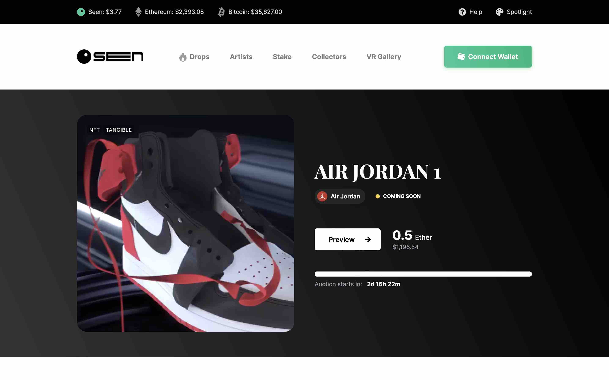
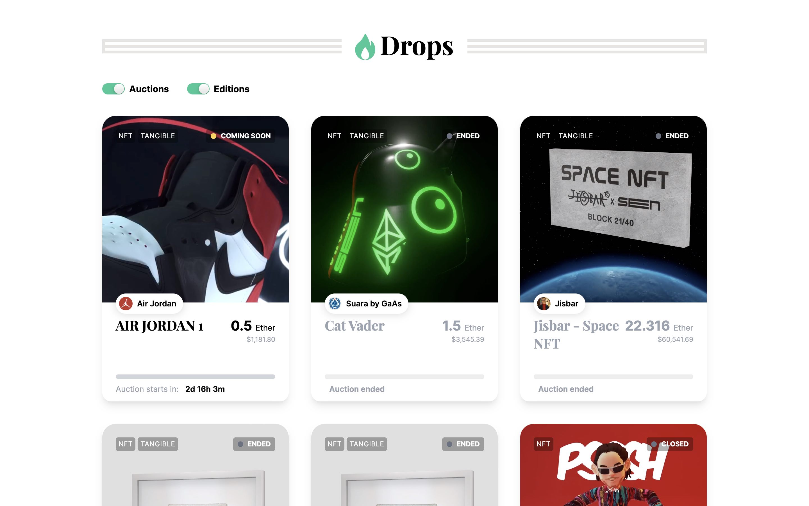
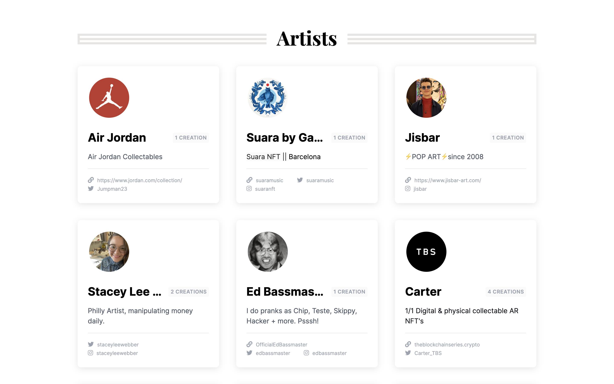
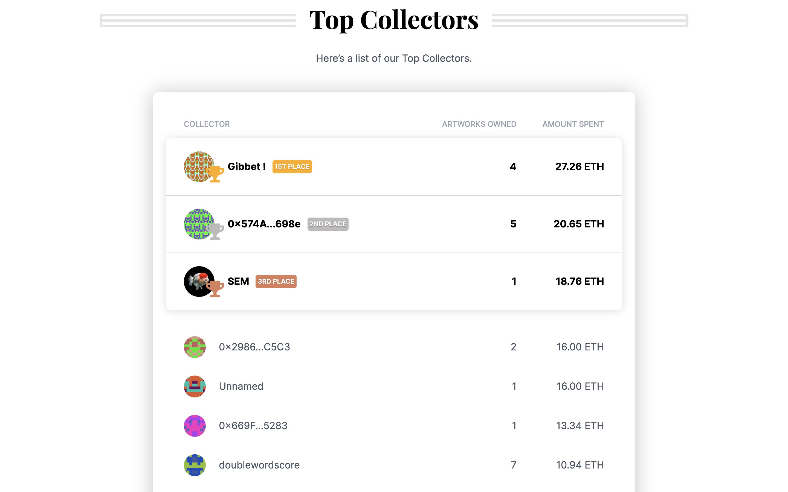
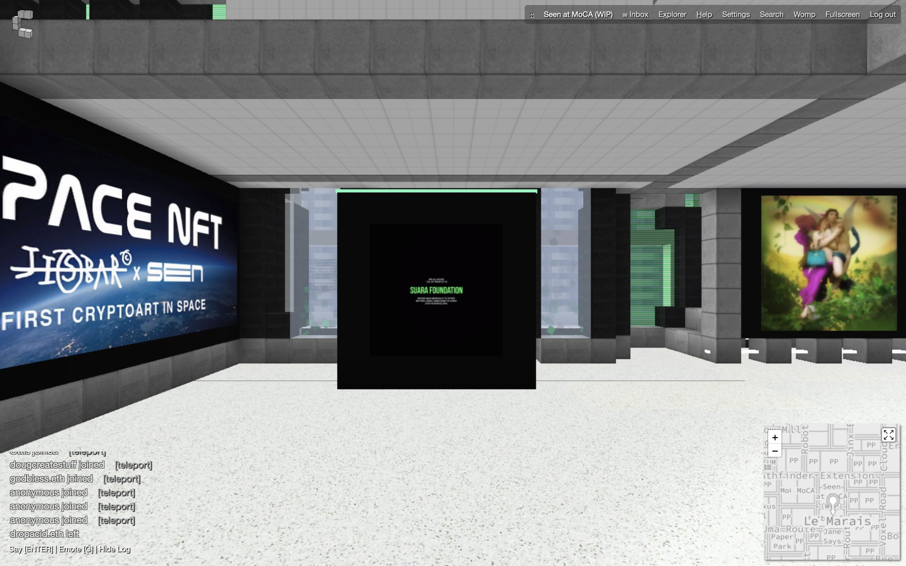
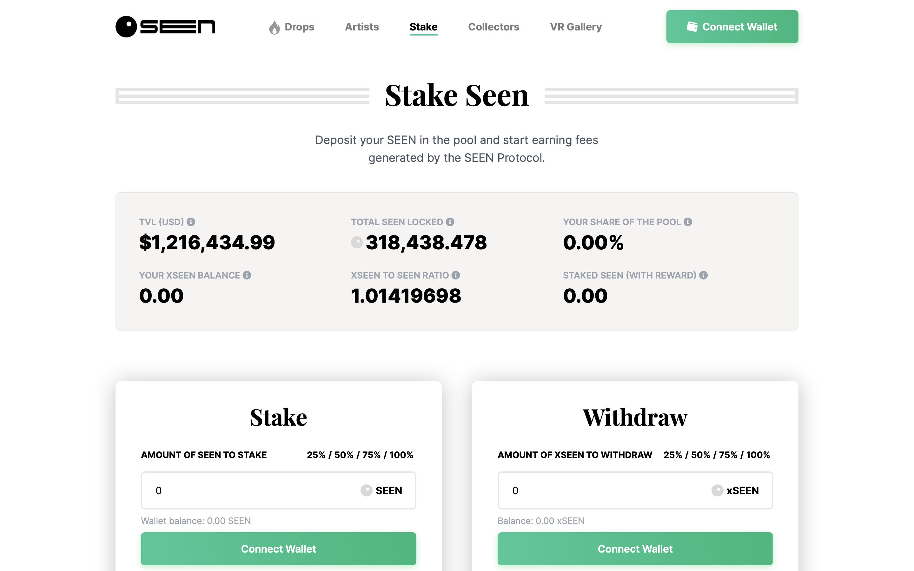

# Seen Haus：融合 NFT 与实体艺术品的数字化苏富比 | Today's Pick

> 今天，「元宇宙特攻队」为你推荐希望成为数字世界的苏富比拍卖行的 [Seen Haus](https://seen.haus/) 。✨✨✨✨✨

**By ABMTF_crypto**

随着艺术品/收藏品作为 NFT 第一个应用场景爆红出圈，越来越多的艺术品 NFT 平台引入并加大策展元素，以自身特色吸引艺术家和收藏者。在诸多艺术策展拍卖平台中，Seen Haus 是第一个通过 NFT 和实体产品拍卖来融合数字和物理世界艺术品的平台，并立志成为数字世界中的苏富比拍卖行。

打开网站首页可见 2 天后即将举行的 Air Jordan 1 实体耐克鞋加 NFT 的拍卖，起拍价 0.5 ETH。 Seen Haus 拍卖的这双 Air Jordan 1 是仅发售 28 双的黑色鞋头限量版中的一双，上面刻有迈克尔·乔丹的签名。获得此鞋的唯一途径是如果你参加了乔丹品牌举办的 2008 年新秀训练营活动。目前，Jay-Z 是拥有这一限量版球鞋的少数藏家之一。而 Seen Haus 的拍卖赢家不仅将获得实体球鞋，而且获得带有动效的球鞋 NFT 作品。

Seen Haus 迄今完成的 55 项艺术品拍卖或空投，其中绝大部分是 NFT+实物、融合数字和物理世界的艺术品，实现销售金额 347.8 ETH，二级市场销售收入为 852,110 美元。

Seen Haus 邀请入驻合作的艺术家现有 24 位，如 tim-gatenby，buddyart00，carter，1penemy，modestep，2ragon 等都是业内知名的加密艺术家。

5 月 1 日，Seen Haus 宣布 Vogue 意大利杂志的创意总监 Ferdinando Verderi 加入创意咨询团队。Ferdinando 一直为 Prada，Versace，Adidas Originals 等品牌制定创意、策略和广告，这为奢侈品牌大 IP 的 NFT 在 Seen Haus 拍卖提供了更多的可能性。

这是 Seen Haus 收藏大户排行榜，排名第一的 [Gibbet!](https://seen.haus/profile/0x8a83716acd66D9e1fb18c9b79540B72E04f80aC0) 已经在平台上花费了 27.26 ETH。

Seen Haus 还在虚拟世界 Cryptovoxels 建立了自己的画廊，让用户能够直观地感受平台作品的高品质。

**VR 画廊地址：** https://www.cryptovoxels.com/play?coords=NW@105W,121N

Seen Haus 的目标是成为用 DAO（去中心化自治组织）治理的数字苏富比，去年 10 月底就发行了总量为 100 万枚的治理通证 SEEN，通证持有者在 Seen Haus 合作、策展、拍卖方式等各方面拥有发言权，并能指引项目的未来发展。在 Seen Haus 拍卖的每笔交易，以 ETH 标价，平台将抽取 15% 作为收入，其余 85% 收入归艺术家所有。

当每次拍卖完成后，平台收取的 15% 的收入直接进入在 Balancer 建立的专用资金池 Smart Treasury（由 SEEN 和 ETH 一比一流动性配对），这意味着存入资金的 50％ 将通过市场从 Smart Treasury 中购买 SEEN，这将有助于保护网络安全并维持对 SEEN 的需求，防止有人出于恶意囤积过多的 SEEN。

Seen Haus 今年 4 月上线质押功能，质押者可以分享拍卖收入的 10%。目前流通的 SEEN 有 39%放在池子里质押。

### 创始团队

Seen Haus 去年 10 月中旬正式成立，由之前的 OFF BLUE 项目改名而来，核心团队包括：创意负责人 @buddyart00，首席开发者 @cryptosamurai，Solidity 首席开发者 @EyeOfSauronSeen、前端设计师 @jigglybuff69 和沟通运营 @Jigsaw。

这里是「元宇宙特攻队」，我们下期见。
