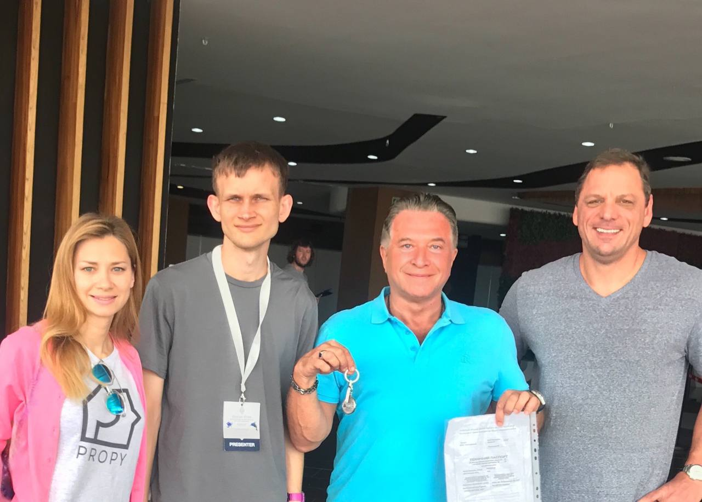

# The world's first real estate NFT auction on Seen Haus | Today's Headline

> What? Seen Haus, which was introduced in the last issue of NFT4Metaverse, is not going to be the Sotheby's of the digital world, why is it selling houses?
>
> Isn't the world's first house auction as an NFT a piece of artwork that will go down in history? ✨✨✨✨✨

**By ABMTF_crypto**

In 5 days the world's first real estate NFT will be auctioned at Seen Haus with a starting price of 7.5 ETH (worth $20,000) and the auction will end in 24 hours.

The house to be auctioned as NFT is a one-bedroom apartment with a fully equipped kitchen and bathroom in the upscale residential area of Svyatoshino, west of the Ukrainian capital Kiev, which has just been tastefully renovated.

_Ethereum founder Buterin Vitalik (second from left) poses with Arrington (second from right) in the photo_.

The apartment will be sold by Michael Arrington, the founder of TechCrunch, who bought the home in 2017 through an Ethereum smart contract. So it's only logical that the world's first property to be sold via blockchain would be the first real estate NFT sale.

This unique collectible NFT includes not only the property deed of this apartment, but also:

- A digital image depicting the apartment
- A digital artwork NFT by the famous Kiev graffiti artist Chizz, this digital painting is also painted on the apartment's living room wall (see above)

_https://propy.com/browse/propy-nft/_

The world's first real estate NFT auction has already generated media attention at

- TechCrunch: [Blockchain startup Propy plans first-ever auction of a real apartment as a collectible NFT](https://techcrunch.com/2021/05/25/ blockchain-startup-propy-plans-first-ever-auction-of-a-real-apartment-as-a-collectible-nft/)
- CoinDesk: [TechCrunch Founder's Apartment to Be Sold as NFT](https://www.coindesk.com/techcrunch-founders-apartment-to-be- sold-as-nft)

As leading Silicon Valley investor and founding partner of DFJ, and blockchain believer, Tim Draper said, "I am excited about how NFTs in the virtual world are going to be applied to real estate in the physical world. I suspect that people will soon be able to buy a building, buy the air rights and buy the virtual rights of any physical space. The future is awesome."

Tim Draper's real estate tech company [Propy](https://propy.com/) is handling the world's first real estate NFT deal, and CEO Natalia Karayaneva wrote an article in Forbes in April, "NFTs Work For Digital Art. They Also Work Perfectly For Real Estate," which is worth a read.

**Article:** https://www.forbes.com/sites/nataliakarayaneva/2021/04/08/nfts-work-for-digital-art-they-also-work-perfectly-for-real-estate/?sh=29a213f143f3

### Why Seen Haus repeatedly delivers amazing lots

Amazing people do something big, and today I would like to add to that the core brains of Seen Haus are not only the founding team, but also the members who hold its multi-signature wallet.

- 0xMaki: Co-founder of SushiSwap, the humble anonymous
- Laserbach: Head of Marketing at Seen Haus
- Jiigsaw01: Head of Operations and PR at Seen Haus, former Calvin klein model
- Andy8052: Fractional platform developer
- Solarcurve: Low-profile big brother
- Jigglybuff69: Seen Haus designer
- CryptoSamurai: Fractional platform developer, favorite artwork is Roland's Sleeping Boy

This project above is presented by NFT4Metaverse and see you next time!
