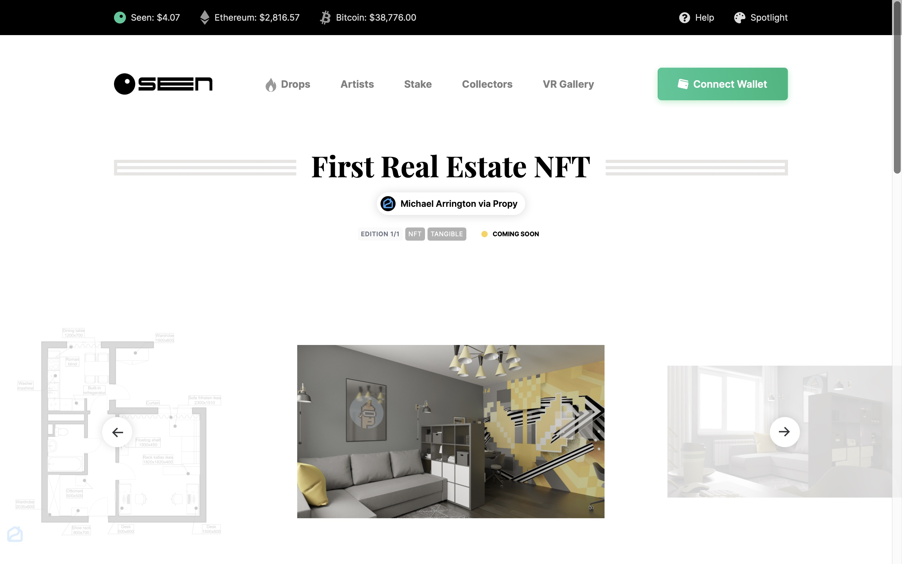
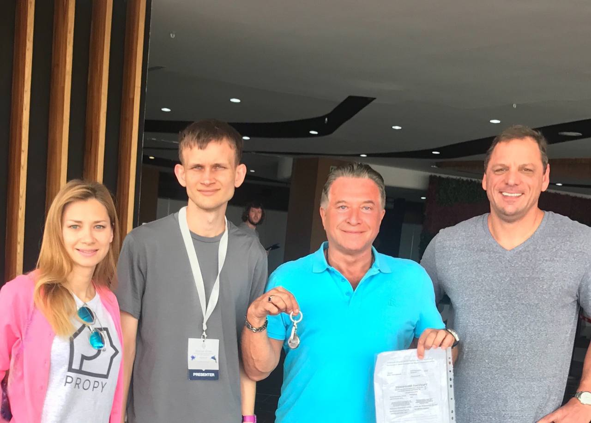
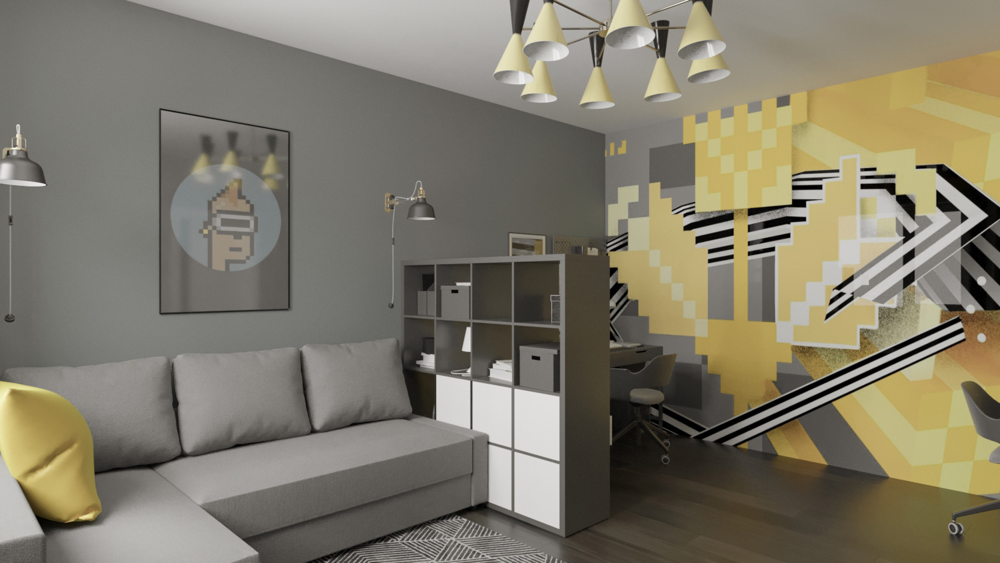

# 5 天后，全球第一个房地产 NFT 在 Seen Haus 上拍卖 | Today's Headline

> 什么？「元宇宙特攻队」上期介绍的 Seen Haus 不是要做数字世界的苏富比拍卖行，怎么卖起房子了？
>
> 全球第一所房子作为 NFT 被拍卖销售，难道不是一件能够载入史册的行为艺术品么？✨✨✨✨✨

**By ABMTF_crypto**

点开 **seen.haus**，你没看错！5 天后全世界第一个房地产 NFT 将在 Seen Haus 开拍，起拍价 7.5 ETH（现价 2 万美元），拍卖将在 24 小时内结束。

作为 NFT 拍卖的房子位于乌克兰首都基辅西部 Svyatoshino 高档住宅区，是一间刚刚完成高雅装修、带有设备齐全的厨房和浴室的一室公寓。

_以太坊创始人 V 神（左二）与阿灵顿（右二）亲切合影_

出售这套公寓的是 TechCrunch 创始人迈克尔·阿灵顿 (Michael Arrington)，他是在 2017 年通过以太坊智能合约买下这一住宅。因此，全球第一个通过区块链销售上链的物业成为第一个房地产 NFT 出售是件非常顺理成章的事情。

这个独一无二的收藏类 NFT 不止含有这套公寓的房产证，还包括：

- 一幅描绘公寓的数字图像
- 由著名的基辅涂鸦艺术家 Chizz 创作的数字艺术品 NFT —— 这幅数字画也画在了公寓客厅墙上（见上图）

_https://propy.com/browse/propy-nft/_

全球第一个房地产 NFT 拍卖已经引发媒体关注：

- TechCrunch：[Blockchain startup Propy plans first-ever auction of a real apartment as a collectible NFT](https://techcrunch.com/2021/05/25/blockchain-startup-propy-plans-first-ever-auction-of-a-real-apartment-as-a-collectible-nft/)
- CoinDesk：[TechCrunch Founder’s Apartment to Be Sold as NFT](https://www.coindesk.com/techcrunch-founders-apartment-to-be-sold-as-nft)

硅谷知名投资者、德丰杰创始合伙人 Tim Draper 是区块链信徒，他说，“我对虚拟世界中的 NFT 将如何应用于物理世界中的房地产感到兴奋。 我推测人们很快就能购买房子、购买空气权，购买任何物理空间的数字所有权，未来可期。”

Tim Draper 投资的房地产科技公司 [Propy](https://propy.com/)操刀全球第一个房地产 NFT 这桩买卖，他们家女 CEO Natalia Karayaneva 4 月在福布斯杂志写了篇文章《NFT 适用于数字艺术，同样也非常适合房地产》，非常值得一读。

**文章链接：** https://www.forbes.com/sites/nataliakarayaneva/2021/04/08/nfts-work-for-digital-art-they-also-work-perfectly-for-real-estate/

### Seen Haus 为何屡屡推出令人惊叹的拍品？

牛逼人做牛逼事，今天要补充介绍 Seen Haus 核心大脑不仅是创始团队，还有掌握它多签钱包的成员：

- 0xMaki：SushiSwap 联合创始人，谦虚的匿名者
- Laserbach：Seen Haus 市场负责人
- Jiigsaw01：Seen Haus 运营与公关负责人，前 Calvin klein 模特
- Andy8052：Fractional 平台开发者
- Solarcurve：低调大佬
- Jigglybuff69：Seen Haus 设计师
- CryptoSamurai：Fractional 平台开发者，最喜欢的艺术品是 Roland 的 Sleeping Boy

这里是「元宇宙特攻队」，我们下期见。
