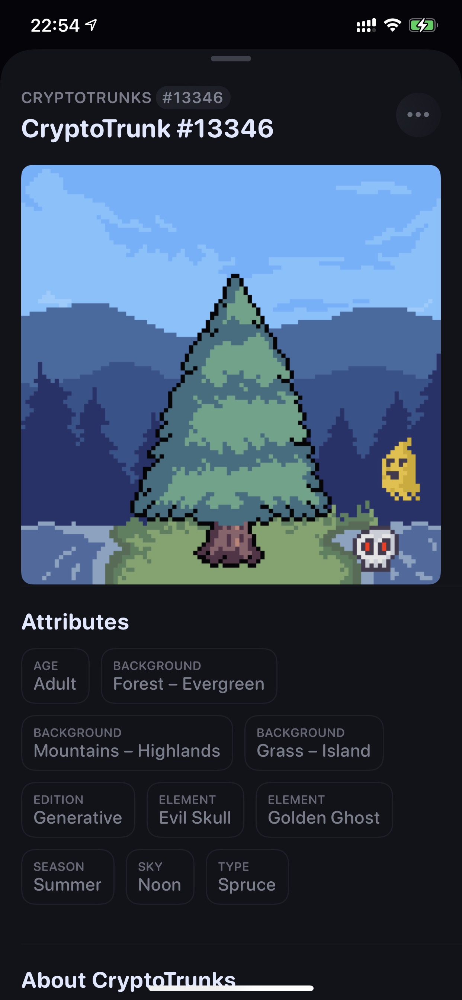

# CRYPTO TRUNKS: See how much CO2 your ethereum transactions emit and how tall a tree grows? | Today's Pick

> Today, NFT4Metaverse recommends the world's first NFT project using oracle and zero carbon emission: **Crypto Trunks** ✨✨✨✨
>
> Website:**cryptotrunks.co**

**By ABMTF_crypto**

High energy consumption and lack of environmental protection have become another controversial topic in this bullish crypto market. Not long ago, Elon Musk used this as an excuse to suddenly announce the suspension of accepting bitcoin payments for Tesla cars, surprisingly triggering the deepest round of plunges this year.

Crypto Trunks is the industry's first NFT project that uses a prophecy machine to calculate carbon emissions and randomly generate collectibles.

Crypto Trunks uses the Chainlink prophecy machine to look at the transaction history of your ethereum wallet address to calculate how much Gas was spent in total, and thus extrapolate how many kilograms of CO2 were produced in total, combining other wallet data and variables to generate a random 100 by 100 pixel tree - if you If you have more transactions and consume more Gas, the thicker the tree will be to indicate how much you are "spoiling" the environment 🌲 !

Crypto Trunks are divided into 19,500 Generative Trunks (available by airdrop) and 1,500 Genesis Trunks (priced at 0.5 ETH), for a total of 21,000 - an apparent tribute to the 21 million total Bitcoins. Since the project went live on May 21, the day after the biggest crash of the year, Generative Trunk has been fully claimed and 1,500 Genesis Trunks have been bought, with 1,026 bought.

As shown above, this Generative Trunk number 13346 has 10 attributes and 7 layers (sky, background elements, mid-ground 1 and 2, tree and foreground elements).

- Age: Adult, an attribute generated based on the Gas spent on wallet transactions over the calendar year, with 5 levels of **Sapling, Young, Adult, Old and Ancient**, each size being one order of magnitude larger than the previous one.
- Sky (sky): Noon, this attribute is determined by the year in which the first transaction of the wallet took place, this one being the wallet enabled in 2018.

Other layers and attributes have different probabilities of scarcity (list of attribute scarcity, which can be checked by joining the project Discord). When collecting Generative Trunk, you can keep swiping and swiping until you find a tree you think is very rare and pay Gas to collect it. You can of course get a second or third Generative Trunk, but the Gas for casting NFT keeps adding up.

Genesis Trunk has a fixed price of 0.5 ETH and its properties are completely different from Generative Trunk, the project owner uses Chainlink VRF (Verifiable Random Function) to determine which tree you get, so it is a truly randomly generated collector NFT.

As the graph shows, Crypto Trunks is currently actively traded on Opensea: over 10,000 collectors have listed and traded over 20,000 trees, with a total of 91.3 trees traded successfully for an average price of 0.17 ETH.

highest*sale_price: 4.25 ETH*

On May 29th, the project announced that it had partnered with Offsetra to offset over 5,200 tons of CO2 from all NFT casting that occurred at the project, making it the first carbon-free NFT project in the industry.

### Reference Links

- Ether Wallet Trading Carbon Emissions Calculator: **https://carbon.fyi/**
- Carbon Emissions Calculator: **https://www.notion.so/Carbon-FYI-Methodology-51e2d8c41d1c4963970a143b8629f5f9**
- Carbon offset website:** https://offsetra.com/**

This project above is presented by NFT4Metaverse and see you next time!
