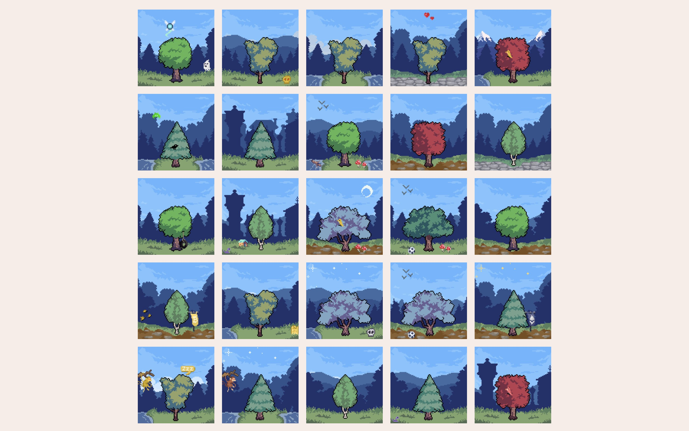
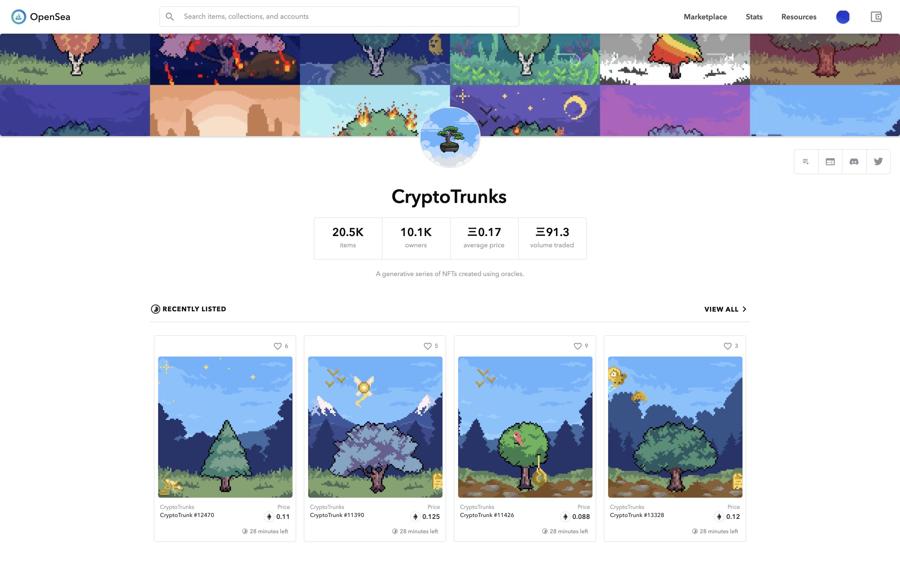
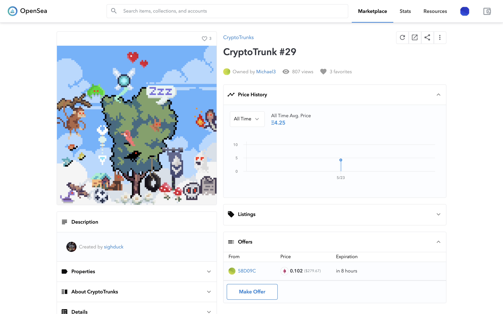

# CRYPTO TRUNKS：看看你以太坊钱包交易排放了多少二氧化碳，长成了多高的树？ | Today's Pick

> 今天，「元宇宙特攻队」为你推荐全球首个使用预言机、无碳排放的 NFT 项目：**Crypto Trunks** ✨✨✨✨
>
> 网址：**cryptotrunks.co**

**By ABMTF_crypto**

能耗高、不环保，成为这轮牛市加密货币和 NFT 爆红出圈的又一争议话题。前不久，在币圈呼风唤雨的马斯克以此为借口突然宣布特斯拉暂停接受比特币支付购车，竟然引发了今年幅度最深的一轮暴跌。

创意玩法层出不穷的的 NFT 经受住了这次深度调整，自然没有放过碳减排、环保这一热门题材。Crypto Trunks（加密树）就是业内第一个使用预言机计算碳排放量随机生成收藏品的 NFT 项目。

Crypto Trunks 使用 Chainlink 预言机查看你以太坊钱包地址的交易历史，来计算总共花费多少 Gas，从而推算总共产生多少公斤二氧化碳，结合其他钱包数据和变量，随机生成 100 乘以 100 的像素树——如果你钱包发生的交易量、消耗的 Gas 越多，标志你「糟蹋」环境程度的树 🌲 就越粗！

Crypto Trunks 分 19500 棵 Generative Trunk（空投可领取）和 1500 棵 Genesis Trunk（售价 0.5 ETH），总数 21000——显然是在向总量为 2100 万个的比特币致敬。项目在今年最大幅度暴跌发生后的第二天 5 月 21 日上线至今，Generative Trunk 已全部被领完，1500 棵 Genesis Trunk 已被买走 1026 棵。

如上图所示，这棵编号为 13346 的 Generative Trunk 有 10 个属性、7 个图层（天空、背景元素、中景 1 和 2、树和前景元素）：

- Age（年龄）：Adult（成年），这一属性根据钱包历年交易花费的 Gas 生成，分**树苗、年轻、成年、年长和古老** 5 个等级，每个尺寸都比上一个大一个数量级；
- Sky（天空）：Noon（中午），这一属性由钱包第一笔交易发生年份来决定，这个是 2018 年启用的钱包。

其他图层和属性则拥有不同概率的稀缺性（属性稀缺性清单，可加入项目 Discord 查询）。在领取 Generative Trunk 的时候，可以不停地刷，一直刷出你认为非常珍稀的树，支付 Gas 领取。你当然可以领取第二第三棵 Generative Trunk，但铸造 NFT 的 Gas 不断加码。

Genesis Trunk 固定售价 0.5 ETH，其属性与 Generative Trunk 完全不同，项目方使用 Chainlink VRF（可验证随机函数）来决定你获得哪棵树，因此它是真正随机产生的收藏 NFT。

如图所示，Crypto Trunks 目前在 Opensea 交易活跃：有 1 万出头收藏者挂牌交易 2 万多棵树，总共有 91.3 棵树交易成功，平均售价 0.17 ETH。

_售价最高：4.25 ETH_

5 月 29 日，项目方宣布与 Offsetra 合作抵消了超过 5,200 吨项目发生的所有 NFT 铸造产生的二氧化碳 ，成为业内第一个无碳排放的 NFT 项目。

### 参考链接

- 以太坊钱包交易碳排放计算器：**https://carbon.fyi/**
- 碳排放计算方法：**https://www.notion.so/Carbon-FYI-Methodology-51e2d8c41d1c4963970a143b8629f5f9**
- 碳排放补偿网站：**https://offsetra.com/**

这里是「元宇宙特攻队」，我们下期见。
