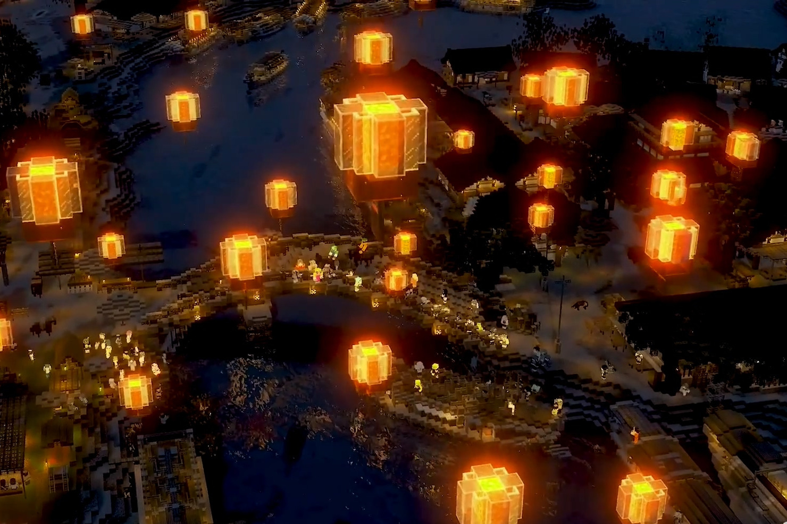
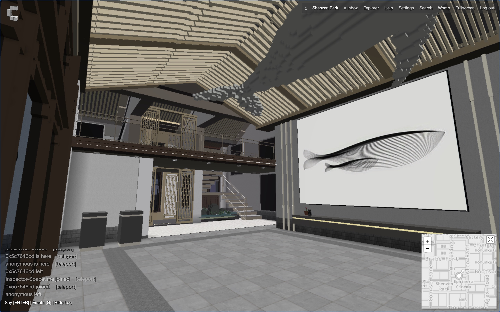
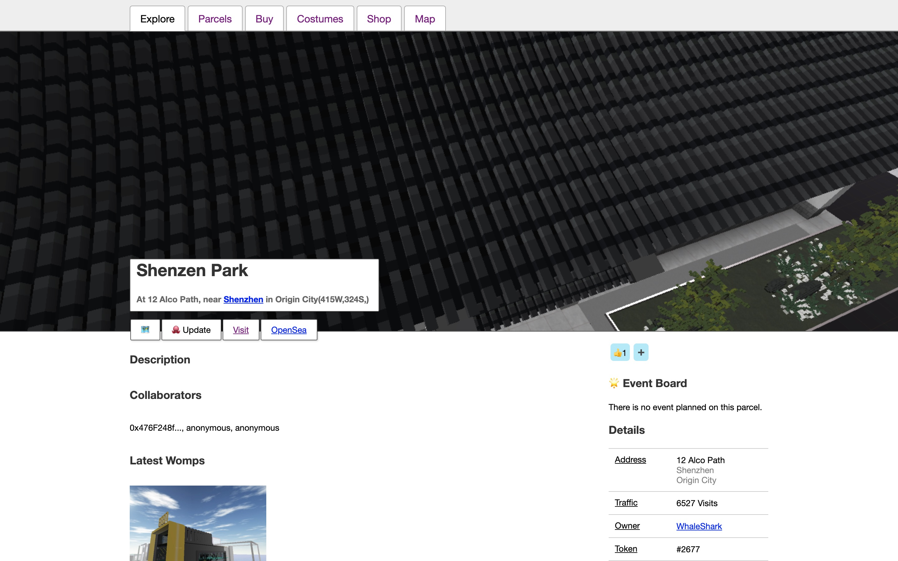

# 国建《清明上河图》NFT 推出在即，元宇宙资本独家披露合作始末 | Today's Interview

> 「国家建筑师 Cthuwork」缘何发售《清明上河图》NFT 盲盒、挺进元宇宙？「元宇宙特攻队」特邀元宇宙资本合伙人 Alen 为你独家披露。

**By Alen**

<iframe style="width: 100%; height: 500px" src="//player.bilibili.com/player.html?aid=540082845&bvid=BV1mi4y1b76M&cid=172799113&page=1" scrolling="no" border="0" frameborder="no" framespacing="0" allowfullscreen="true"> </iframe>

这是在 B 站拥有 70 万粉丝的「国家建筑师 Cthuwork」去年 4 月 3 日发布的原创视频。国建通过体素艺术用无数方块积木立体化复现了画家张择端勾勒的北宋京城汴梁及汴河两岸的自然风光与繁华景象，至今在 B 站获得 722.9 万播放量、4.1 万条弹幕，全站排行榜最高第 3 名，被 B 站官网「入站必刷 78 大视频」收录。「国家建筑师 Cthuwork」2012 年成立，一直在 Minecraft 虚拟世界中搭建中国传统建筑广受欢迎。

据悉，「国家建筑师 Cthuwork」将于 6 月 24 日推出体素版《清明上河图》NFT 盲盒，从《清明上河图》的长画卷中提取具有戏剧性和特色的人物制作 20000 份限量版数字盲盒，这些盲盒将基于 BSC 链进行发行。盲盒销售完毕后，国建团队将会开启《清明上河图》元宇宙的建设。

今年 1 月，专注于 Metaverse 投资的「元宇宙资本」与「国家建筑师 Cthuwork」达成合作。今天，「元宇宙特攻队」特邀元宇宙资本合伙人 Alen 撰文独家披露其对 NFT、Metaverse 的洞察与投资合作逻辑：

> 我是 2017 年就了解了 Decentraland，当时就很喜欢这个概念，老游戏玩家嘛，想象力还是有的，但当时不太成熟，所以一直没怎么参与。契机是去年年底 NBA Top Shot 的大火，文化（体育）+金融，让我们看到了 NFT 能借助赚钱效应的形式，快速破圈的可能性。
>
> 我们很快意识到这将带来 2 个非常大的变化：
>
> 1. NFT 这个载体能快速地将所承载的信息和金融结合，结果就是曾经叫好不叫座的内容和创造力将会被大量地激活。大量个体激活之后将带来的是新的协作形式；
>
> 2. Metaverse 或者虚拟空间的加速到来，本质上是宏观经济、货币政策、技术、人才、资本在疫情催化下的一次共振，是一个全新的市场，意味着有大量未开垦和未被定义的市场，早期的探险家就会获得话语权、规则定义权，并且获得大量的红利。
>
> 在这种大变革下，如果不早点去争夺话语权，是一件很可惜的事情。以上在当时只是朦朦胧胧的感觉，但这种感觉背后配合上赔率思维，已经足以让我们行动起来。随之而来的是想要和什么样的项目走近一点。
>
> 我们从 NFT 这个 Metaverse 底层基石的源头出发去思考这个问题：
>
> **承载信息+金融+可编程+区块链**
>
> - 区块链，意味着能持续存在，能持续产生影响
> - 信息：意味着文化和传播，喜闻乐见的内容总是更能引起大众的共鸣，获得更多的共识，带来社交的可能性和更大的生命力。
> - 金融：与 Crypto 的结合，能带来创新的模式
> - 可编程：意味着后续能持续迭代更多玩法
>
> 很自然地想到，投资 Metaverse 的建筑生产力是一个很棒的方向：
>
> 1. 短期稀缺，大部分人喜欢当李嘉诚炒地皮，而缺乏设计建造能力，我们认为在 Metaverse 里还这样是不太合理的；
> 2. 虚拟建筑一旦建造能持续存在，成为虚拟空间里的社交场所，潜移默化的对玩家产生影响力；
> 3. 参考现实生活中的建筑行业、当下的主流币圈，Metaverse 里还有大量模式有待开发，想象空间很大；
> 4. 优质的建筑生产力是“可插拔”的，类似于“中间件”。
>
> 这样，又能很自然的想到 Minecraft 里，Crypto 由于年龄段的原因，从小接触的就是像素风和体素风的画风，又和 Minecraft 的玩家高度重合，所以 Minecraft 里本身就有大量的优质内容天然适合引入到 Crypto 的世界。
>
> 于是在今年 1 月，我们在朋友的引荐下，很荣幸接触到了国内最大的 Minecraft 团队——国建，他们的作品《Minecraft 版的清明上河图》在 B 站已经累积拥有了 700 多万的播放，也被 B 站推到了入站必刷榜之中。同时还有《故宫》、《火锅城》、《千里江山图》等大量优质作品。他们带给我们更多的是惊喜，因为他们最强大的核心能力，是人才的培养能力，社区里已经有 250 名高级建筑师，以及更多还在成长中的建筑是，年龄分布在 15 到 30 岁之间。如果这些人才都能被引入到 Crypto 的世界中，那我们相信能加速 Metaverse 的构建，把更多优质的东方元素建筑带入到 Metaverse 的世界中。
>
> 我们也很高心他们看到了 NFT 的价值和可能性，在早期加入建设者的行列中来。
>
> 我们元宇宙资本继续想做的，就是找到类似国建这样的优质内容创作团队，通过更先进的激励形式，进一步激活创造能力，加速 Metaverse 的到来。

_地址：https://www.cryptovoxels.com/parcels/2708_

除了上述 NFT 盲盒发售，「国家建筑师 Cthuwork」已经受 WhaleShark 邀请在 CryptoVoxels 建造名为「深圳公园」的中式建筑。

_地址：https://www.cryptovoxels.com/parcels/2677_

这里是「元宇宙特攻队」，我们下期见。
