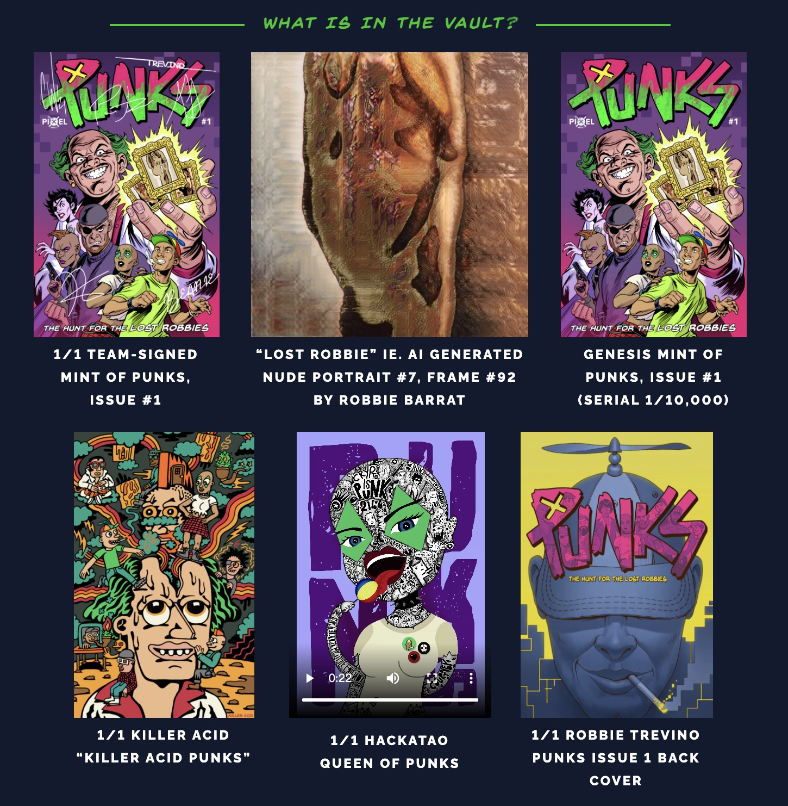

# 朋克漫画：有故事、漫画、衣服和 DeFi 功能的 NFT | Today's Pick

> 今天，「元宇宙特攻队」为你推荐一个基于 CryptoPunks 开发的，有故事、有漫画、有衣服，还有 DeFi 功能的 NFT 项目：**PUNKS the Comic**（朋克漫画）✨✨✨✨
>
> 官网：**https://punkscomic.com/**

**By ABMTF_crypto**

Larva Labs 在 2017 年开发并免费分发的 10,000 个 CryptoPunks，作为第一个建立在以太坊上的 NFT，如今成为最为珍稀的数字收藏品：据 DappRadar 排行榜显示，CryptoPunks 销售交易额 3.5 亿美元，排名第二，仅次于 NFT 销售冠军 NBA Top Shot 的 5.9 亿美元，但 CryptoPunks 平均单价为 2.58 万美元，而 NBA Top Shot 仅为 103 美元。

如此高价的 CryptoPunks，能不能让更多人拥有呢？PUNKS the Comic（朋克漫画）设计了一套有意思的玩法和机制：

5 月 10 日，首期朋克漫画创始发行，价格 0.2 ETH，包含以下权益：

- 连载朋克漫画第一期，ERC-721 标准的 NFT，铸造 10,000 个
- 印刷版漫画，全球免费送货。限量印刷 10,000 份（只有不销毁 NFT 的用户才能领取印刷版漫画，领取时间另行通知）
- 有 27 份类似幸运抽奖，可随机抽到来自艺术家 Hackatao、Killer Acid 和 Robbie Trevino 的朋克 NFT 作品

购买了首期朋克漫画 NFT 后，咋玩？到了 7 月，会有两种玩法：

- 质押：在 24 个月里分享占总量 50% 的 $PUNKS 代币。$PUNKS 代表项目拥有的 16 个 CryptoPunks 的碎片化所有权（价值 600 多 ETH）

- 销毁：获得创始人金库 DAO 治理代币，其代币最大数量与漫画 NFT 一致，10,000 枚，即销毁一个漫画 NFT 换取一枚治理代币。持币者可以对金库进行 DAO 治理（例如筹集资金以获得新的金库资产），享有金库持有的 25% $PUNKS 代币和作品（首期内容见上图）销售或整个金库被买断的权益，并可加入私有 discord 群组。这个金库的价值将会通过朋克漫画发起者 Pixel Vault 后续项目持续增长。

值得注意的是，只有购买首期朋克漫画 NFT 才有资格参加 $PUNKS 质押或销毁 NFT 换取创始人金库治理代币，未来发行的漫画不享有这一权利。

总量为 1 亿的 $PUNKS 代币由 NFT 细分化平台 Fractional 发行，代表 16 个画进漫画故事里的 CryptoPunks 的价值（初始价值 1250 ETH）。$PUNKS 代币持有者可对全部买断 16 个 CryptoPunk 的底价进行投票。投票对底价达成一致，即触发整个 CryptoPunks 金库的拍卖，而单个 CryptoPunk 不得出售。75% $PUNKS 代币归入质押池和创始人金库 DAO，25%则为 Pixel Vault 团队保留。

项目方相当良心，还制作朋克漫画周边，商品销售的 100% 利润将直接归属于 $PUNKS 代币持有者。

最有意思的是，这 16 个 CryptoPunks 并不是放在金库里铸造 NFT 细分化代币完事，而是被 Pixel Vault 团队画进了漫画，首部朋克漫画《搜捕失踪的罗比》就有这 16 个 CryptoPunks 扮演的角色，这代表了 NFT 在元宇宙中内容化媒介化的一种可能性。

因此，第二期朋克漫画计划以最近火爆的猿猴为角色来创作，社区用户可以提交自己猿猴形象作为第二期的主角，前提条件是必须拥有第一期朋克漫画的 NFT 才能提交，而且每部漫画只允许提交一次。

## 关于 Pixel Vault

一家专注于通过 IP 开发、以去中心化和众包方式在各种媒体上提升加密原生资产的媒体公司，通过产生价值的故事和知识向利益相关者和更广泛的加密社区扩展了静态链上资产。

这里是「元宇宙特攻队」，我们下期见。
