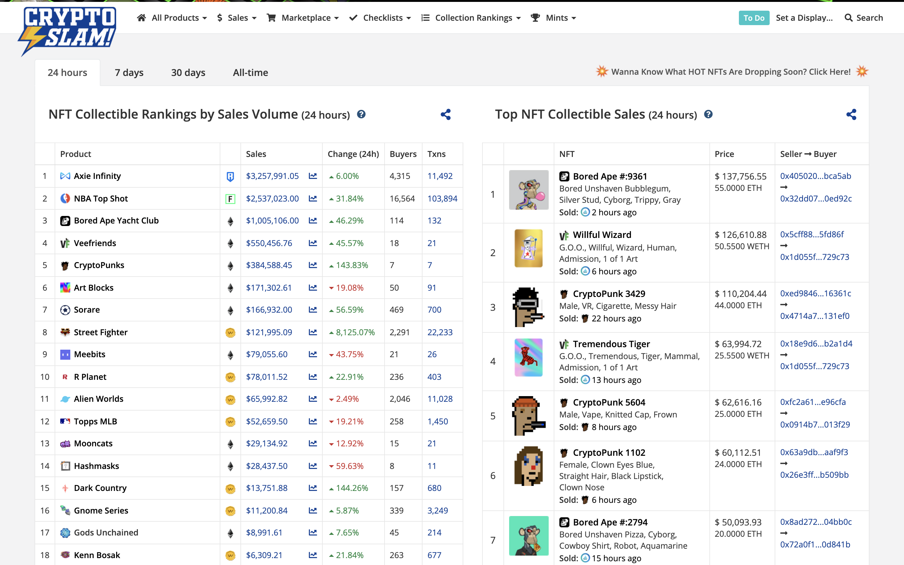
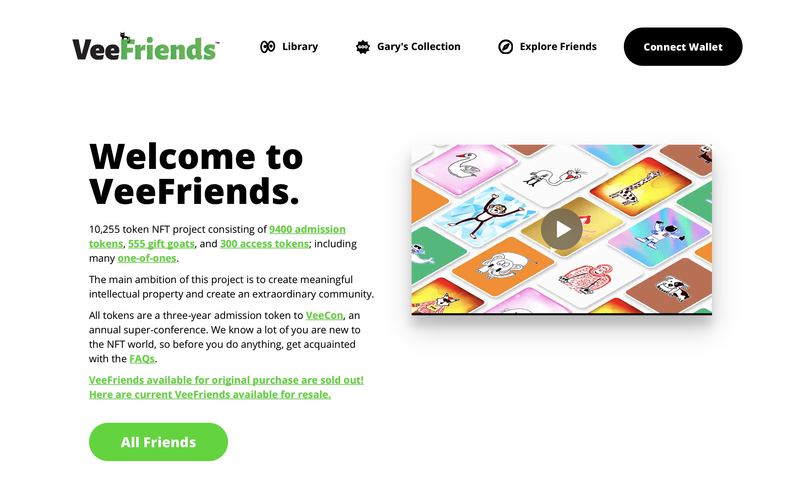
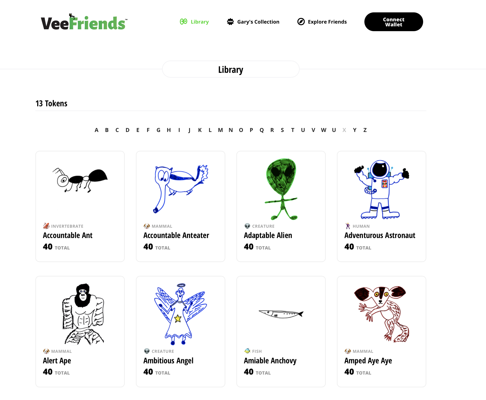
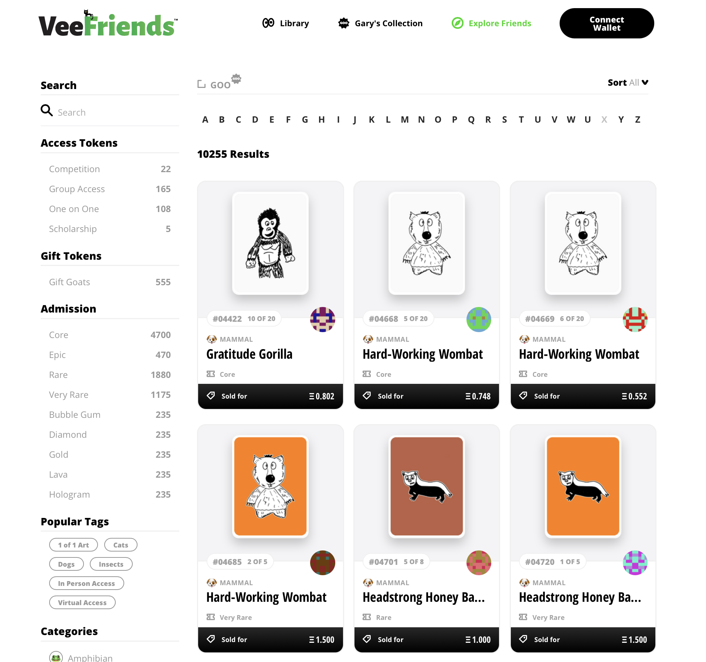
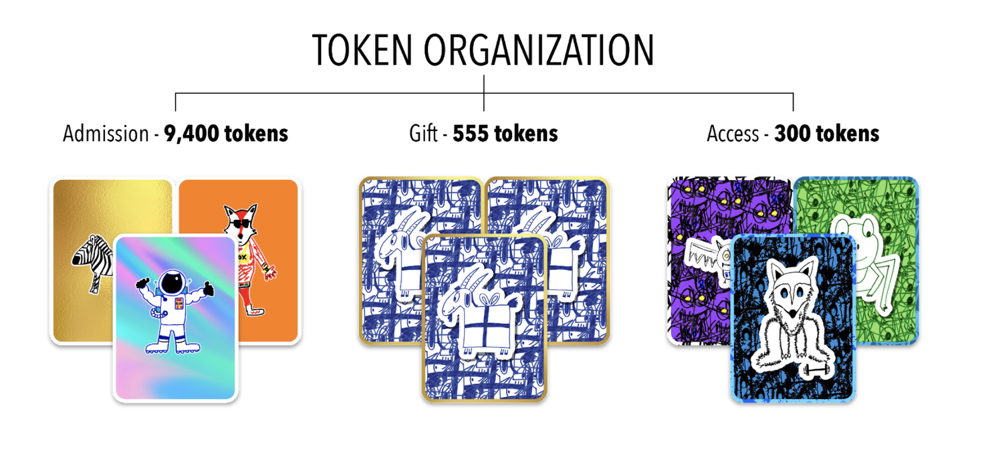
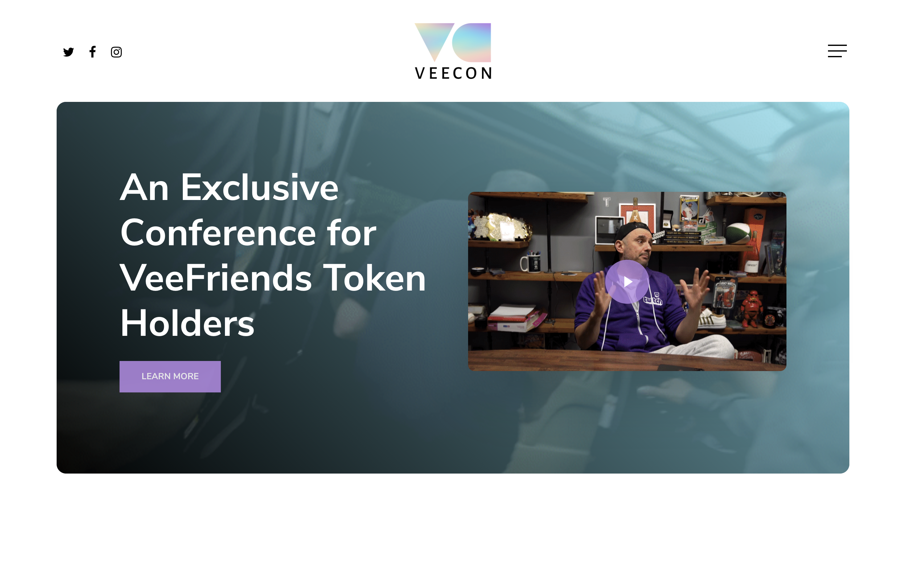
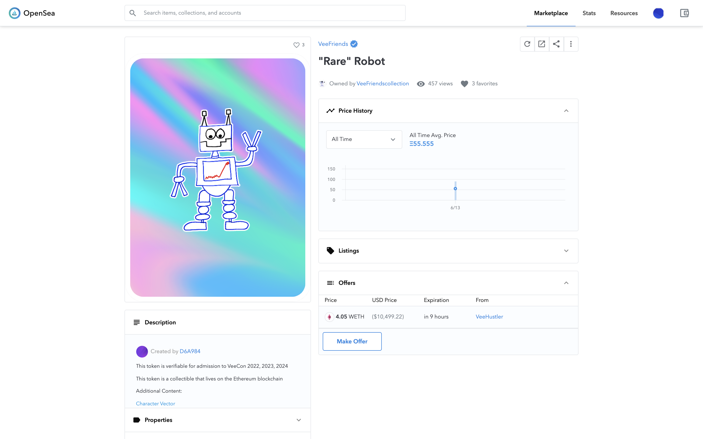
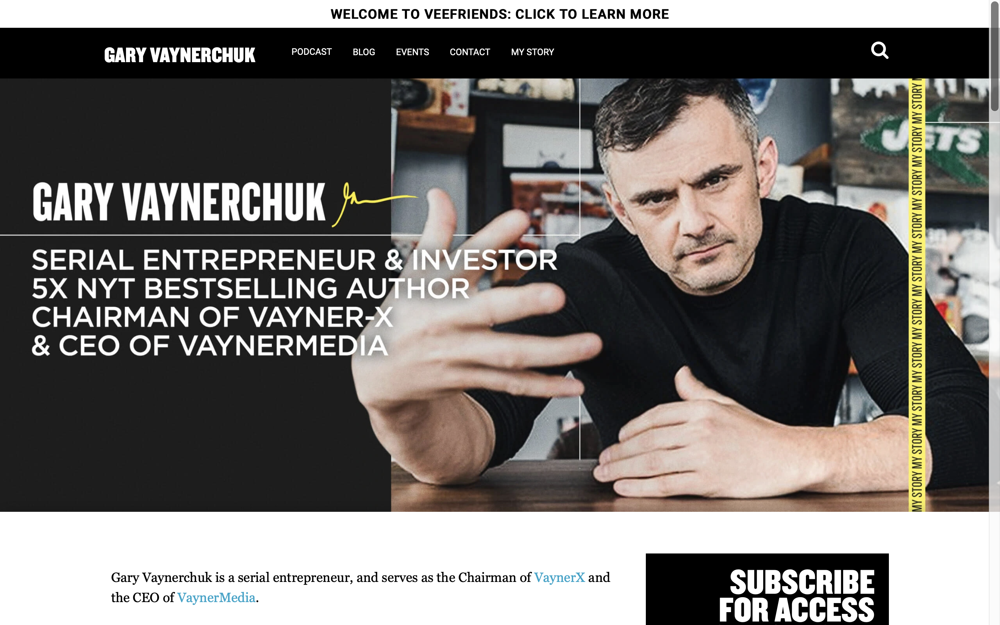
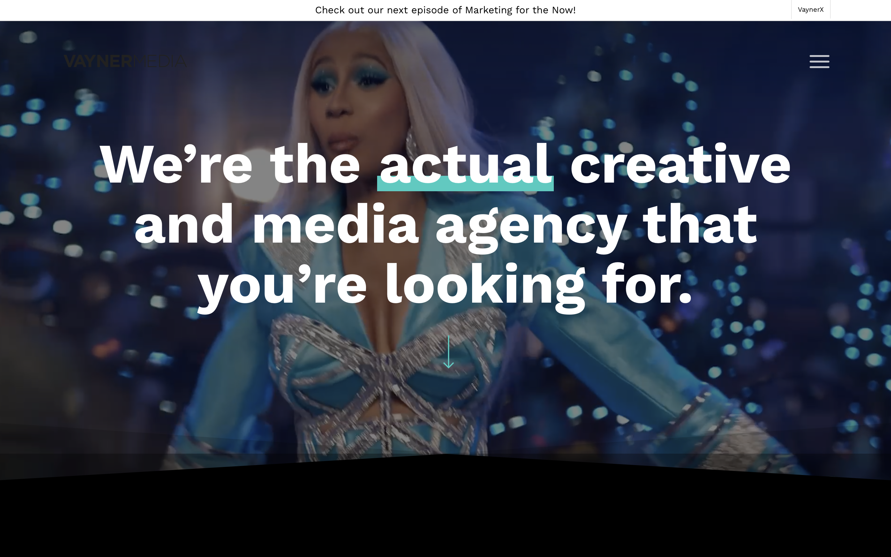

# VeeFriends：24 小时冲榜前 4 的社交 NFT | Today's Pick

> 今天，「元宇宙特攻队」为你推荐一位美国明星企业家 Gary Vaynerchuk 发行的社交 NFT：VeeFriends ✨✨✨✨✨
>
> 官网：**veefriends.com**

**By ABMTF_crypto**

经常关注 NFT 排行榜 [CrptoSlam](http://cryptoslam.io/) 的朋友最近会发现有个新项目，其 30 天销售额名列第 7（$6,670,334.85）、7 天销售额名列第 5（$3,558,786.93）、过去 24 小时销售额名列第 4（$538,575.37），和 Axie Infinity、NBA Topshot、Bored Ape Yacht Club 等热门项目并驾齐驱，它就是 [VeeFriends](https://veefriends.com/)。

从官网首页的短视频介绍可以得知，VeeFriends 是这个名叫 Gary Vaynerchuk 的成功企业家为他创建的以创意和商业为主题的社区发行的社交 NFT。

这个 NFT 是数字收藏品，也是大会门票（可连续参加 2022 年、2023 年和 2024 年 VeeCon 大会），还是能够和 Gary Vaynerchuk 一起进行线上一对一交流、线下聚餐玩运动的会员权益凭证。

很显然，这就是最近兴起的社交代币（Social Token）。但和用 ERC 20 智能合约一键发币不同，VeeFriends 的所有 268 个形象角色全部由 Gary Vaynerchuk 自己动手一笔一划画出来的，可谓诚意满满。

发行总量为 10,255 个的 VeeFriends 代币分为 3 种：

- **Admission（9400 个）**：主要权益是连续参加三年 VeeCon 大会的门票（有效期截至 2024 年 5 月 4 日）。Admission Token 是具有不同稀有性和可收藏性的数字收藏品，每种角色形象不同，数量也不同。
- **AGift（555 个）**：持币者可获得由 Gary 和 VeeFriends 团队策划的礼物体验。此外，Gift Token 也是 VeeCon 大会连续三年的门票。
- **Access（300 个）**：持币者可以和 Gary 一起吃饭、打球或参加车库销售等各种体验。其中 210 个代币提供的是线上交流，90 个是面对面交流。此外，Access Token 也是 VeeCon 大会连续三年的门票。

## VeeCon 大会是什么？

定于 2022 年、2023 年和 2024 年连续三年，专门为 VeeFriends 持币者举办的 VeeCon 大会将围绕商业、营销、灵感、创意、创业、创新、竞争展开，当然还有很多有趣的娱乐活动。

Gary Vaynerchuk 说，VeeCon 的灵感来自他参加过的各种喜欢的商业大会、音乐节、夏令营活动等。VeeCon 可能是他多年来一直想举办的大派对，希望给所有参会的持币者带来巨大的分享交流和社交价值。

VeeFriends 5 月 12 日采用荷兰式拍卖开售，迅速售罄。目前二级市场交易最贵的 NFT 高达 55 ETH。

## 谁是 Gary Vaynerchuk？

发行如此成功的社交 NFT 的 Gary Vaynerchuk 究竟何许人？

连续创业者、现任 VaynerX 董事长和 VaynerMedia 首席执行官的 Gary Vaynerchuk 现年 45 岁，1978 年随全家从白俄罗斯移民到美国纽约。7 岁起就开始推销柠檬水，读高中时就销售了数万美元的棒球卡和玩具，14 岁帮家里人做装冰袋的生意。

Gary 对新鲜事物特别敏感，上世纪 90 年代互联网泡沫兴起时，他把父亲经营的本地酒类商店转型为最早的酒类电商平台之一，实现了从 300 万到 6000 万美元的爆炸性增长，并把业务改名为 Wine Library。在为 Wine Library 做运营推广时，Gary 2006 年起在 YouTube 开始拍摄播放名为 WineLibraryTV 的视频节目，几乎每天一集，持续了 5 年。通过此，Gary 对线上内容、电商、Email 营销、谷歌广告投放等了如指掌，不仅成为营销传播方面的畅销书作家，而且成立了 VaynerMedia 这家数字广告公司，为百事可乐、通用电气、强生、大通等 500 强企业提供全案服务。

除了经营多项业务外，Gary 通过社交媒体实时记录了他作为 CEO 的日常生活，在所有平台上获得超过 3000 万粉丝。他的播客 The GaryVee Audio Experience 跻身全球顶级播客之列。Gary 是五次《纽约时报》畅销书作家，也是最受追捧的公众演说家之一。

现在常被人称为 GaryVee 的 Gary 能及早敏锐地识别趋势和模式，并帮助他人了解这些变化如何影响营销和消费者行为。无论是新兴艺术家、电子竞技、NFT 投资还是数字通信，Gary 都了解如何将品牌相关性带到最前沿。而且，他还是一位活跃的天使投资人，早年投资了 Facebook、Twitter、Tumblr、Venmo、Snapchat、Coinbase 和 Uber 等。

所以，这么一位大佬来试水发行社交 NFT，果然势大力沉……

这里是「元宇宙特攻队」，我们下期见。
