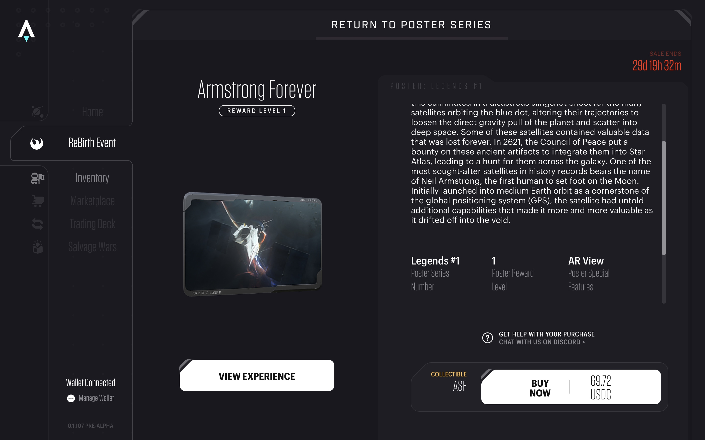
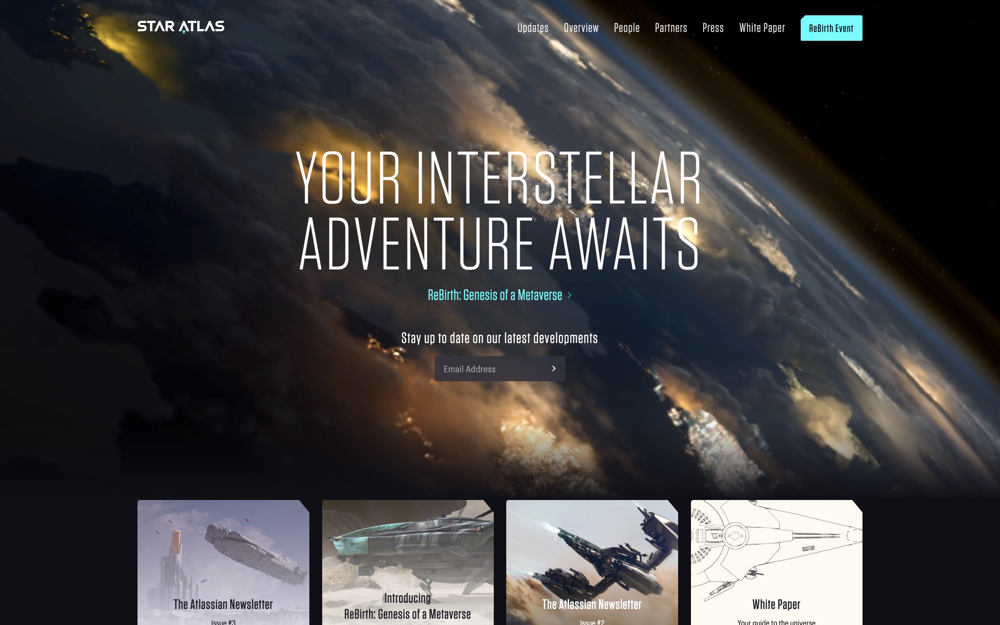
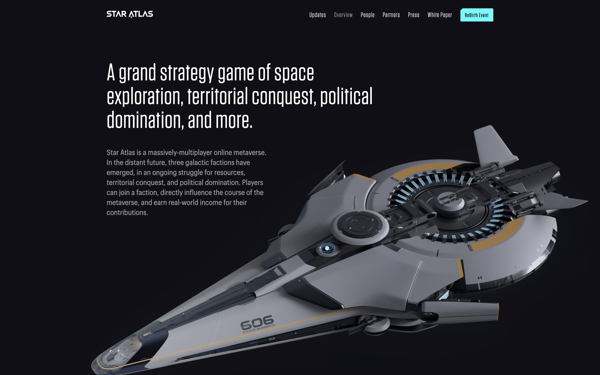

# Star Atlas：从收集 AR 海报开启的太空游戏元宇宙 | Today's Pick

> 无垠的太空永远是最令人神往、引人入胜的元宇宙题材。今天，「元宇宙特攻队」为你推荐基于 Solana 链上的元宇宙游戏项目：Star Atlas ✨✨✨✨✨
>
> 官网：**staratlas.com**

**By ABMTF_crypto**

6 月 17 日，当全世界关注「神舟十二号」飞船升空将三名中国宇航员送往「天宫号」空间站的时候，美国 SpaceX 也发射了猎鹰 9 号火箭将升级版 GPS III 卫星送入轨道，以纪念第一位踏上月球的人类宇航员尼尔·阿姆斯特朗（Neil Armstrong）。

这次纪念的方式有所不同。发射卫星的业主美国太空部队、发射卫星承运商 SpaceX 和元宇宙游戏项目 Star Atlas 首次合作发布名为「Armstrong Forever」（永远的阿姆斯特朗）的 NFT，一款带有 AR（增强现实）效果的元宇宙海报（meta-poster）。

（video）

点击打开[海报链接](https://play.staratlas.com/rebirth/3J73XDv9QUsXJdWKD8J6YFk4XxPNx5hijqjyxdNJqaG9) ，用 Instagram 或 Facebook 手机 App 扫码，即可看到视频呈现的三维立体、跃出电脑屏幕的 ARMSTRONG GPS III — SV05 卫星。这份 USSF 推广活动的第一张海报 6 月 15 日开售，7 月 20 日（即人类首次登月 52 周年纪念日）截止，售价 69.720 USDC，以纪念阿姆斯特朗在 1969 年 7 月 20 日那一天登月。

在 Star Atlas 打造的太空主题元宇宙里，这个 NFT 不只是一张炫酷的 AR 海报，而是拥有一套独特的游戏奖励，包括一艘带有白色热皮的独家 Opal Jet 太空船、带有一个采矿站发电厂的采矿装备和一个带有交易甲板的轨道空间站。拥有 Armstrong Forever NFT 还有机会享有各种游戏内福利，如游戏内尼尔·阿姆斯特朗制服补丁、宇宙飞船的轨道卫星附件和游戏内复古太空服。海报能被铸造成可转售的 NFT，在整个 Star Atlas 元宇宙中使用。

上述 NFT 道具只有你加入 Star Atlas 虚拟游戏元宇宙才能发挥作用。

Star Atlas 设定在 2620 年这个遥远的未来，有人类、外星人和机器人三派势力互相为资源、领土和政治统治而持续争夺。玩家可以成为某一势力一员来影响这场星际冲突的结果，同时凭借自己的贡献获得奖励。而 Star Atlas 取名灵感来自于古希腊神话中的擎天巨神阿特拉斯（Atlas），Atlas 这个单词意为地图册，Star Atlas 游戏的一个主要目标就是探索、导航和发现星球，并为其他探索者记录相关数据。

Star Atlas 是一款采用 Unreal 游戏引擎实现电影级视觉效果的大型多人在线游戏，也是希望基于 TPS 高达 5 万的 Solana 区块链运行，融合 NFT 和 DeFi，最终建成一个星际冒险的虚拟世界。团队具有打造 3A 级游戏和 DeFi 丰富经验，因此设计了颇为丰富的「play to earn」（边玩边赚）的玩法和机制：

- **深空探索**：在 Star Atlas 的开放宇宙中旅行到任何地方。所有可见的星星都可以手动导航到或完全记录在地图册中。
- **势力安全区**：安全区将新手玩家引入 Star Atlas。中深太空区域允许更高质押的对战和更高的挖矿收益。
- **战斗**：所有舰船、空间站和陆地设施都配备了各种武器和盾牌，用于攻击和防御。
- **空间站模块化建设**：升级空间站和地面设施以解锁更高的层级和功能。
- **舰员和飞船组件舾装**：分配合适的舰员并安装最好的设备，以提高飞船的分数并扩展其能力。
- **职业**：选择适合理想职业路线的舰员和船只。从赏金猎人到数据运行者等等，职业千差万别。
- **去中心化自治公司**：游戏中创建的派系允许玩家集体竞争、整合资源、自治和管理自己的微观经济。
- **经济模型**：玩家可以将游戏中的虚拟收入提取为现实世界的收入，完全支持去中心化的、玩家驱动的经济。

元宇宙游戏是内嵌自由市场和经济模型的虚拟世界，因此 tar Atlas 设计了两种代币和市场：

- ATLAS 代币：用于获取飞船、舰员、土地和设备的原生游戏代币，它也是主要用于市场交易货币。
- POLIS 代币：多功能治理代币，应用于游戏内和指导现实世界的经济政策。
- 通用市场：连接所有参与者，是买卖所有资产的枢纽。玩家还可以发布付费游戏内任务的列表。

Star Atlas 的建设才刚刚开始，上述机制设计目前还处于蓝图阶段。团队宣布 7 月 23 日新网站发布，7 月 24 日发布浏览器小游戏，并发售银河系资产。而在此之前，Star Atlas 发布了主题为「ReBirth」（重生）、总共 14 张不同内容的高清海报，每张海报都带有 AR 体验、音乐和游戏内奖励。用户可以购买元宇宙海报并将其铸造成 NFT，用于收藏或出售。

这里是「元宇宙特攻队」，我们下期见。
