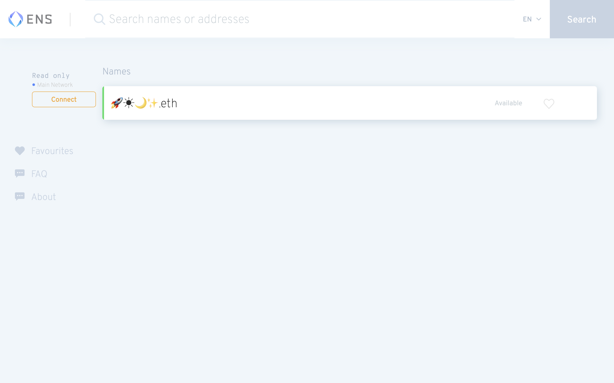

# ENS 和 YAT，谁将成为元宇宙的身份通行证？ | Thought for Today

> 和现实世界一样，未来元宇宙里每个人都需要自己的身份。那么，ENS（以太坊域名）和 YAT（表情包域名），谁将成为行走 Metaverse 的通行证呢？
>
> ENS 官网：**ens.domains**
> YAT 官网：**y.at**

**By JESSCATE93**

## ENS：让以太坊成为 Web 3.0 的互联网门户

吸引集聚目前最多加密协议资产和用户的以太坊，不经意解决了长久困扰互联网的一个重大问题：单点登录（Single Sign-On，缩写 SSO，也译为「一键登录」）。

_“使用以太坊登录”似乎正在成为登陆未来互联网每个应用的整体解决方案_

熟悉使用以太坊平台的朋友会发现，无论是登陆各种 DApp，进行 DeFi 或 NFT 交易，在 Opensea、Rarible 等 NFT 平台上注册成为艺术家展出作品、链接到自己的博客，只需连接你的以太坊钱包（如 MetaMask 这样的主流钱包 App 或浏览器插件）便可通行无阻。如果注册一个 ENS（用户名+密码），不仅能让你直接访问以太坊生态的所有服务，并可以代表独一无二的你。

特别是 ENS 最近开放了表情（Emoji）域名注册，这让你的 ENS 不仅是通行证，还是彰显可爱"个性"的数字名片。

### 传统互联网身份登录的“单点故障”

- 传统互联网没有内置个人用户名/认证系统，IP 地址会根据设备/位置而变化，而且 DNS（域名系统）从来都不是真正意义上的个人 ID 系统。每个服务都需要知道你是谁，所以每个 App 都创建了自己的用户名/密码系统。
- 于是就是我们熟悉的剧情，人们重新使用写在便利贴上的弱密码；不厌其烦的注册，每用一个新 App 就要注册一次，密码还不能一样，黑客们频繁出没……解决方案之一如密码管理器，但这玩意儿谁用啊。

- 过去十年中的另一种解决方案是社交登录。你已经有了 Google、Facebook 等社交帐户，那为什么不直接登录新服务呢？用户不必单独创建又一个「用户名+密码」，新服务不必管理它——双赢？

但是，问题来了：

- 用户真的希望 Google、Facebook 控制整个互联网的「用户名+密码」的身份登录吗？
- 较小的服务真的想听任这些大公司的摆布吗？
- 由大公司控制的 SSO 永远不可能是「中立的」。

而且，人们在用 Google 帐户登录所有服务时仍然在使用弱密码。

### 作为新范式的以太坊登录，如何做到中立的？

- 首先，以太坊为普通人提供计算机生成的公钥/私钥对，并配备适当的系统以将它们安全地连接到服务，加密货币的激励措施终于完成了之前互联网先驱、密码朋克的理想。

- 其次，以太坊私钥是由你控制的安全密码。无需中央服务即可使其工作，只需用你的私钥签名即可。你的私钥在自己的设备上生成，自己保管。不过，用户需要用户界面和体验良好的钱包来存储/使用他们的私钥，像 MetaMask、WalletConnect，还有我们之前介绍的彩虹钱包等这些钱包产品都在致力于此。

## YAT：建立自己的表情包互联网门户 🤑

Yat 是一个用表情包打造成的去中心化的数字身份识别系统，它的起名的规则是：

在已有的表情包库里，随意搭配成 3 位及以上的组合，放在 y.at/ 后面。想买 1-2 位的话，需要单独联系官方。

Yat 起名有个稀缺性计算机制：RS 主要由每个 Yat 的**长度**决定。其他因素包括 Yat 中使用的表情符号的平均流行程度（基于当前的全球使用情况）和 Yat 的模式（即重复的表情符号或"书尾"表情符号）。简而言之，就是越短越贵，元素越热越贵；对称的比非对称的贵，重复的比不重复的贵.

### 亮点：表情包是人们最熟悉且距离最近的传播元素

表情包是和人们生活最密切相关的传播因子，一 emoji 顶千言啊 🙄 ；表情包是与人们指尖距离最近的 memes，也是我们片刻放下生活意义时的会心调侃。Yat 这个标准的提出在于，你可以在这里拥有这些元素。

Yat 是占领表情包叙事的第一个项目，并为它提出了一个有趣的价值框架：**群体行为决定稀缺性**。它从 Web 2.0 的域名延伸而来，每个人都要在互联网上有一个门户（domain）的需求依然旺盛。但现在 y.at 的作用只是指代任意一个 Web 2.0 的网页或网页集合。和 ENS 不同，Yat 现在还不是 Web 3.0 的入口，更像是桥梁。

结果，你真的就去排列组合讲自己的故事了。镜花水月 y.at/🔮 🌺 💧 🌕 ，y.at/🌕 🍕 🌕 ，还有我们的 y.at/📺 ⏳ 🕸️ 🌕

我还想了一个「群体选择博弈决定稀缺性」的游戏：

- 试验对象：YAT
- 比如购买三或四个 emoji 做后缀的用户（假如共 1000 人）在目前已有的 xxx 个 emoji 库中随意组合 3 个。1）最终看谁选到最稀缺的组合。2）根据群体行为决定每个 emoji 的稀缺性
- 比如 Jack 选了 🦃️ 🍲 🥑，最终都没人选这仨，那这个就不稀缺。Jessie 选了 💩 💊 📺 ，每个 emoji 被选到的概率分别为 12/1000，25/1000，799/1000，总稀缺性就是乘积。
- 这个游戏的特点：不是事先人为确定好的稀缺性，而是由群体行为最终决定；随机漫步，每个人选任意 emoji 的概率都是一样的，因为不存在偏好（平时可能 🚀🐉 🌕 啥的受欢迎，但现在是群体博弈游戏，行为更不确定，但是赢也没有技巧，纯碰运气）
- 唯一可能的影响，比如可以设计算力差异，比如买更多后缀的人有多次选择 emoji 组合的机会。

是不是有点像什么？这将是 NFT 中一个值得期待的领域——互联网的新门户。Yat 是不是能让表情包成为互联网传播价值的开始（可能它已经是了），这种标准能不能延续下去，Yat 或许可以通过搭桥探索出更多的玩法。

这里是「元宇宙特攻队」，我们下期见。
