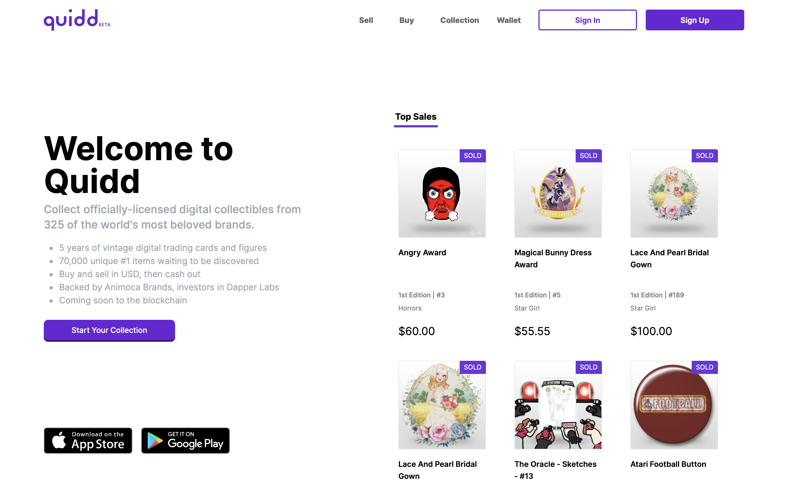
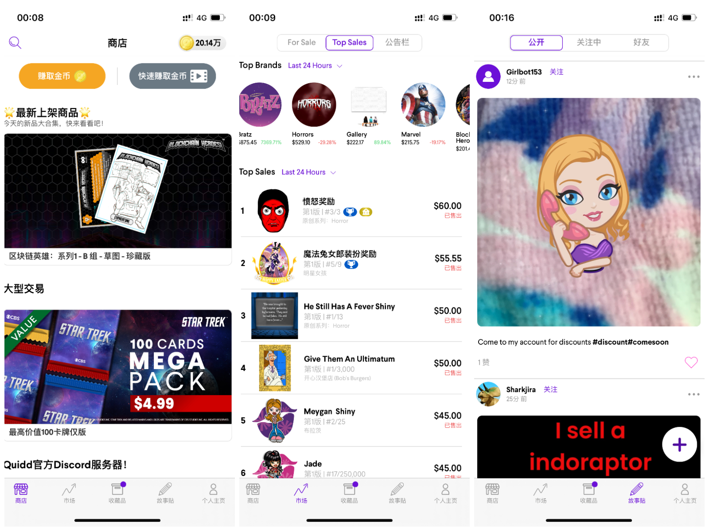
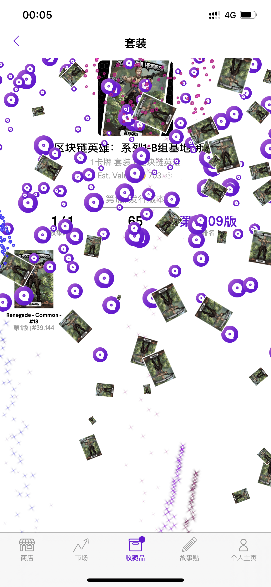
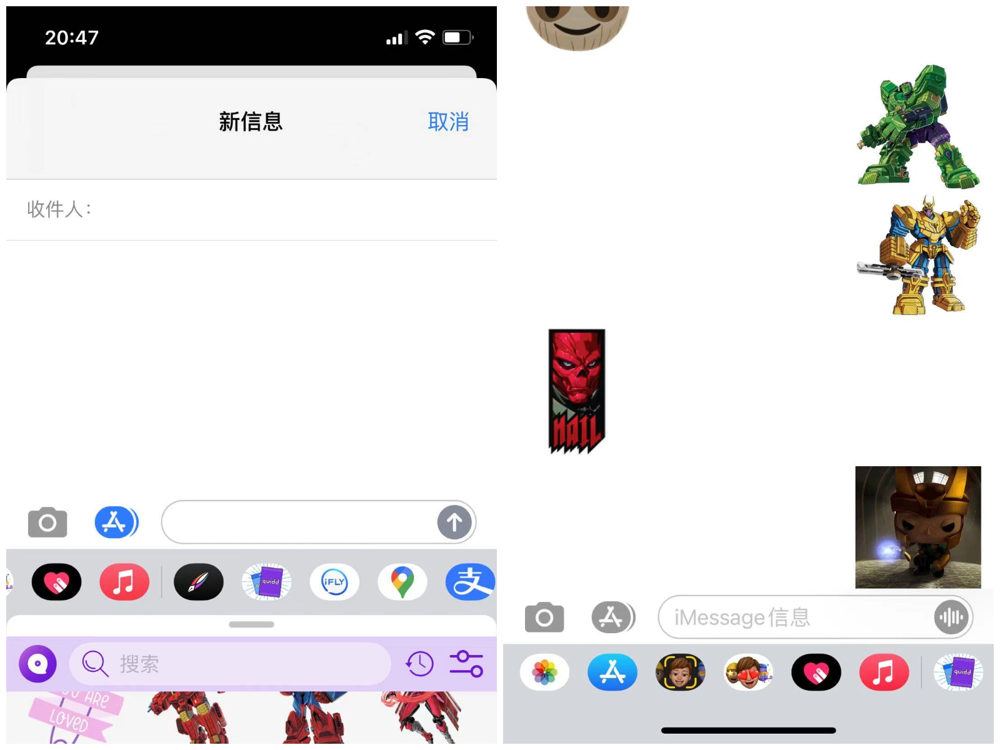

# QUIDD：让你玩得不亦乐乎的数字收藏卡 | Today's Pick

> 今天，「元宇宙特攻队」为你推荐即将进入元宇宙、全球最受欢迎的数字收藏品 App：QUIDD ✨✨✨✨✨
>
> 官网：**market.onquidd.com**

**By ABMTF_crypto**

还记得小时候买了一堆方便面集齐小浣熊卡片全套之后的满足感和快乐吗? 今天，只要你下载 iOS 或安卓版手机免费应用 QUIDD，就可以用虚拟的方式，时时刻刻，想收集什么就收集什么！

和单价高昂的加密艺术品不同，新注册 QUIDD 就有免费的新人卡包供你领取，以开始你的收藏之旅，你每天打开 QUIDD App，就能通过签到、观看广告视频或完成任务赚取金币，当然也可以花上几块钱购买金币来换取你喜爱的收藏卡。QUIDD 内置一级和二级市场，用户可以在一级市场购买，也可以在二级市场购买和出售，并可以使用现金。

和今年牛市 NFT 销售额最高的 NBA Top Shot 只有 NBA 授权的 IP 不同，QUIDD 聚集了众多官方授权、风靡全球的热门电影、欧美剧、日本动漫、电玩、经典卡通、潮玩品牌、球星等 IP，应有尽有！截至 2019 年 8 月的数据，QUIDD 总共获得了包括迪士尼、漫威、HBO 的《权力的游戏》、CBS 的《星球大战》、瑞克和莫蒂、NBA 等 325 个品牌授权，总共销售了 21 亿个独立编号的数字收藏品，目前已经成长为全球最大的数字收藏品市场。

因此，QUIDD 的易用性和可玩性超越了物理实体和目前大部分 NFT 收藏卡。比如，你在 QUIDD 能够收藏到雷射闪卡、烫金闪牌、动态贴图，配上各种华丽高端的特效；或者是可以 360 度随意旋转观赏的 3D 公仔、模型、立体漫画书。收集全套后，你有可能抽中神秘隐藏版。根据收藏系列不同，收集的难度跟挑战性也不一样。而且，每一件虚拟物品都附有独一无二的编号。

具体来说，QUIDD 具有以下特色：

- 收集官方授权、稀有的数字收藏品
- 100 多个热门品牌，一键打开未知的惊喜
- 珍藏你的心爱之物，出售多余物品赚取金币
- 用故事贴向全世界展示你的收藏品
- 登上最具价值、最快集齐排行榜，成为全球 TOP1 收藏家
- 简单的操作： 一键抽卡、收藏、交易、展示！

而且，QUIDD 的卡牌贴纸表情可以通过 iMessage 发送给自己的朋友！

毫无疑问，QUIDD 的主要用户群体针对的是千禧一代和 Z 世代。千禧一代是数字先驱者，见证了搜索引擎、移动互联和即时通讯的崛起，而 Z 世代一出生就生活在一个数字化的世界里，光速般快捷的互联网、智能手机、视频点播、游戏设备和社交媒体伴随着 Z 世代成长，他们可以说是数字世界的首批“原住民”。

随着 NFT 今年的出圈火爆，QUIDD 的收藏者、游戏玩家、动漫及电影的狂热粉丝非常容易接受 NFT 带来的数字所有权的概念。在本来热爱他们的热爱、追随享受品牌 IP 带来的快乐的同时，能够通过完全拥有并交易自己的数字资产来获利，何乐不为？这无疑将大量的传统玩家带入 NFT 和元宇宙的世界。[QUIDD 的官方帮助网站](https://intercom.help/quidd/en/)明确说明了这些套装和物品在未来可以由所有者自行决定在区块链上铸造为 NFT。

就在 6 月，基于 Harmony 的 NFT 平台[达芬奇画廊](https://davinci.gallery/)成功拍卖了 QUIDD 的几幅印象派画家莫奈的 NFT 画作。

QUIDD 的 NFT 之旅，刚刚开始……

## 关于 QUIDD

QUIDD 是 2015 年在美国纽约创立的数字收藏品公司，2017 年从红杉等机构融资 1300 万美元，2019 年被位于香港的游戏公司、如今 NFT 领域的重要玩家 Animoca Brands（投资了打造加密猫和 NBA Top Shot 两个 NFT 爆款的 Dapper Labs）和分片公链 Harmony 联合收购。

题外话：QUIDD 联合创始人 Erich Wood 2018 年离开公司后创立了同样做数字收藏品平台的 Tibles，就在 5 月完成了 114 万美元的种子轮融资，领投的则是 Dapper Labs。据悉，应用公测版将于 7 月在 Dapper Labs 开发的 Flow 链上发布。

这里是「元宇宙特攻队」，我们下期见。
