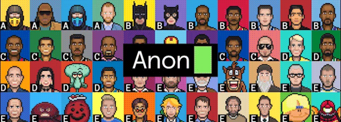
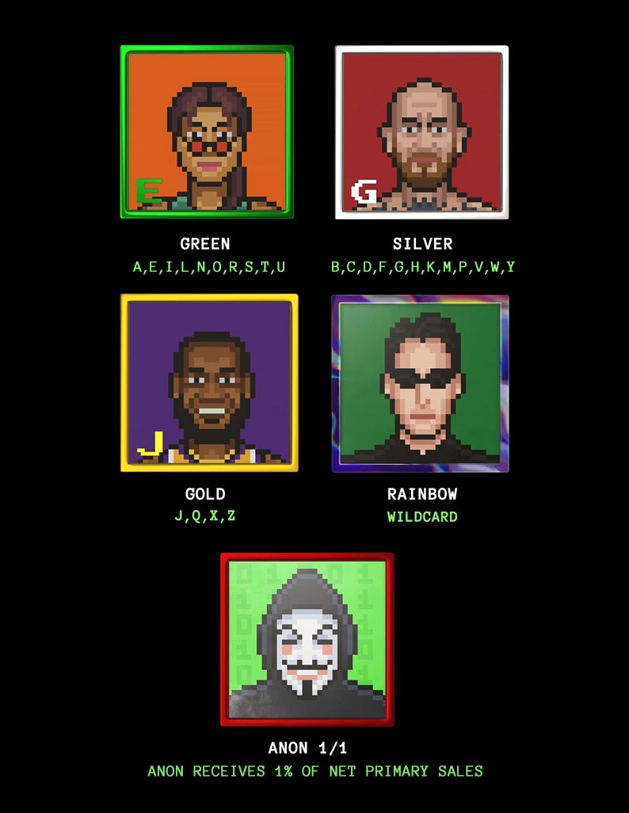
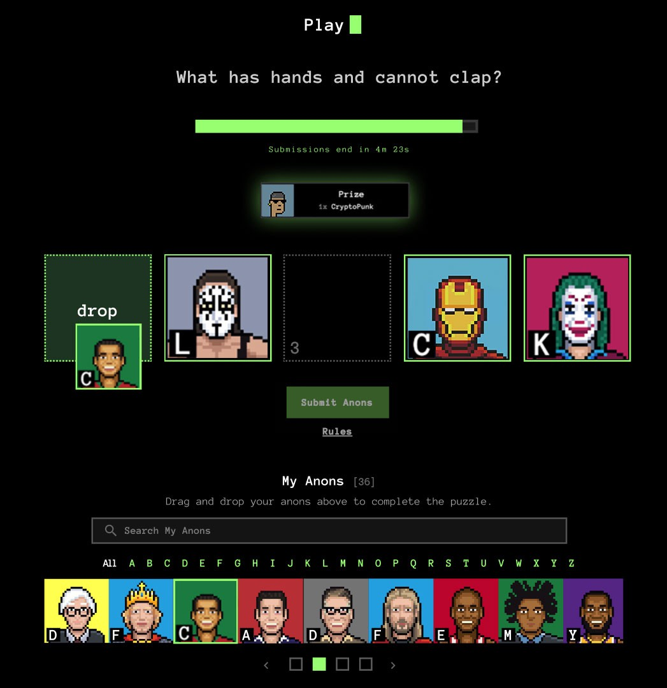
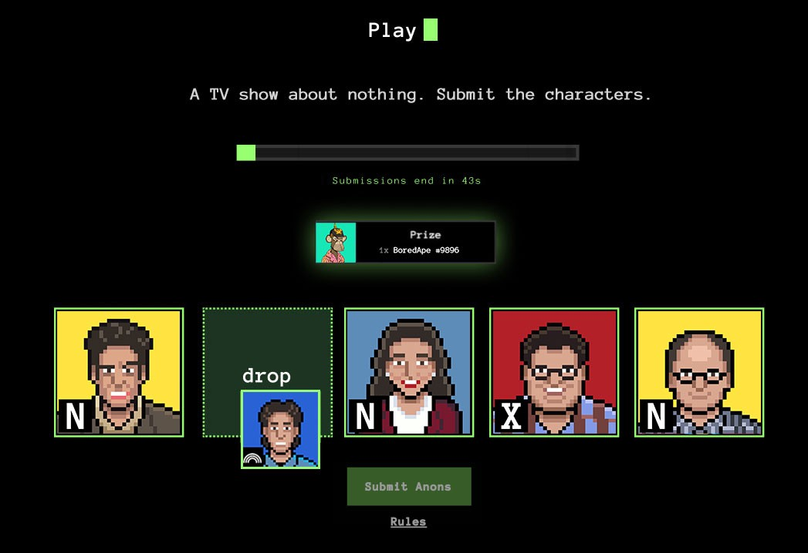
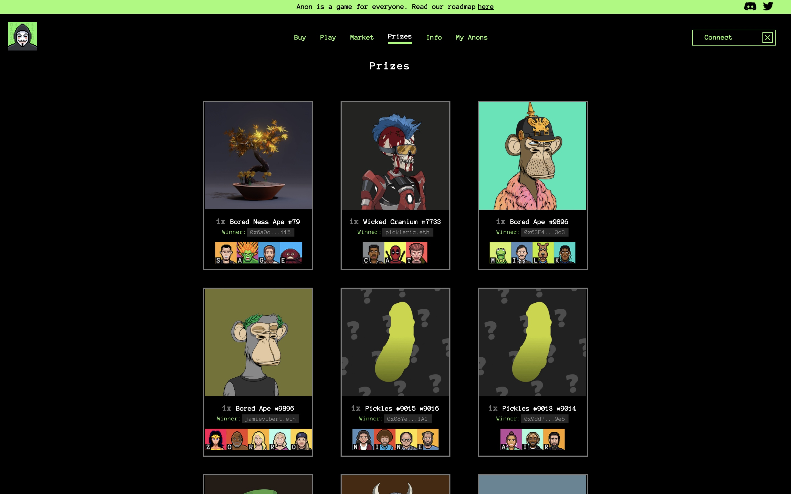
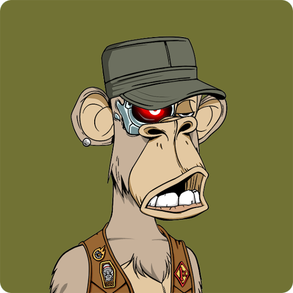
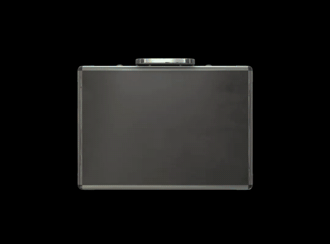

# ANON：拼字谜赢大奖的 NFT 游戏 | Today's Pick

> 今天，「元宇宙特攻队」为你推荐一款拼字谜赢大奖的 NFT 新游戏：ANON ✨✨✨✨✨
>
> 官网：**helloanon.com**

**By ABMTF_crypto**

无论是拍出咋舌天价的加密艺术品，还是大众抢开盲盒的数字收藏品，这轮牛市爆红出圈的 NFT，目前似乎用作炫耀和收藏，暂时没有太多用途。因此，除了 CryptoPunks、Bored Apes 等头部项目，大部分 NFT 难逃热热闹闹开售、冷冷清清收场的尴尬局面。

6 月 17 日上线的 ANON 则尝试为 NFT 收藏品开辟一条新路：拼字谜、赢大奖。

拼字游戏是欧美国家教育普及后长久流行的游戏，许多人会在吃早餐、喝下午茶或者上下班通勤时拿一支笔在刊登字谜游戏的报纸上涂写，以期赢取大奖或纯粹消遣益智。

ANON 则把这个老少皆宜的拼字游戏搬到了元宇宙里。Anon NFT 称之为 Tile（砖块），其代表字母和灵感来自各种流行文化偶像的艺术品。你可以在官网购买、交易和收藏 Anon Tile，也可以参加每周发布的限时游戏以赢取奖励。

每个 Anon NFT 都将根据其稀有等级以及它在游戏中的用途来保有价值。无论你收到什么 Tile，社区里总会其他玩家需要那个字母，这就为每个人创造了双赢局面。社区用户可以玩游戏、收集 Tile，或者如果认为新字谜发布后需求会增加可以在二级市场上购买 Tile。

如果足够幸运，你可能获得唯一限量版的 Anon Tile，能够享有一级销售额的 1%的收益。拼字游戏获胜者不仅可以获得如 CryptoPunks、Bored Apes、朋克漫画这样的稀有的 NFT 收藏品或稀有的实物收藏品等大家，还将在排行榜上获得一席之地，有机会赢得特殊的福利和奖励。

### 游戏怎么玩？

游戏规则很简单：

- 拼字游戏将发布在网站的「游戏」栏目
- 获得带有正确字母的 Tile 来解谜（如果没有，可以转到「市场」购买需要的 Tile）。
- 以正确的顺序放置你的字母
- 在游戏结束之前点击提交
- 收到所有提交后，将在链上所有正确答题的人中随机选择获奖者
- 每个地址将允许一次成功的提交
- 要领取奖品，你必须持有成功解题的 Tile

补充规则：

- 解谜格子里只能使用 1 个彩虹 Tile。彩虹 Tile 是可以代表任何字母的通配符
- 每个帐户每次游戏最多可领取 1 个奖品
- 唯一限量版的 Anon Tile 被视为可以代表任何字母的通配符

ANON 上线才半个多月，已经发布了 14 个拼字游戏，送出了 Wicked Craniums、Bored Apes 和 Gutter Cats 这样的高价值 NFT 奖品。

明天 7 月 3 日周六、后天 7 月 4 日周日美国东部时间上午 10 点，ANON 发布的两个新游戏将分别送出
Gutter Cat 和 CryptoPunk 大奖。

据了解，游戏排行榜也很快上线，社区用户通过正确提交答案或获奖赚取积分，最终得分最高者将赢取稀有猿猴（RARE Cyborg BAYC）。

看到这里，是不是心动了？即刻上官网购买 Anon Tile，还有不到一半的 Tile 静待你开箱参与。

这里是「元宇宙特攻队」，我们下期见。
