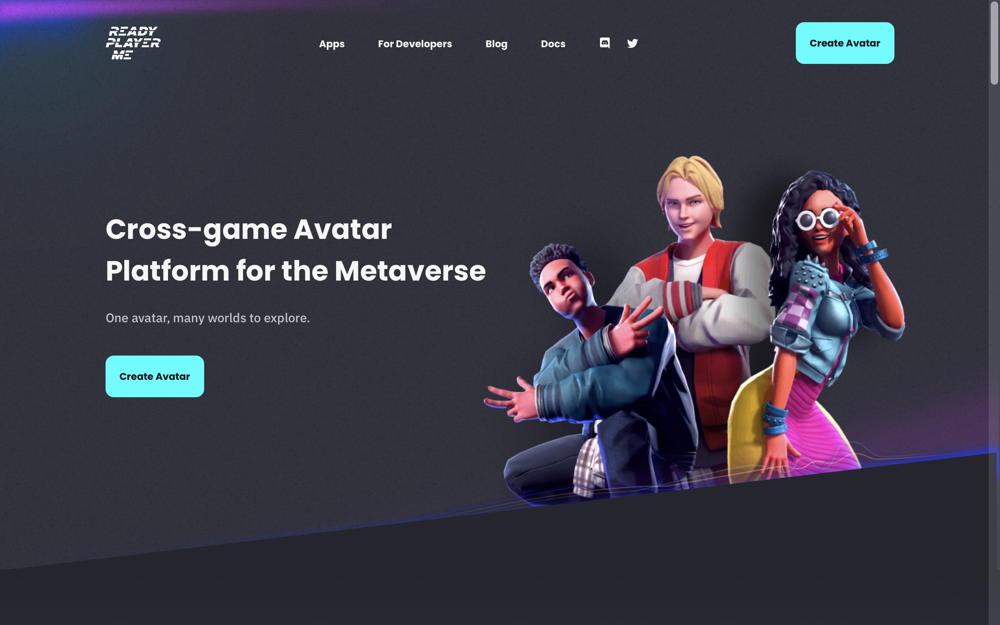
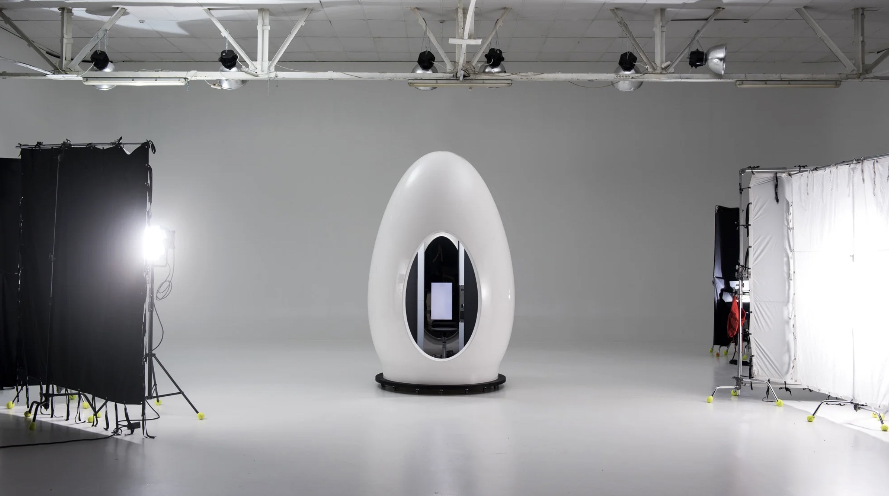
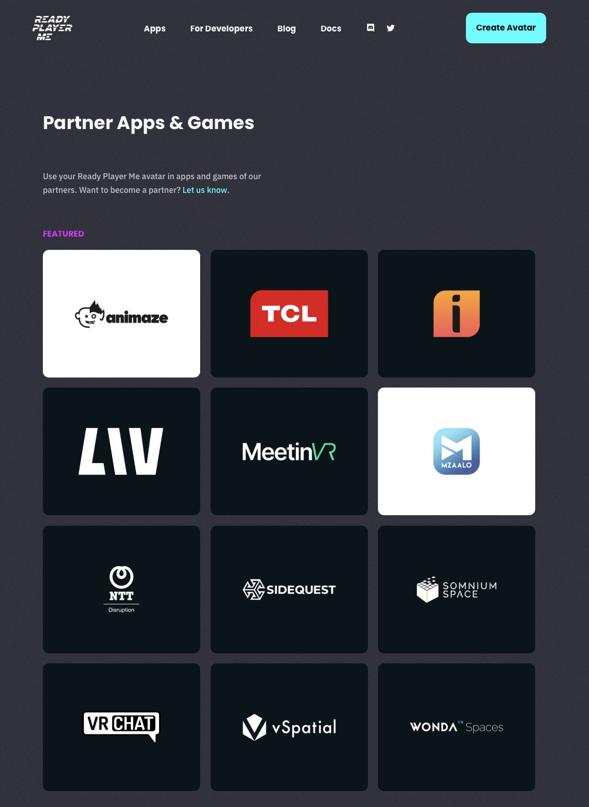
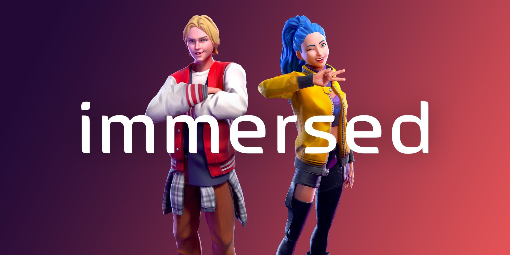
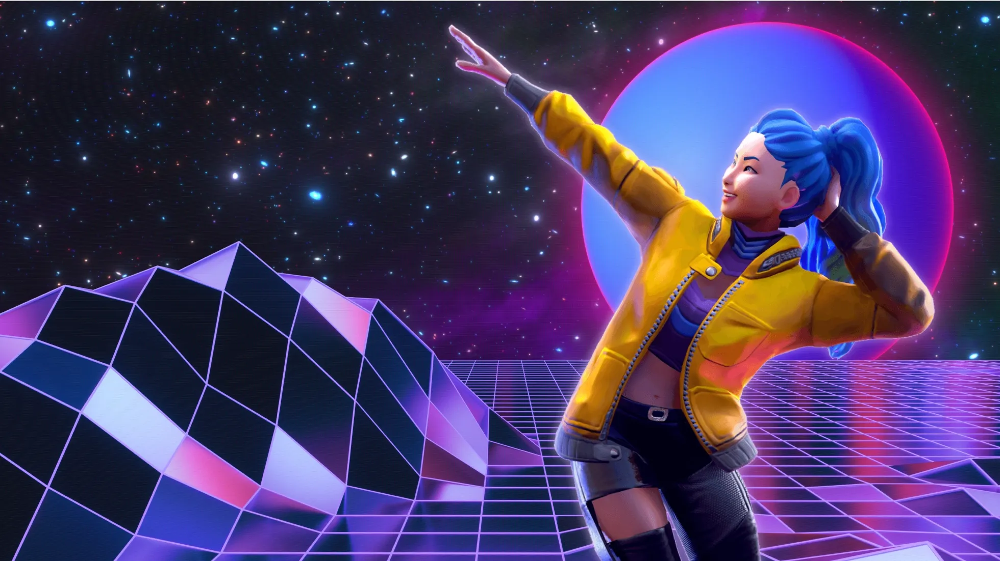
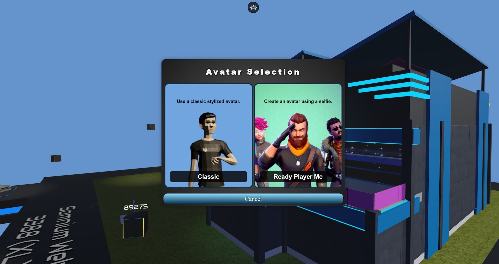
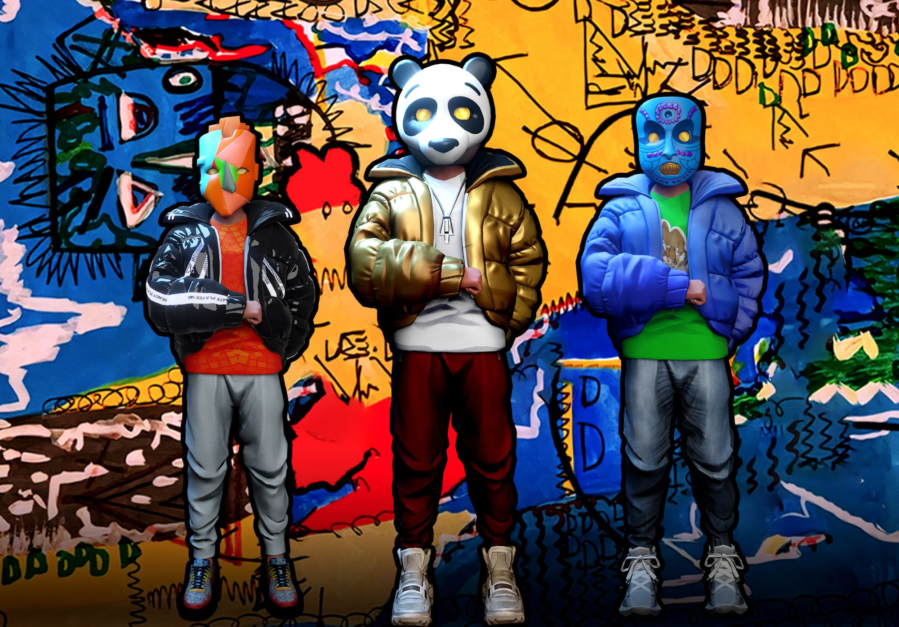
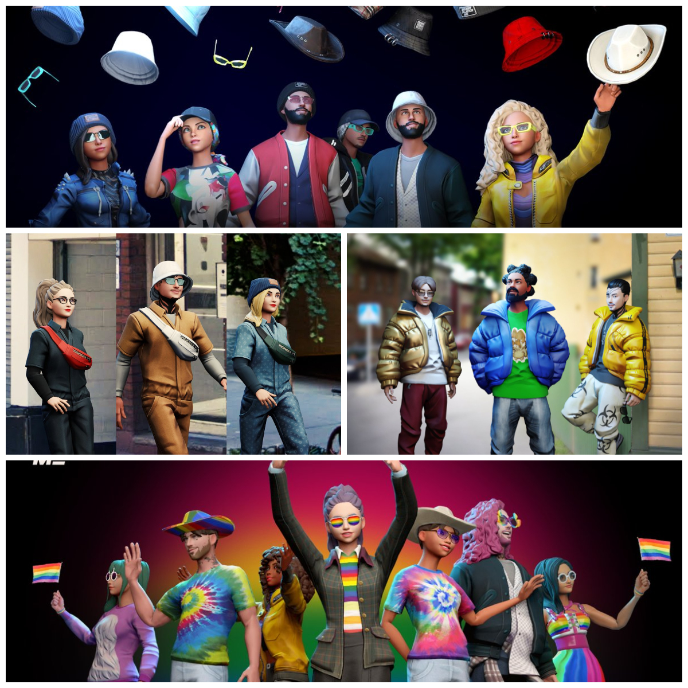

# Ready Player Me：元宇宙统一 3D 头像，探索无穷虚拟世界 | Today's Pick

> 今天，「元宇宙特攻队」为你推荐 Ready Player Me，让你个性化创建 3D 头像（Avatar），自由行走在形形色色的虚拟世界 ✨✨✨✨✨
>
> 官网：**readyplayer.me**

**By ABMTF_crypto**

通过游戏、社交、协作、娱乐，乃至加密艺术、虚拟资产，元宇宙（Metaverse）正在来到你的身边。

毫无疑问，它不会以一个单一的应用、平台和世界呈现在你眼前，而是有成千上万的应用吸引你的浸入。

创建一个专属于你的 3D 头像，用一个统一的身份探索无穷的虚拟世界，势所必然。

Ready Player Me，为你打造进入元宇宙的通行证。

## 打造 Ready Player Me 的是谁？

（Video）

从以上视频可见，上传一张照片或简单的自拍就能生成一个栩栩如生的 3D 头像，你还可以选择编辑头像的肤色发型和穿着装扮。

轻松简易的功能背后，其实技术并不简单。打造 Ready Player Me 平台的 Wolf3D 是一家成立于 2014 年的 AI 公司。他们第一个产品是专业级 3D 扫描仪，在机场、博物馆、会堂等公共场所扫描了超过 20,000 人，收集了大量高质量面部扫描数据库，让 Wolf3D 建立深度学习模型，从而能够根据任何一张任何设备拍摄的自拍照生成完美的虚拟头像。几年来，Wolf3D 与腾讯、华为、HTC、沃达丰和 H&M 等多家公司合作，为他们的用户打造了一流的 3D 头像系统。

## 200 多开发者采用 Ready Player Me 头像

一年前，Wolf3D 发布 Ready Player Me 平台，不仅让普通用户简单几步创建能够通行众多虚拟世界的 3D 头像，还为开发者提供免费易用的工具，让他们的应用和游戏中能够集成现成的 Ready Player Me，不用自研开发 3D 头像系统。在 **readyplayer.me/developers** 页面可见，Ready Player Me 支持 Web、iOS、安卓应用和 Unreal、Unity 两大游戏引擎。

到今年 6 月，Ready Player Me 的普及达到了一个里程碑：有超过 200 名开发者正在将 Ready Player Me 头像添加到他们的应用和游戏中，其中一些已经准备就绪，供你使用、

> Immersed 是一款 VR 工作协同应用，它能让你在最多 5 个虚拟显示器上工作，并与你的同事用 3D 头像在虚拟办公室中交流协作。

> Koji 是社交媒体自我介绍中的链接应用，可让网红大 V 直接与粉丝沟通变现。如今有了 Ready Player Me 头像，沟通联系纽带更紧密。

> Somnium Space 是基于区块链的 VR 虚拟世界，用户自然有定制和拥有 3D 头像在其中漫游的刚需。

> Ready Player Me 通过合作将知名的 NFT 项目 Hashmasks 三个独特面具带给用户限时免费使用。

## 6 步轻松创建 3D 头像

6 月，Ready Player Me 为用户提供潮酷的夹克、帽子、眼镜、腰包、彩虹服装等自定义新选项，让你通过最新的街头服饰系列展示你的风格。

如何在 Ready Player Me 创建你的 3D 头像非常简单：

1. 点击前往 **readyplayer.me/avatar**
2. 选择你的头像类型：

- 全身，非常适合 VRChat 或 LIV 等应用
- 半身，专为 Mozilla Hubs 或 WondaVR 等应用而设计

3. 选择你的体型。如果你不指定，算法将根据你在下一步中提供的照片选择最匹配的体型。

4. 拍摄或上传自拍照。要获得最佳结果，请遵循以下提示：

- 确保光线充足，深色照片会减弱辨别定义头像特征的能力。
- 保持随意，别太严肃，想想你的身份证照片。

5. 自定义头像的服装、头发、眼睛等。Ready Player Me 拥有 300 多个自定义选项，每周都会有新的选项出现。

6. 准备好后，单击“下一步”。

恭喜你成功创建 Ready Player Me 头像。你可以将漂亮的渲染图分享到推特或将你的头像导出到 VRChat、LIV、Mozilla Hubs 或 150 多个支持 Ready Player Me 的应用和游戏。

有一点很良心的是，创建好的文件还能导出 .GLB 的 3D 文件数据保存在本地。

这里是「元宇宙特攻队」，我们下期见。
