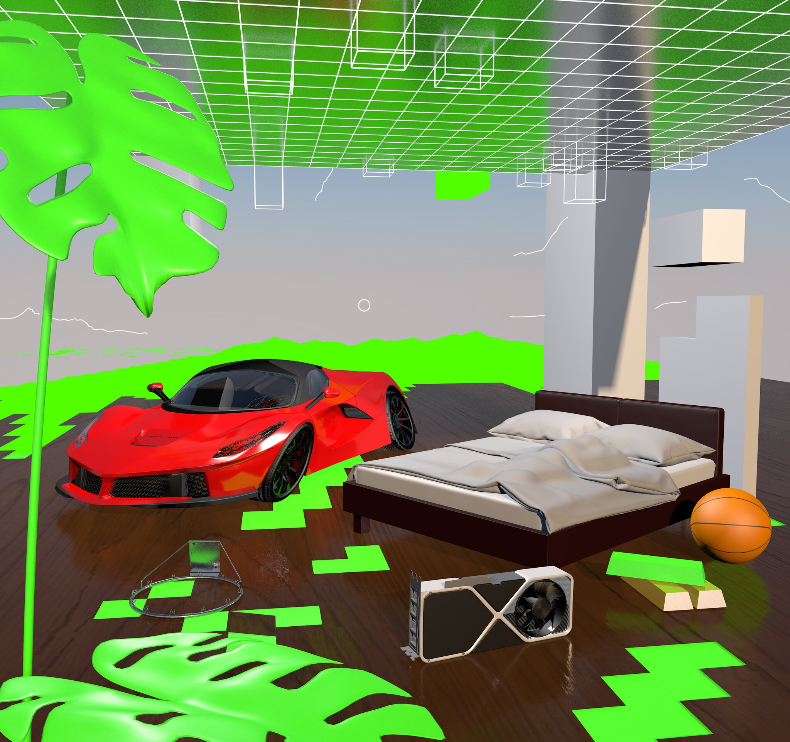
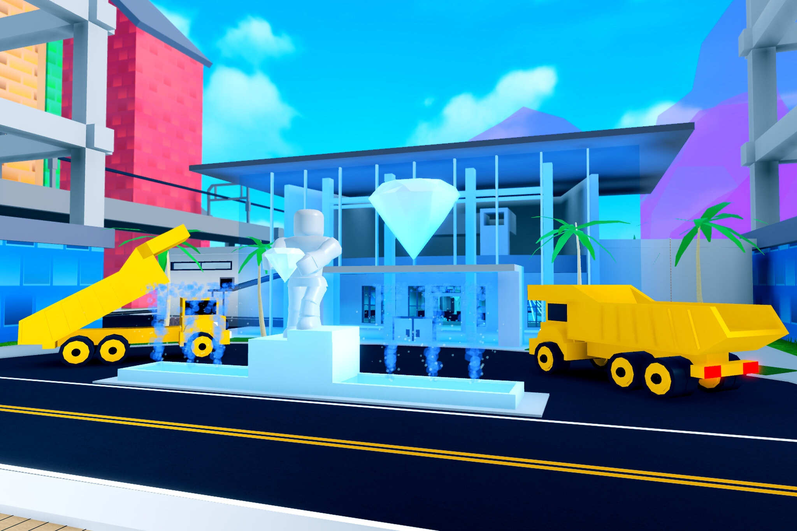
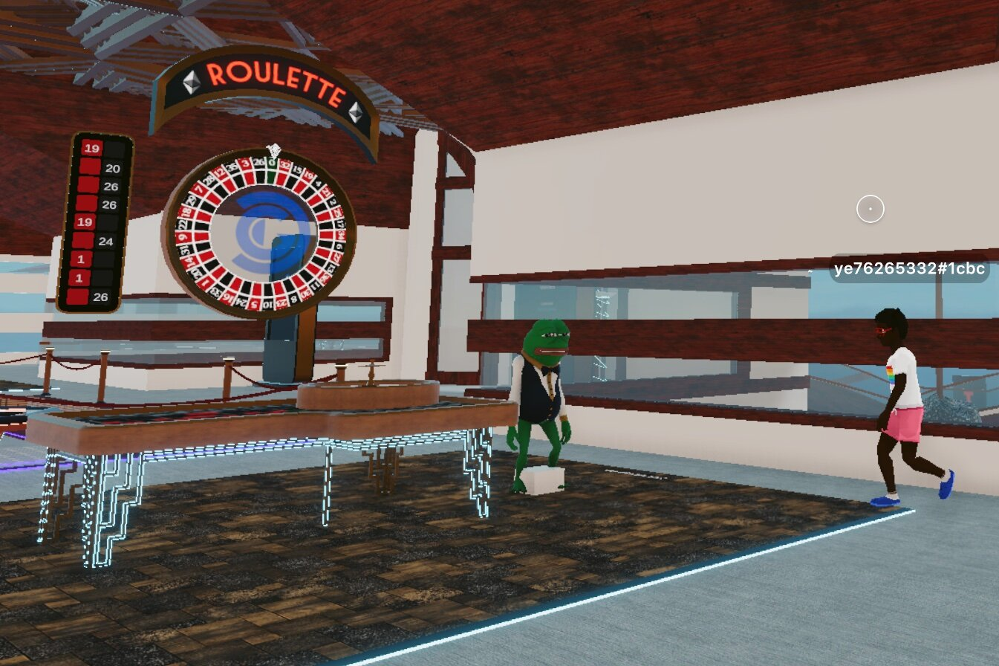
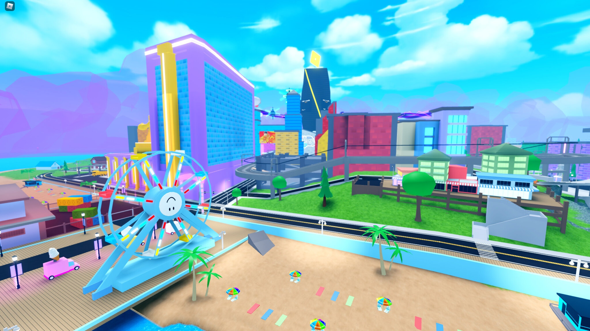
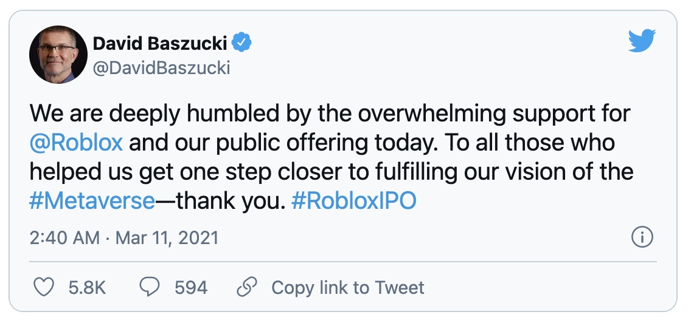
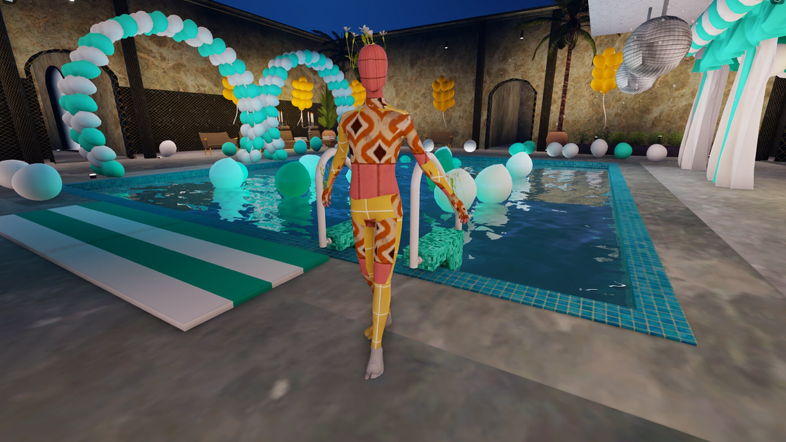

# 纽约时报：我们还没有进入元宇宙吗？ | Thought for Today

> 关于元宇宙，加密行业说他们正在建造它，游戏玩家可能已经生活在其中，艺术界正在用它来变现，而互联网老兵正试图拯救它。然而，它究竟是什么？
>
> 今天，「元宇宙特攻队」为你推荐美国《纽约时报》7 月 10 日一篇深度报道，看看正在「出圈」的元宇宙在主流社会眼中是什么样子。

**By John Herrman and Kellen Browning**

科技界最大的想法往往在它们真正连贯之前就已经进入了词典。行话术语突然出现，解释不足，却又使用过度，例如：物联网、共享经济、云等。

在一些罕见的情况下，这些术语会被坚持下来。很多人谈了很多联系松散的事情，然后这些事情合并成一个半懂不懂的东西，然后我们就永远生活在这个东西里。还记得听说过"互联网"吗？现在准备好迎接"元宇宙（Metaverse）"吧。

这个概念来自于数字时代早期。由作家尼尔·斯蒂芬森（Neal Stephenson）在他 1992 年出版的小说《雪崩》（Snow Crash）中提出，然后在欧内斯特·克莱恩（Ernest Cline）的小说《头号玩家》（Ready Player One）中被重新想象为绿洲，它指的是一个完全实现的数字世界，存在于我们生活的物理世界之外。

在小说中，乌托邦式的元宇宙可能被描绘成一个新的疆域，在那里社会规范和价值体系可以被重新书写，以摆脱僵化的文化和经济秩序。但更多的时候，元宇宙是有点歇斯底里，它更像一个逃离堕落世界的虚拟避难所。

作为流行语，元宇宙指的是各种虚拟体验、环境和资产，这些在全球疫情推动的万物互联的变迁中获得了巨大的发展。这些新技术融合在一起，暗示着互联网下一步演进的方向。

像 Roblox 和《堡垒之夜》（Fortnite）以及《动物森友会》（Animal Crossing）这样的视频游戏。玩家可以建立自己世界的《新地平线》（New Horizons）具有元宇宙的倾向，大多数社交媒体也是如此。如果你拥有一个 NFT，甚至只是一些加密货币，你就是元宇宙体验的一部分。虚拟和增强现实至少也接近元宇宙。如果使用数字头像参加工作会议或派对，你就将踏入元宇宙的范围。

创始人、投资者、未来学家和高管们都试图在元宇宙中占有一席之地，阐释其在社会联系、实验、娱乐，以及最关键的盈利方面的潜力。

风险投资人兼高产作者马修·鲍尔（Matthew Ball）描述元宇宙不只是一个虚拟世界或一个空间，而是"移动互联网之后一种继承状态"——一种极度互联的生活框架。他[写道](https://www.matthewball.vc/all/themetaverse)："不会有非常清晰的'元宇宙之前'和'元宇宙之后'的界限。相反，随着时间的推移，随着不同的产品、服务和能力的整合和融合，它将慢慢出现。"

马克·扎克伯格（Mark Zuckerberg）在 5 月接受 [CNET](https://www.cnet.com/features/mark-zuckerberg-on-facebook-vr-future-new-sensors-on-quest-pro-fitness-and-a-metaverse-for-work/) 采访时，分享了他自己以 Facebook 为中心的观点。他说，"我们希望让尽可能多的人能够体验虚拟现实，能够跳入元宇宙，并在其中获得这些社交体验。"他指的是该公司开发的实验性虚拟现实环境 Horizon，他希望人们能够使用 Facebook 的 Oculus 头盔进行探索。

在 6 月接受 [VentureBeat](https://venturebeat.com/2021/06/12/nvidia-ceo-jensen-huang-weighs-in-on-the-metaverse-blockchain-chip-shortage-arm-deal-and-competition/) 采访时，制造计算机芯片的英伟达公司首席执行官黄仁勋分享的更多是一种氛围，而不是一种愿景，"我们将能够几乎感觉到我们彼此的存在"。

如果这一切听起来令人激动，那么现在这个可能就可以了：元宇宙是互联网，但远不止于此。尽管它可能仍在未来，但如果它真的实现了，它似乎比以往任何时候都更接近你我。

_Roblox 是一个独立开发者创建受儿童欢迎的游戏的平台，它被描述为一个元宇宙。_

## 一个建立在区块链上的世界

今年早些时候，在加密货币的热潮中，一种名为 MANA 的货币的价格开始在美国主流数字货币交易所 Coinbase 的排行榜上攀升。

MANA 是一个名为 Decentraland 的虚拟世界的货币，3 月，那里的[数字土地](https://www.bloomberg.com/technology)的价格相当于几十万美元（经过两年时间 10 美分左右价格徘徊，MANA 在 4 月短暂突破 1.6 美元，使其总市值超过 24 亿美元）。

从规模上看，Decentraland 更像是一个由用户生成的 NFT 组成的公社。截至 7 月，每次只有几百人登录，比 3 月的高峰期少了几千人。它的创造者描述这个平台时说，与其说它是一个空间，不如说是用来建立一个地方的基础设施（Decentraland 的货币和土地合约在以太坊区块链上运行）。

Decentraland 的居民不断为其他用户创造场景和体验，如音乐会和艺术展览。有一些赌场，你可以用 MANA 进行赌博，赌台管理员都是用 MANA 支付其工资。Decentraland 是正在进行建设的工地这种感觉弥漫在由尚未完成开发的地块和主题公园组成的人口稀少的网格之中。在参加各种活动之间，用户们大多只能徘徊和好奇：现在能做什么？

投机者似乎不那么困惑；毕竟，Decentraland 首先是一个关于稀缺的数字资产的实验。本月，自称是"数字房地产公司"的 Republic Realm 以超过 120 万 MANA 的价格购买了 Decentraland 的 259 块虚拟地产的 NFT（按照当时的牌价，价值超过 90 万美元）。

苏富比在 Decentraland 的艺术区购买了一小块地，并建造了一个其伦敦画廊的复制品，最近结束了其在元宇宙的首次展览。负责此次销售的 Michael Bouhanna 估计，在画廊的 3200 名参观者中，有 90%的人对苏富比是什么或做什么并没有什么概念，但他说这次活动对帮助现有客户直观感受 NFT 是什么很有帮助，因为该拍卖行已经在销售 NFT。

Decentraland 与如第二人生（由一家名为林登实验室的私人公司拥有和运营的虚拟世界）的前身不同之处在于，它确实是相当去中心化的。根据 Decentraland 创始人的计划，Decentraland 一直是让它的用户拥有这个世界的所有权，建造和做他们喜欢的事情。

相比之下，Decentraland 基金会的发言人戴夫·卡尔(Dave Carr)说，"《堡垒之夜》是一种中心化体验，"这意味着它的功能是自上而下的，主要决定来自其开发商 Epic Games。"在这里，你感觉你在其中有明确的角色。"

_在 Decentraland，有一些赌场，你可以用 MANA 进行赌博，赌台管理员领取 MANA 工资。_

## 不仅仅是游戏

当 Epic 开发《堡垒之夜》时，它的计划并不是要创造一个元宇宙。但是，2017 年开始的一个玩家与僵尸战斗的塔防式游戏，仅仅一年后就爆发了，成为一种国际现象。

Epic 首席创意官唐纳德·穆斯塔（Donald Mustard）说："它以一种我们都没有预料到的方式起飞了。“

随着数百万玩家涌入《堡垒之夜》大逃杀——其游戏模式有点像《饥饿游戏》，公司急于增加社交功能，如语音聊天和舞蹈派对。作为对苹果的反垄断诉讼的一部分，5 月在联邦法院公开的财务文件中，Epic 表示，《堡垒之夜》在 2018 年和 2019 年的收入加起来超过了 90 亿美元。玩家花钱将他们的角色打扮成超级英雄的服装和香蕉套装。

现在，Epic 将《堡垒之夜》作为不仅是一种互动体验，而且是一个[元宇宙](https://www.epicgames.com/site/en-US/news/announcing-a-1-billion-funding-round-to-support-epics-long-term-vision-for-the-metaverse)来营销。

"这不仅仅是一个游戏，"Epic 营销副总裁马修·韦辛格（Matthew Weissinger）在法庭上说。"我们正在建立这个叫做元宇宙的东西--一个社交场所。"

该公司表示，去年 4 月特拉维斯·斯科特（Travis Scott）在《堡垒之夜》中举行的一场音乐会吸引了超过 1200 万次的同时观看。Epic 首席执行官蒂姆·斯威尼（Tim Sweeney）说，近 50%的玩家正在使用游戏的创意模式，能让用户用建筑和游戏来填充自己的岛屿。

对斯威尼先生来说，元宇宙的形成也需要为其独立性而战。他没有具体提到未来几个月内将作出裁决的 Epic 对苹果的诉讼，但他多次影射了这一点。

定义元宇宙很困难，但他知道它不是什么。"元宇宙不是一个有标题目录的应用商店。"斯威尼先生说，”在元宇宙中，你和你的朋友以及你的外表和化妆品可以从一个地方到另一个地方，拥有不同的体验，同时保持彼此的社交联系。"

有没有可能有一天，从 Roblox 到《堡垒之夜》和其他游戏有一条隧道，在某种未来主义的世界里把它们都连接起来？斯威尼先生说，是的。

_每年在 Roblox 上创建的游戏有数百万个。这里是监狱逃亡游戏《疯狂城市》的镜头。_

## 打造年轻的百万富翁

Roblox，一个由独立开发者创造受儿童欢迎的游戏的平台，可能是元宇宙最接近的和最广阔的愿景。

根据该公司的收益报告，在 2021 年第一季度，人们花了近 100 亿小时玩 Roblox，每天有超过 4200 万用户登录。玩家还在 oblox 的虚拟货币 Robux 上花费了 6.52 亿美元，这些货币可以用来为他们的角色购买帽子、武器、热气球和其他数字物品。在 3 月 10 日上市后，该公司估值飙升至 450 亿美元，截至本周估值接近 500 亿美元。

Roblox 的联合创始人兼首席执行官戴夫·巴祖基（Dave Baszucki）在 Twitter 上表达了他的感激之情，当天收市时，他在该公司的股份价值突然升至 55 亿美元。

> 我们对 @Roblox 和我们今天的公开募股所获得的压倒性支持深感谦卑。感谢所有帮助我们离实现 #元宇宙 愿景更近一步的人，谢谢你们。#RobloxIPO
>
> - 戴夫·巴祖基（@DavidBaszucki）2021 年 3 月 10 日

巴祖基先生拒绝为本文接受采访，但他曾四处且雄心勃勃地把 Roblox 描述为一个元宇宙。他说，他的目标是让数十亿人使用 Roblox，而不仅仅是儿童。在今年 2 月的一次投资者推介会上，他说公司在该平台上举行业务会议。

"正如邮件、电报、电话、文本和视频是协同工作的工具一样，我们相信 Roblox 和元宇宙将加入成为商业交流的基本工具。”巴祖基先生说，"最终，有一天我们甚至可能在 Roblox 中购物。“

事实上，今年 5 月，一个数字古奇（Gucci）包在该平台上的售价超过了 4100 美元，超过了实物的价格。当然 Roblox 也有并非公司容许的阴暗面，比如脱衣舞俱乐部、[性爱派对](https://www.fastcompany.com/90539906/sex-lies-and-video-games-inside-roblox-war-on-porn)和[纳粹重现](https://www.wired.com/story/roblox-online-games-irl-fascism-roman-empire/)。

每年在 Roblox 上创建的游戏有数百万个，它们产生的大部分钱--通过销售数字物品和升级--都给了独立开发者。在某些情况下，十几岁的游戏制作者已经成为百万富翁。

16 岁的阿蒙·朗格（Ammon Runger）和他 23 岁的同事斯特凡·巴罗尼奥（Stefan Baronio）制作了监狱逃生游戏《疯狂城市》(Mad City)，每月吸引 20 多万名玩家，赚取了六位数的收入。巴罗尼奥先生用这些钱买了一辆新车并支付了大学学费。他说，这种经历"改变了生活"，但他没有把 Roblox 称为"元宇宙"。

巴罗尼奥先生说："我绝对觉得他们正在走向成功，但我仍然认为他们离成功还很远。“公司表示 Roblox 的一半玩家是 13 岁或更小的人。

在任何情况下，该公司都在开拓进取。Roblox 首席商务官克雷格·多纳托（Craig Donato）说，17 至 24 岁的人是该平台增长最快的消费者，而且该公司正在增加更多的语言，以匹配它在世界各地扩展用户群。

多纳托先生说，在疫情大流行期间，他花了很多时间在公司的虚拟办公室开会，以至于回到物理空间后，他不得不提醒自己，他不能做与他的 Roblox 角色一样的事情。

"我当时想，'天哪，我必须确保我不会随便跳出窗户，'”他说。

_Roblox 的古奇花园_

## 但它是宇宙吗？

虽然企业对元宇宙有很大的兴趣，但怀疑论者比比皆是。

游戏发行商 Take-Two 的首席执行官斯特劳斯·泽尔尼克（Strauss Zelnick）在 5 月的财报电话会议上说，他对"流行词过敏"，认为元宇宙可能都是在炒作。"如果你把元宇宙、SPAC 和加密货币放在一起，在五年内，这些都会有关系吗？我不确定会不会，"他说。

还有人怀疑来自科技业的兴趣是否只是机会主义的，或者完全不着边际。

例如，埃沃·海宁(Evo Heyning)已经在元宇宙工作和玩耍了 20 年。美国国务院甚至雇用她来帮助建立其在第二人生建馆。

海宁女士说，在早期的虚拟世界中，"它总是被视为人们参与到一种新型的公共领域中。现在，很明显，很多公司都要宣称自己的主导地位。"

来自科技高管的希望和保证是好的，但私有平台就是私有平台。"现在，我可以创建一个化身，但我不能从一个世界跳到另一个世界，"海宁女士说，她描述了一个被称为"互操作性"的概念。在她看来，元宇宙不是单一的公司或组织的产品或空间，甚至不是所有的产品或空间加在一起——而是它们连接的方式。

为了追求这种联系，45 岁的海宁女士与一些志愿者一起成立了开放元宇宙互操作性小组，旨在建立"连接虚拟世界"的技术标准，希望元宇宙玩家能够采用这些标准。

罗伯特·朗（Robert Long）也是这个小组的成员，他对刚起步的元宇宙世界的希望比作早期的万维网。"整个事情没有一个单一的主人，"他说，"它就像网络一样是去中心化的，有很多不同的人托管它。我们正在寻找元宇宙的 HTML。"

NFT 市场 Foundation 的创始人兼首席执行官凯冯·特朗尼亚（Kayvon Tehranian）也认为，建造元宇宙是一个机会，可以纠正他认为的互联网前管理者和用户犯下的错误。他说，关键是区块链技术，人们如何参与元宇宙倒是第二位的。

"事实上，我们被一个随时存在的全球层所包围，"特朗尼亚先生说，他指的是以太坊区块链。"在那里，没有任何中心化一方来决定某物是否可用？"他说，这是对我们已经生活在其中的数字世界的解毒剂——他把目前描述为类似于元宇宙，但有苹果、Google、Facebook 这些"独裁者"存在的数字世界。

他的元宇宙符合自由的特定定义。"我真正关心的是，你作为独立个体拥有物品和资产，"他说，"财产所有权是一种工具。它可以发挥作用。它带来了经济激励。"

这可能听起来，依据你的意识形态倾向，更多的是幻灭而不是乌托邦。对特朗尼亚先生来说，这只是现实问题。

他说，"我们仍然在谈论人性，它是贪婪和自私的。“

事实上，许多人正把元宇宙看作是发财的机会。迈克·温克尔曼（Mike Winkelmann）又名 Beeple，那个以 6900 万美元的价格出售其艺术品 NFT 的人，正在筹建一家名为 Wenew 的初创公司，该公司将出售与时间片段相关的 NFT，用该公司的话来说，就是创造 "元宇宙的记忆宫殿"。它的早期产品包括网球明星安迪·穆雷（Andy Murray）职业生涯中的一些时刻。

尽管温克尔曼先生在以加密货币为导向的元宇宙愿景中占有一席之地，但他对元宇宙可能是什么或已经是什么的认识很宽广。无论元宇宙是什么，它都不仅仅是虚拟现实，增强现实，区块链和 NFT，或者是虚拟世界和游戏。

他说，"人们在很大程度上把它看成是头号玩家或者是虚拟现实的事情。”

"这只是关于那个屏幕离你的脸有多近，"他继续说，把他的手机举到他的眼前。"这并没有改变一个事实，即这些事情很多都在一个已经是虚拟的空间里发生的。"

他表示，它只是要继续融合，直到我们都戴上护目镜，或生活在粘液罐中，在从今日互联网逐步迷失方向的过渡之后，这也许比它得到的赞誉更加元宇宙化。

"这是关于未来的一个原始版本，“温克尔曼先生如是说。

> 这里是「元宇宙特攻队」，我们下期见。
