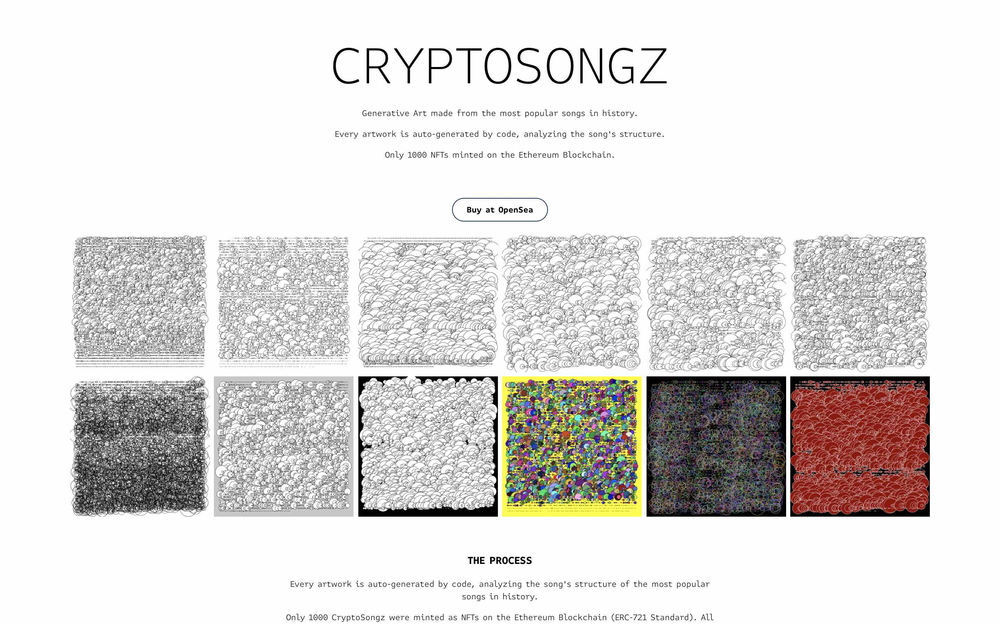
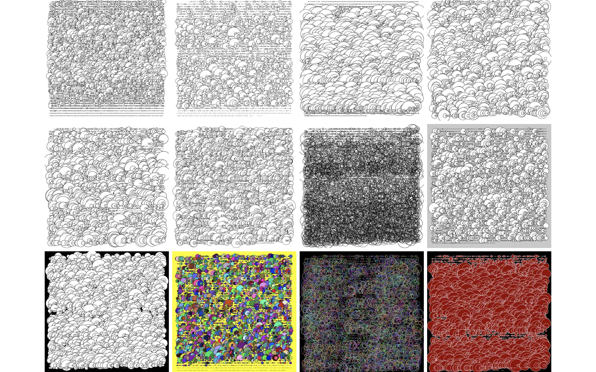
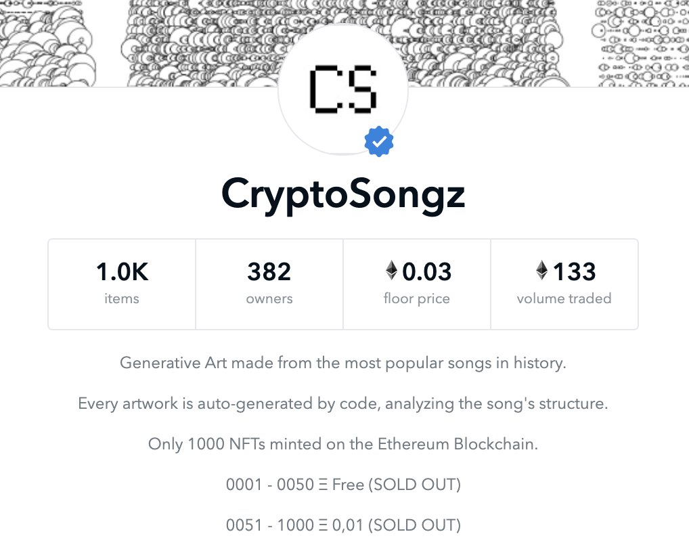

# CRYPTOSONGZ：让旋律节奏舞动可见的音乐 NFT | Today's Pick

> 今天，「元宇宙特攻队」为你推荐 CryptoSongz，让 1000 首音乐旋律节奏可视化舞动的 NFT 收藏品。✨✨✨✨
>
> 官网：**cryptosongz.com**

**By ABMTF_crypto**

CryptoSongz 实际上是根据欧美流行音乐的结构用代码自动生成的艺术品，在以太坊区块链上铸造了 1000 个 NFT。每件作品都被渲染成分辨率为 800x800 像素 PNG 图片，大部分都是黑白的线条图案，不过你也可以找到一些彩色的图案。

1000 件 CryptoSongz 作品中，首批 50 个 NFT 是免费赠送给早期支持者。剩下 950 件以 0.01 ETH 的价格出售，如今早已售空。

如果要购买，只能上 [Opensea](https://opensea.io/collection/cryptosongz) 购买。目前平均售价为 0.03 ETH，有 382 位拥有者，完成了 133 次交易。

## 为什么要做 CryptoSongz

(video 1)

目前保持匿名的创始人表示：

> 我有 20 年的视觉艺术家生涯，最近 6 年在环游世界，但我作为音乐迷有着 38 年的历史。
>
> 这个项目的目的是以一种最强烈的方式连接人和技术。在过去的一年中，我一直在 NFT 的大海中深潜，我刚刚发现了 "感情的一个层面"，如果你喜欢或不喜欢它，纯粹取决于审美。我认为这是一个很好的机会，在 NFT 项目中增加一个 "新的感情层"，那还有什么比生成艺术和音乐的结合更好的呢？
>
> 人和音乐有非常强的联系，每当我们听自己喜欢的歌曲时，我们可以闭上眼睛，想象创造我们自己的画面。我希望看到这个系列作品的每位都能以一种深刻的方式联系起来，就像我自己在建立这个项目的 45 天里所做的那样。

(video 2)

## CryptoSongz 社区有什么建议

眼下，社区正在讨论 CryptoSongz NFT 应该用视频渲染的方式来替代平面画。

一旦所有音乐的视频渲染完成后，可以通过更新元数据或通过可解锁的内容功能，将它们添加到每首音乐的 NFT 中，这样所有者就可以随时查看视频。也许甚至可以在他们的耳机或笔记本电脑上将音乐与视频同步，作为一种视觉化的东西，视频渲染效果将是惊人的，同时也会增加很多价值。

## CryptoSongz 并不孤单

(video 3)

这一名为 Time Currents 的声音交互作品，是通过节点式的视觉编程，让声音模块分析出音乐的声道、频率等特征，变成参数连接到 3D 物件上，改变其形态而生成。

**NFT 链接**

`https://opensea.io/assets/0x495f947276749ce646f68ac8c248420045cb7b5e/92854960588464254555946828023973119272598955986146577935146406045923581886465/`

作者 metaSynth 是一位年轻的多媒体跨界艺术家，通过创意编程等媒介，设定各种参数，让艺术品具有自然生长、与周边事物产生反应的能力，并且将 NFT 与衍生体验绑定，成为融入到生活中的动感力量。她说：

> 艺术品的生命力不在于静止的油彩或像素之中
>
> 而是它的互动性、自发性、生长性
>
> 这些流动的特质才是真正的美感所在

这里是「元宇宙特攻队」，我们下期见。
