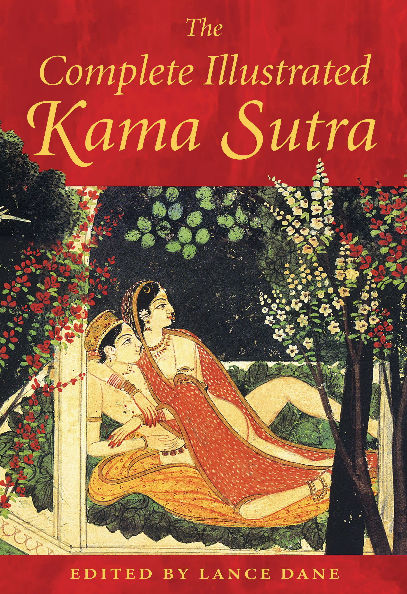
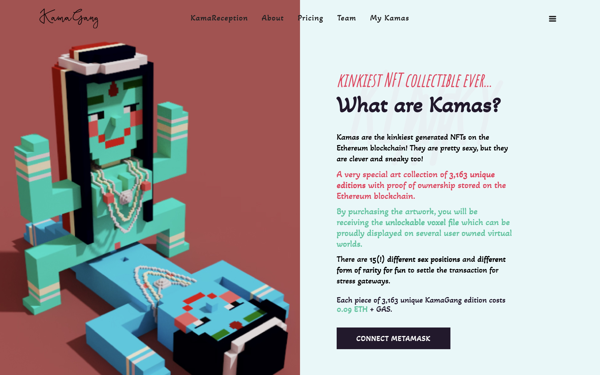
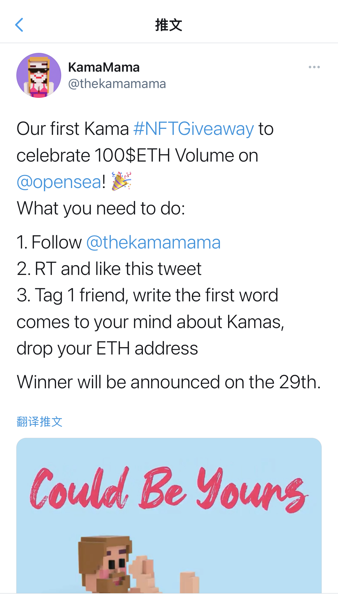

# KAMAGANG：让世界充满爱的体素 NFT | Today's Pick

> 今天，「元宇宙特攻队」推荐 KAMAGANG，一款或许你心里很喜欢但不敢到处炫耀的体素 NFT✨✨✨✨
>
> 官网：**kamagang.com**

**By ABMTF_crypto**

Kama Sutra 是印度源远流长的《爱经》，据说在印度的机场、旅游景点以及触手可及的城市街角书店里都能买到这本宝典。

KamaGang 灵感即来自于此。这 3163 个在以太坊区块链上铸造的体素 NFT 根据《爱经》介绍的 15 种姿势和稀有度设置产生。用户购买后即可收到可解锁的体素文件，可在 CryptoVoxel、Rareroom 这样的虚拟世界、三维画廊里展示。

项目方自觉 KamaGang 有 3 点不同之处打破了目前 NFT 项目的俗套：

1. 数量不再是 10000 个！据称，这 3163 个通常由两个人组成的十分性感聪明又狡黠的体素化身不是用代码自动生成，而是一个个用手工精心绘制而成；
2. 拒绝拷贝！项目创意勇敢触碰禁忌——嗯，官方第一个推特账号前两天刚刚被封禁；
3. 拒绝成为推特头像！确实，99% 的推特用户不敢拿它做自己的头像 😃

_**藏品交易：** opensea.io/collection/thekamagang_

KamaGang 初始售价 0.09 ETH，很快销售一空，目前在 Opensea 上二次交易活跃，销售额达到 114 ETH。

为庆祝在 Opensea 销售额突破 100 ETH 及获得 Opensea 官方认证，KamaGang 今天（7 月 27 日）在推特发起 NFT 空投奖励活动，感兴趣的朋友可以参与………

这里是「元宇宙特攻队」，我们下期见。
