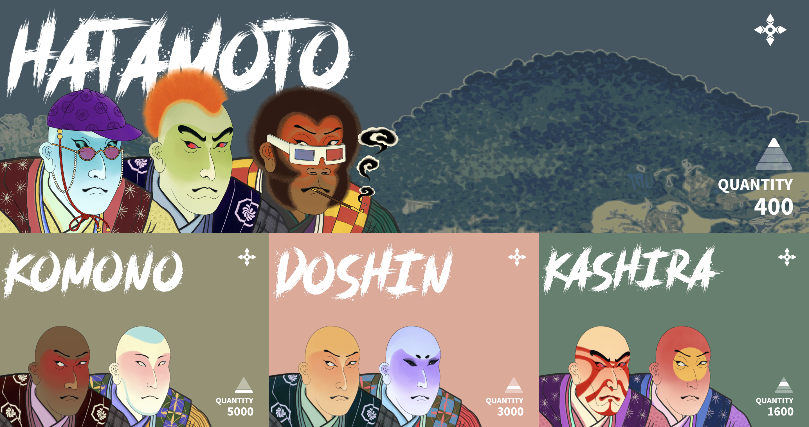
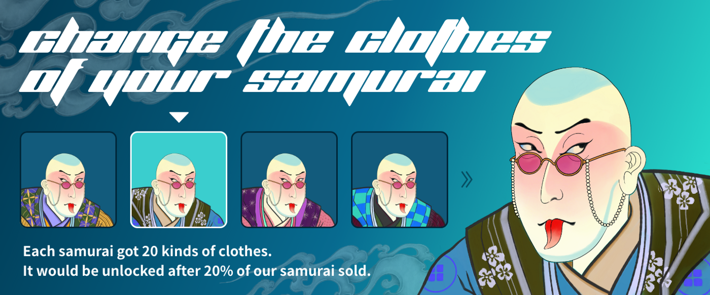
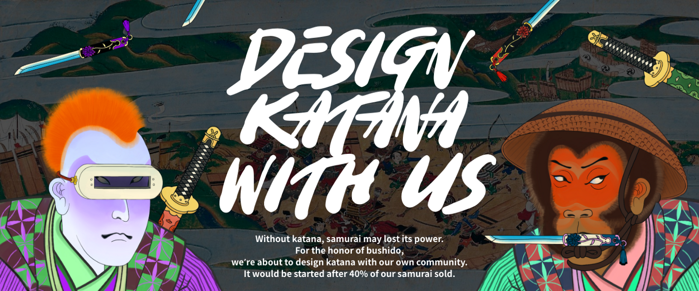
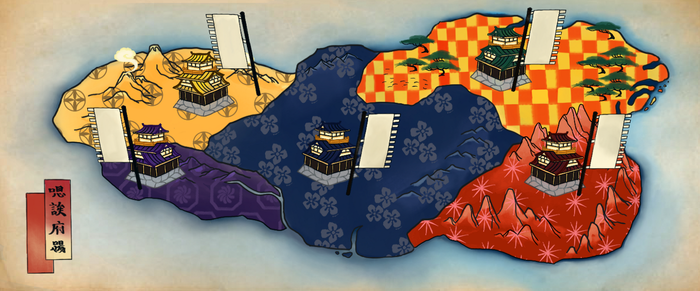

# KATANA N' SAMURAI：用浮世绘记录区块链历史 | Today's Pick

> 今天，「元宇宙特攻队」推荐用日本浮世绘记录区块链历史重要事件的 Katana N' Samurai（武士和刀）✨✨✨✨
>
> 官网：**katanansamurai.art**

**By ABMTF_crypto**

浮世绘，兴于江户时代（1603 ～ 1867 年间，又名德川幕府时代），描绘人们日常生活、风景和演剧的日本风俗版画。它色调鲜明丰富，影响远播欧亚，十九世纪欧洲从古典主义到印象主义诸流派大师无不受到浮世绘画风的启发，具有很高的艺术价值。

出于对浮世绘艺术的热爱，项目方设计了 Katana N' Samurai 这个融浮世绘与 Cryptopunk 一体的 NFT 项目——

> _话说 2021 年，有人意外启动了区块链时间机器，把所有的 Cryptopunk 送回了 1700 年的日本。在这个平行宇宙中，10,000 名武士（Samurai）属于 5 个不同的幕府，拥有不同级别的权力和他们各自的传说……_

目前，这 10,000 个以 ERC721 标准铸造的 NFT 按 0.05 ETH 的价格初始销售，其稀缺性按日本武士 4 个不同等级来确定：

- Hatamoto：400 个，占总量 4%
- Kashira：1600 个，占总量 16%
- Doshin：3000 个，占总量 30%
- Komono：5000 个，占总量 50%

这 10,000 个令人眼花缭乱的武士头像由下列元素组合生成：

- 风景：富士山、北海道、京都、东京、大阪的四季
- 服装：樱花、格子、菊花、十字架、星形图案
- 种族：人类、僵尸、猿人、外星人
- 眼睛：迷眼、红眼、笑眼、艺妓的眼睛、外星人的眼睛
- 帽子和发型：头巾、竹笠、紫帽、绿帽、小帽、连帽衫、针织帽、莫霍克发型、长发、大胡须
- 配件：以太坊耳环、吐舌、烟斗、3D 眼镜、VR、书呆子眼镜、带链眼镜
- 角色：可能是一句话，一个成就，或者一个别人不知道的秘密
- 更多有待解锁的惊喜……

项目方想把 Katana N' Samurai 建成一个能够持续成长的互动社区，最终将由 DAO 来治理运行，因此设计了与社区成长密切相关的路线图：

- 售出 10%：每卖出 1000 张，官方会在 Discord 空投记录区块链大事的浮世绘版画作品。

_图为 7 月 29 日空投的 Katana N' Samurai 与 BanklessDAO、Index Coop 合作推出的版画：化身武士的 Bankless 和化身猫头鹰的 Index Coop 联手打败了化身为蛇的传统银行……_

- 售出 20%：每个武士有 20 套服装可以更换，到售出 20%时，解锁这一功能。

- 售出 40%：真正的武士怎能没有 Kanata（日本刀）呢？到售出 40%的时候，官方将邀请社区成员一起设计日本刀。

- 售出 60%：解锁游戏用的权力分配图。

_在 Katana N' Samurai 世界里，有 5 个幕府争夺最高领导地位。每个武士都有自己的力量值，并将根据其穿着的衣服被分配到一个幕府。在不同幕府的不同武士的进出过程中，每个幕府的总权力值会发生变化。因此，他们的领土大小也会同时有一些变化。拥有最大总权力值的幕府将拥有最大的领土，并显示在世界地图的中心位置。_

- 售出 80%：由社区决定特别空投。

- 售出 100%：Katana N' Samurai 将发展成为一款游戏！

无论是销售 NFT 还是最终打造元宇宙游戏，用浮世绘来描绘记录区块链世界的历史是 Katana N' Samurai 的创意和使命。

自 7 月 23 日开售至今一周，Katana N' Samurai 成长如何？喜欢日本浮世绘和 NFT 的朋友，可以拭目以待……

这里是「元宇宙特攻队」，我们下期见。
