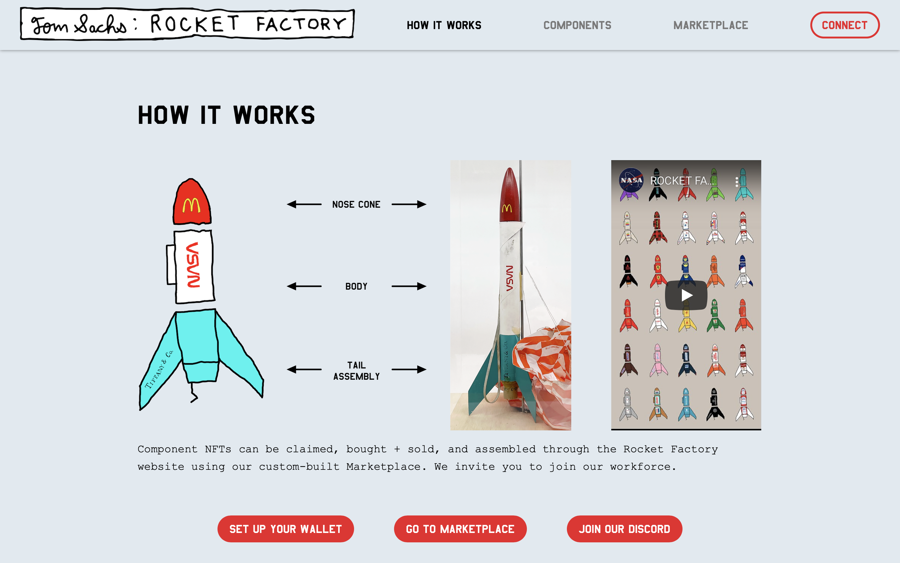

# ROCKET FACTORY：三合一 🚀 NFT 🚀 般速度成功 | Today's Pick

> 今天，「元宇宙特攻队」推荐 🚀 般成功的组合型 NFT 收藏品：Rocket Factory✨✨✨✨✨
>
> 官网：**tomsachsrocketfactory.com**

**By ABMTF_crypto**

随着伊隆·马斯克、杰夫·贝佐斯、理查德·布兰森等地球首富们争先恐后的发射火箭上天、乘坐飞船遨游，载人航天飞行商业化如火如荼，火箭飞船作为收藏类 NFT 热门题材，长盛不衰。

迄今，唯有美国知名当代艺术家 Tom Sachs 推出的 Rocket Factory（火箭工厂）项目成功具有 🚀 般的速度：

- 8 月 1 日美国东部时间上午 10 时，3000 个火箭部件 NFT 在不到 5 分钟的时间被申领一空；

_**OS 收藏：** opensea.io/collection/tom-sachs-rockets_

- 不到一天时间，已有 2400 个 NFT 被交易，1.85 ETH 的最低价，已是 0.15 ETH 申领价格的 12 倍多。

旨在推进元宇宙早日到来的 NFT 原生投资机构 [Sfermion](https://www.sfermion.io/) 基金创始人 Andrew Steinwold 在 Rocket Factory 首发前就发推预言其成功：

- 世界知名的艺术家 Tom Sachs
- 精彩的市场推广
- 有限供给（总共 3000 个火箭零部件）
- 「可建造」功能
- 「可发射」功能
- NFT + 可兑换的实物收藏品

## 火箭工厂的三合一玩法

Rocket Factory 是 Tom Sachs 首个 NFT 系列，借鉴了 Tom 三十多年来的雕塑和绘画的手法，打造一个跨维度的火箭工厂。

- 火箭由头部、主干和尾部 3 个组件 NFT 组成
- 组合成一枚完整的火箭 NFT，组件 NFT 即被销毁
- 3 个组件 NFT 数量各为 1000，可生产 1000 枚完整的火箭
- 3000 个组件有 30 个独特的品牌的标记，即具有不同的稀缺性）
- 3000 个组件中有 100 个被印上贴纸图案，有 10 种贴纸类型，其 NFT 更加稀有和独特。

这 3000 个组件 NFT 已于 8 月 1 日认领一空，现在只能通过官方自建的市场购买和组装。

火箭厂生产的成品火箭 NFT 有 2 个类型：

- 弗兰肯火箭：一个不相干的品牌集群，由不匹配的组件 NFT 组成。
- 完美火箭：由单一的品牌，由三个匹配的组件 NFT 组成。每个完成的火箭 NFT 都将由艺术家赋予一个独特的名字。

组件 NFT 是随机申领，但在 113,500 多个潜在组合中，组合成 1000 个什么样的火箭，完全取决于用户自己。

弗兰肯火箭和完美火箭都具有「发射」选项。一旦选择「发射」，将会手工制作一个精确复制 NFT 的实物火箭模型。火箭工厂开张后头几个月，实物火箭将在美国和欧洲进行发射，将来在其他大洲发射。发射时间和地点将提前公布，实物火箭的拥有者将受邀参加发射活动。

在实物火箭发射后，会努力进行回收。如果回收成功，实物火箭被装在一个定制的展示箱中运给它的主人。完成发射的火箭 NFT 将更新从发射中收集的元数据。而记录实物火箭发射的视频将链接到完成发射的火箭 NFT。

一个 NFT、一枚实物火箭，一段记录发射的视频，它们不是三个独立的东西，而是三合一，一个奇异的跨维度的 NFT。

(video)

未来，通过拥有一个组合完成的火箭 NFT 或组件 NFT 来解锁「火箭联盟 」的会员资格。会员福利将包括：特别获得工厂制服，邀请参加发布会和活动（包括实体和数字），以及其他惊喜。Rocket Factory 还将探索元宇宙，寻找建立火箭工厂总部的地点，为联盟成员提供特殊的准入许可。

## Tom Sachs 是谁？

美国当代艺术家 Tom Sachs 生于 1966 年，他自称是在纽约市工作的 "杂工"。Tom Sachs 的混合媒体雕塑，经常使用日常材料再现现代偶像，显示了生产一个物体的所有工作--这是对现代化趋势的逆转，即产品具有更干净、更简单、更完美的边缘。Tom Sachs 的雕塑是明显的手工制作，用胶合板、树脂、钢和陶瓷拼凑而成。雕塑中的伤痕和不完美讲述了它是如何诞生的，并将它从奇迹般的构思领域中剔除。他的工作室团队的功能就像一个教学医院，或邪教，崇拜胶合板和透明的精神。

他与耐克等品牌合作，实现了一些创新产品和美国实用专利。主要的艺术展览包括太空计划，展示了在地外环境中生存、科学探索、资源采集和殖民化所需的一切。他的作品被世界各地的博物馆收藏，包括古根海姆博物馆、惠特尼美国艺术博物馆、纽约现代艺术博物馆、巴黎蓬皮杜中心、纽约大都会艺术博物馆、旧金山现代艺术博物馆、奥斯陆 Astrup Fearnley 现代艺术博物馆、洛杉矶县艺术博物馆。

这里是「元宇宙特攻队」，我们下期见。
