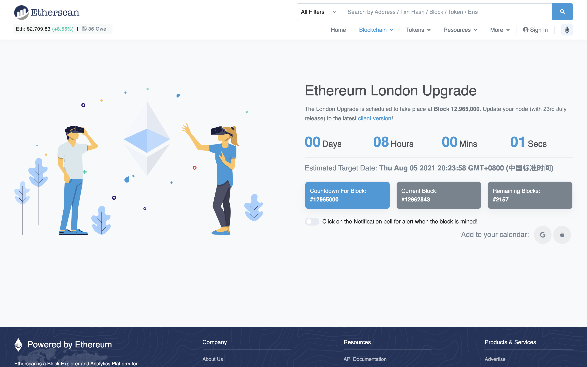
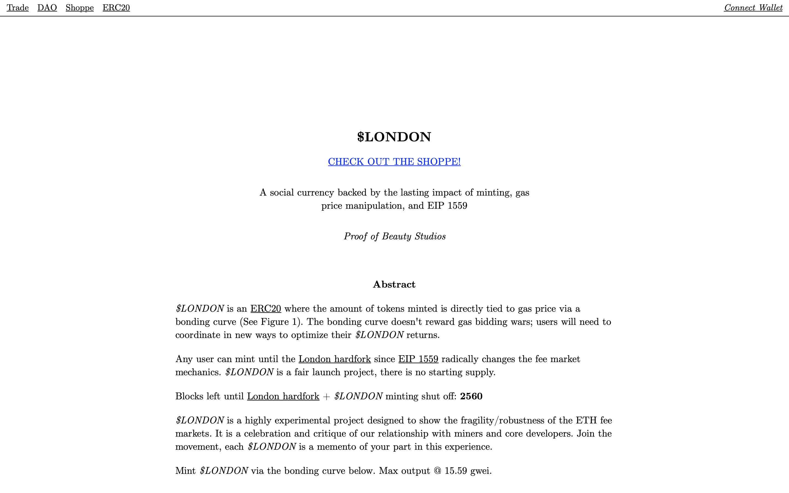
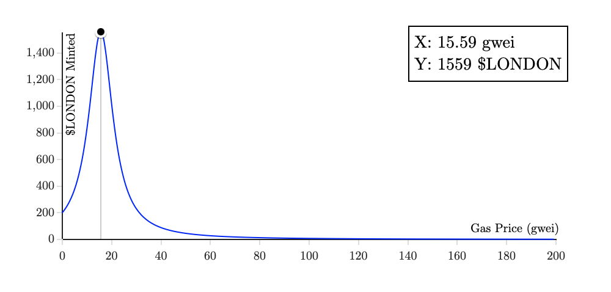
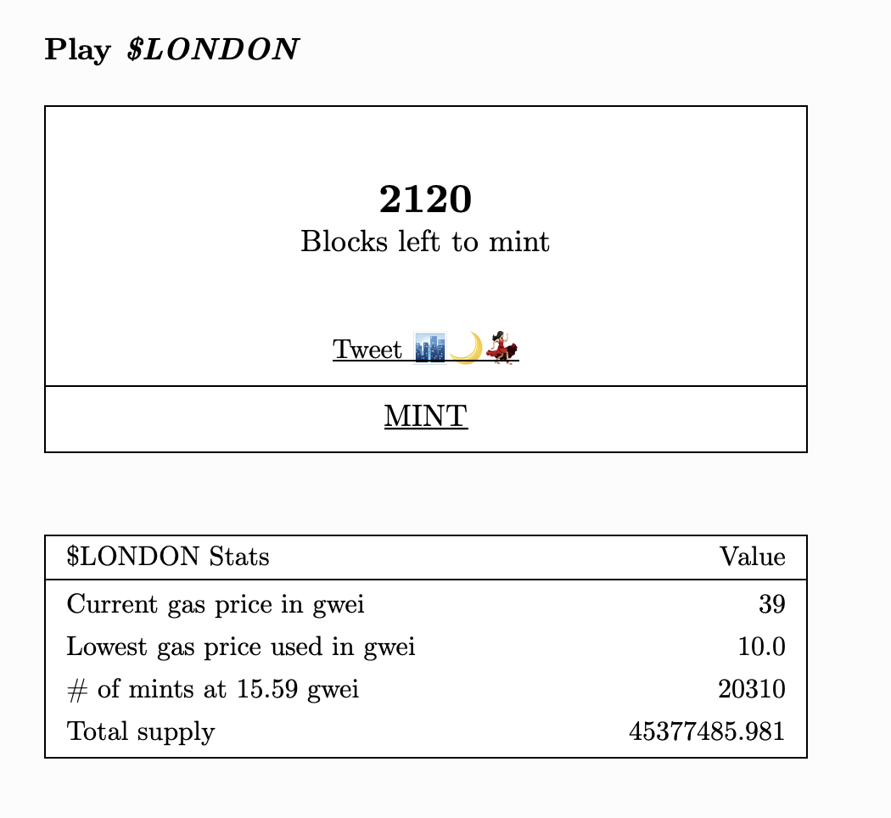
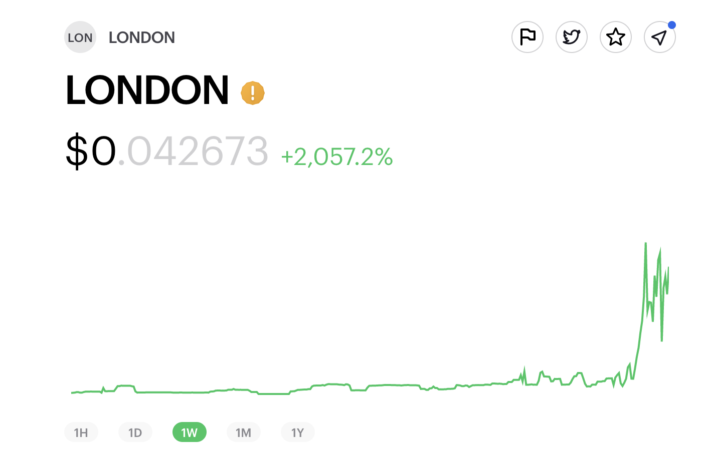

# $LONDON：纪念以太坊伦敦硬分叉升级，赶紧去撸这个有趣的币吧！| Today's Pick

> 今晚 20:23:58，以太坊伦敦硬分叉升级。「元宇宙特攻队」为你推荐这个灵感来自伦敦分叉的 NFT 项目：$LONDON ✨✨✨✨✨
>
> 官网：**london.pob.studio**

**By ABMTF_crypto**

此刻，全世界整个加密/区块链行业正在屏息等待以太坊伦敦硬分叉的到来，严肃紧张地思考这一升级对以太坊的经济模型和未来带来哪些重大的改变、深远的影响……

> **延伸阅读**
>
> [《三分钟读懂 EIP-1559 对以太坊经济模型的改变》](https://www.chainnews.com/articles/989757727647.htm) > [《专题：读懂以太坊 EIP-1559 提案，它为何备受争议？》](https://www.chainnews.com/topics/139044666704.htm)

此刻，我们不妨来瞅瞅业内最优雅的 [POB 工作室](https://www.pob.studio/)从伦敦硬分叉汲取灵感开发的 NFT 项目：$LONDON。

## $LONDON 是什么？

官网首页开宗明义介绍道，$LONDON 是一个高度实验性的项目，旨在展示 ETH 收费市场相反相成的脆弱性和稳健性，是对我们与矿工和核心开发者关系的一种庆祝，也是批判。

所有想参与这个项目的用户可以在伦敦硬分叉之前在官网铸造申领 ERC20 代币 $LONDON，铸造数量与以太坊 Gas 价格直接挂钩。从上图所示的钟型曲线可见，Gas 价格在 15.59 gwei 时能铸造数量最多：1559 个 $LONDON，你加价越多反而领到的代币数量越少，有趣不？

这是截至本文写作时剩余的以太坊区块数（其实就是倒计时），鉴于今天平均 30 以上的 gwei 价格，以 15.59 gwei 领到 1559 个 $LONDON 这个数量确实需要佛系随缘了，如果想无论如何参与一下，可以加速交易领几个试试 😃

## $LONDON 怎么玩？

今早，有之前撸到 $LONDON 的朋友看到上图所示近 20 倍涨幅急急忙忙就卖了。在此，特攻队友情提醒你：稍安勿躁 😜

项目方说了，在伦敦硬分叉之后，将发布名为[$LONDON Gift Shoppe](https://london.pob.studio/shoppe) 的 NFT 商店，上架的生成性纪念品 NFT 只能用 $LONDON 兑换。

商店总共上架 6236 个优美的纪念品，分为「普通、稀有、超级稀有、秘密稀有」4 个等级，每个需要 1559 个 $LONDON（上图为其中 10 个作品的预览动图）兑换。

值得注意的是：

- 在以太坊区块 12968150 之前（即伦敦硬分叉后 12 小时），每个地址只能兑换 1 个纪念品。之后可随心所欲想兑多少就换多少，每笔交易可最多铸造 10 个。

- 除了兑换 NFT，持有 $LONDON 可以参与名为[「伦敦夜总会」](https://snapshot.org/#/london.pob.eth)的 DAO 治理，享有投票权。未来，DAO 将受 $LONDON 持有者委托进行更多的艺术实验。

- 上述 NFT 被领完后，项目方按照之前社区投票结果将销毁 15.59% 的收益。销毁后，如何处理这些资金将由社区投票决定。

这里是「元宇宙特攻队」，我们下期见。
