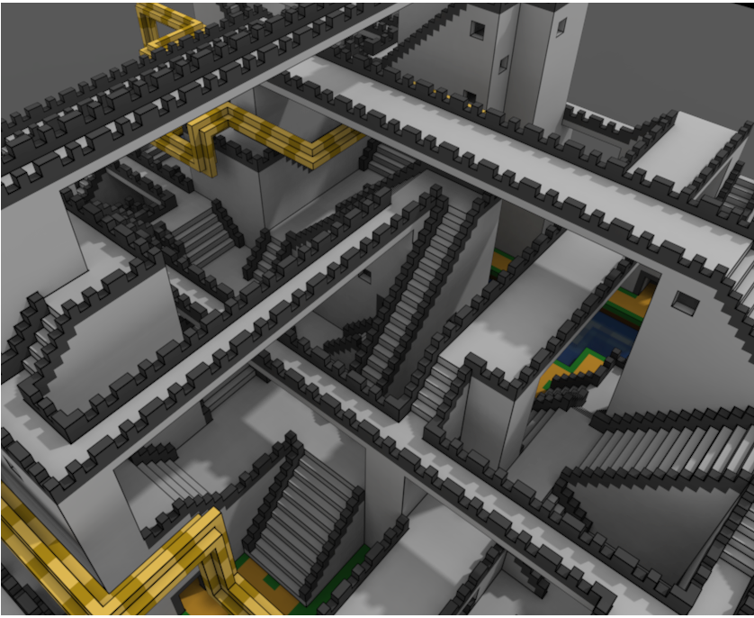
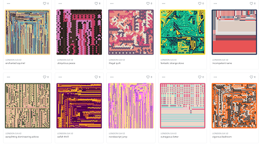
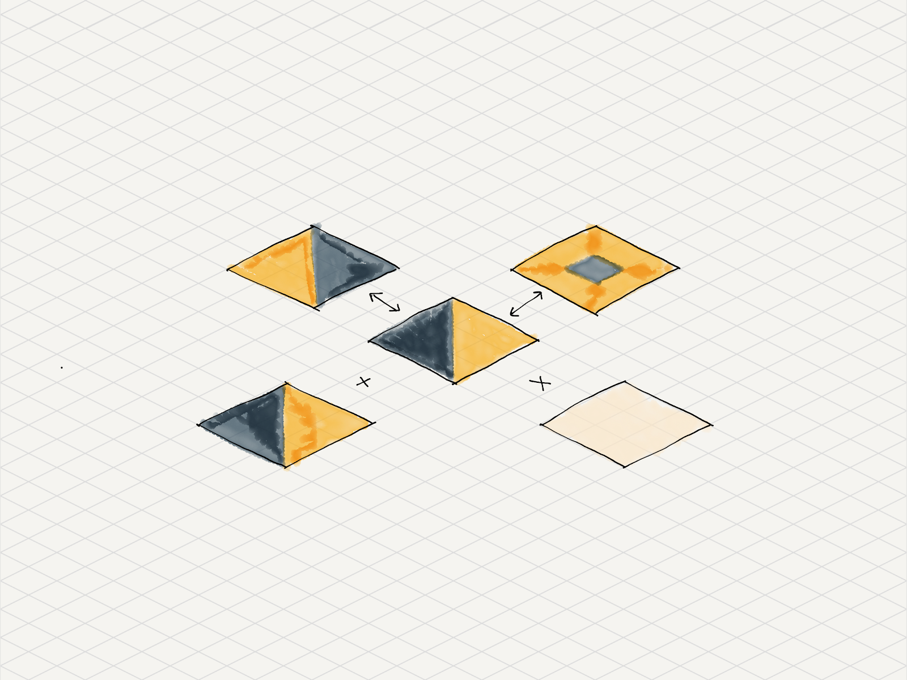
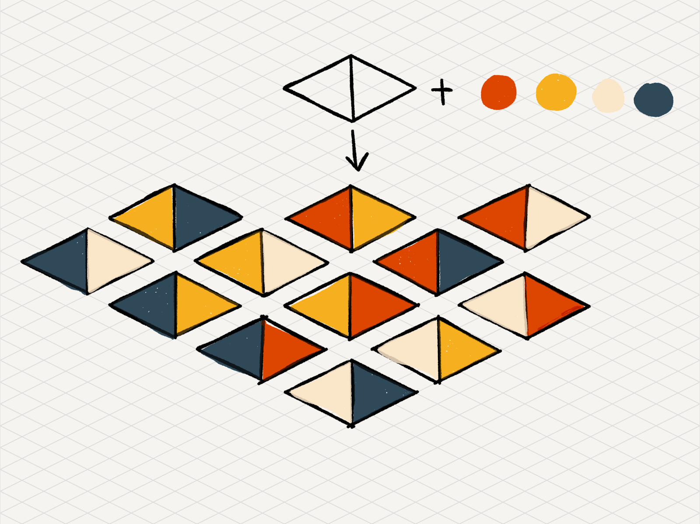
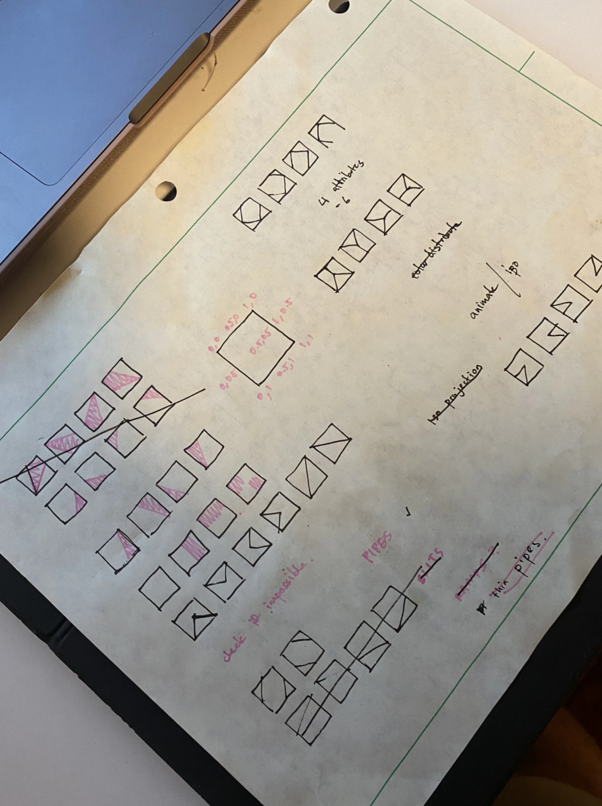
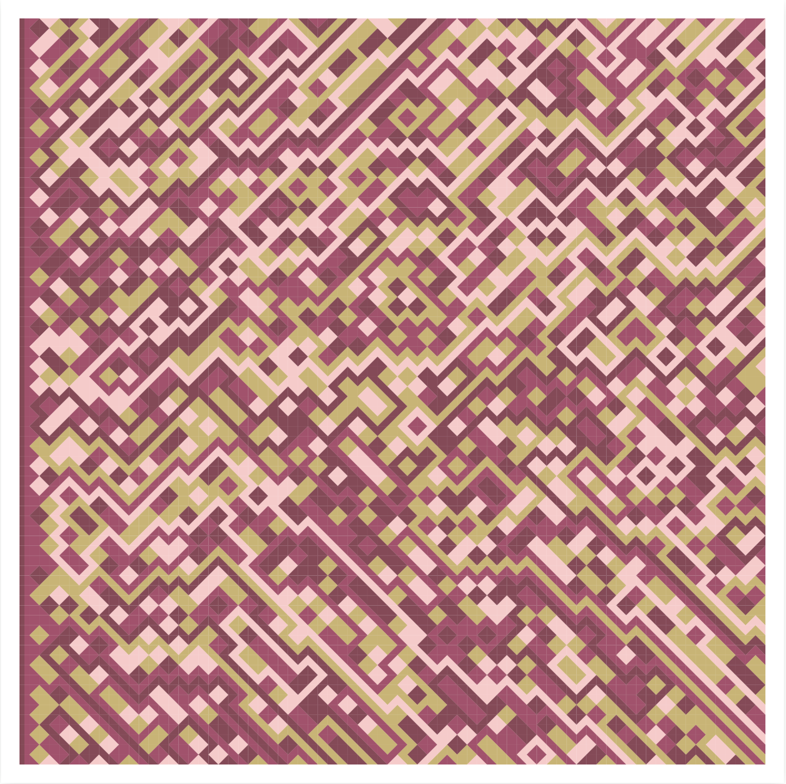
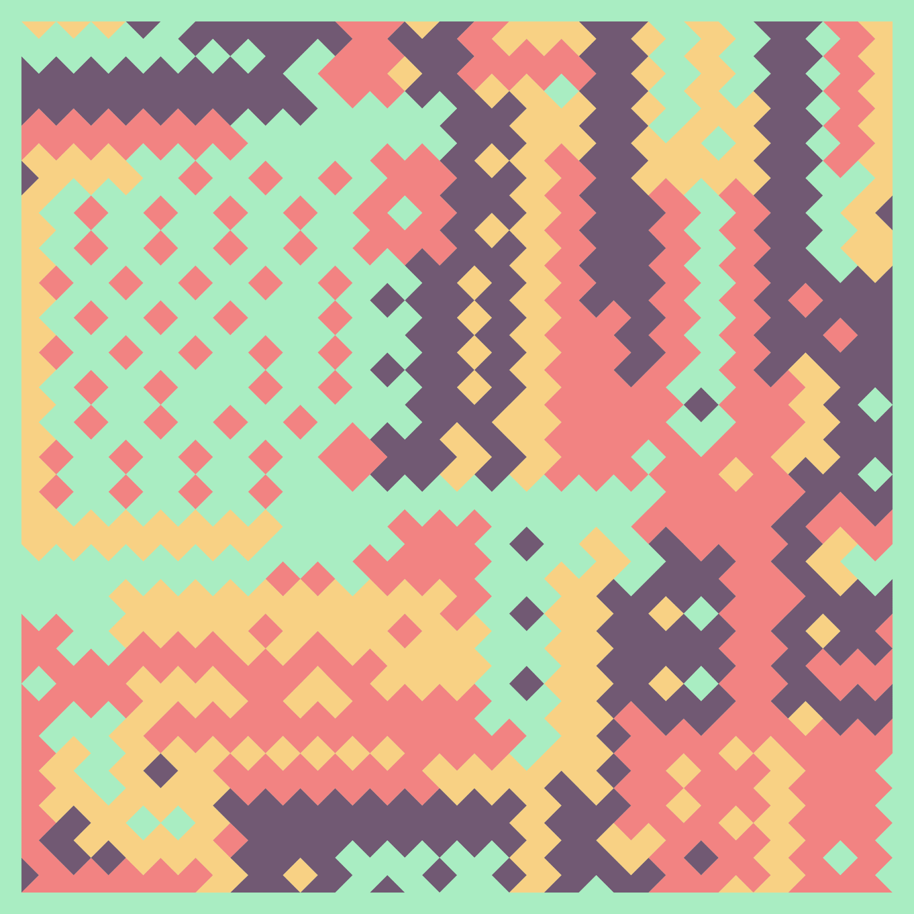

# $LONDON：礼品店艺术背后的故事 | Thought for Today

> 昨晚 20:11:34，以太坊伦敦硬分叉成功升级。灵感来自伦敦分叉的 $LONDON 的 NFT 也被一抢而空，甚至推高了当晚的以太坊 Gas 价格。为帮助大家进一步了解这一生成艺术品，元宇宙特攻队翻译了这篇由项目主创设计师撰写的介绍文章。
>
> $LONDON Gift Shoppe 官网：**london.pob.studio/shoppe**

**By Proof of Beauty**

随着 [$LONDON Shoppe（伦敦礼品店）](https://london.pob.studio/shoppe) 的礼品一领而空，我想是时候分享更多关于这一生成艺术品及其内部运作的信息了。

## 选择它的「源头」之美

伦敦礼品生成艺术源自对游戏开发中发现的程序生成的长期研究。我一直很欣赏让游戏世界更有沉浸感所做的工作，并发现了一个独特的机会，将他们的一些技术应用于时尚艺术，而不是数字现实。

为此，我在过去的几个月里研究和探索了游戏中用来创建程序化世界的各种算法，发现最有前景和最有趣的设计是「波函数崩溃」，简称 WFC。

> **WFC GitHub 仓库：** https://github.com/mxgmn/WaveFunctionCollapse

WFC 是一种特别强大和适应性强的算法，其核心是一个「数独」超级解算器。它不是解决网格中的数字，而是解决视觉「砖片」。这些「砖片」在游戏中是土路、草地、森林和城堡。

_图片来自 WaveFunctionCollapse repo_

$LONDON 的生成艺术的核心是一个 WFC 的实现，其中有一些关键的偏差，以创造 "抽象 "艺术而不是游戏世界。

_看到 WFC 算法了吗？_

## 视觉灵感

在艺术方面，我的灵感主要来自 [Kjetil Golid](https://generated.space/) 的作品中的抽象形式，如 [Archetype](https://artblocks.io/project/23) 和 [Tilework](https://generated.space/sketch/tilework/)。

我喜欢强烈的形式和强烈的色彩特征，想创造我对这种美学的表达。我以前所有的作品都倾向于以更多的绘画方式来赞美色彩，这个算法的设计是为了突出一个更「流行」的艺术风格。

## 打造一个「砖片」生成器

_WFC 通过匹配边缘颜色来匹配砖片_

WFC 的核心是一个解谜器。你给它提供一组边缘有不同颜色的砖片，它试图只把同类颜色的边缘匹配在一起。砖片内实际画的是什么，取决于视觉设计或诠释。

大量的工作被投入到创建一个砖片生成器上，这个系统允许我向它输入简单的规则，并从给出的简单规则中推断出我想要的所有砖片。

_我输入颜色+黑白砖片，其余的由它来做_

在每个礼品的通证元数据中，你会看到一个 `tileSet` 属性，该属性选择使用哪一组砖片来生成艺术品。每个 `tileSet` 提供不同的视觉输出，因为砖片之间有如何相互匹配的限制。

_早期围绕砖片集合进行的头脑风暴_

## 从随机性中创作艺术

单就 WFC 而言，它在制作游戏中的世界地图方面非常出色。系统中的随机性是一个设计特点，而不是一个错误。然而，在我们的案例中，我们实际上并不想要这种随机性。WFC 中的随机性导致了大部分「模式套路」，但我希望生成的艺术品能有独特的感觉，并有自己的「自然焦点」来吸引人们的目光。

_随机铺排的早期设计_

早期的设计均匀地分配颜色，没有创造构图的能力，把某些颜色放在画布的某些区域。

为此，我在 WFC 实现的基础上添加了一个噪音函数，这实际上创造了一个 "加权 "的随机系统，对要放置的砖片的 X 和 Y 轴很敏感。

例如，假设它在坐标(5,5)附近，算法将更倾向于选择例如红色的砖片。如果坐标是（15,15），它可能更愿意选择另一种颜色的砖片，比如蓝色。

随着噪声函数的传递，我还建立了一个记忆组件，让 WFC 的实现试图重复它先前绘制的图案。这导致了有趣的重复模式，并创造了某种美感。

结果的差异是微妙的，但确实在最后的输出中创造了相当多的变化和「艺术」氛围。

## 总结

究其核心，「伦敦礼品店」是一个相当优雅的算法，是将一个主要是游戏开发系统重新用于艺术创作。

经过几周的算法微调，礼品艺术品已经准备好被铸造为 NFT 了。你可能已经看到了我通过打磨算法的过程中开展的实验成功。

艺术上偏离了我传统上的做法，但这是一个值得欢迎的变化。

希望你们喜欢它。

**延伸阅读：** $LONDON：纪念以太坊伦敦硬分叉升级，赶紧去撸这个有趣的币吧！

这里是「元宇宙特攻队」，我们下期见。
