# POB：寻找独特的以太坊交易铸造 $HASH | Today's Play

> $LONDON 币及其伦敦礼品店 NFT 的火爆，激发了许多人对推出这一项目的 POB 工作室强烈兴趣。POB 是 ProofOfBeauty（美的证明）的缩写，该工作室旨在实验各种技术与艺术交织的数字体验，它的口号是「区块链是我们的画布，通证是我们的画笔」。
>
> 在纪念伦敦升级、寓意以太坊 Gas 大战的 $LONDON 项目之前，POB 在 1 月推出的 $HASH 项目通过铸造一个以太坊交易记录为一个生成艺术 NFT 来纪念以太坊历史，令人耳目一新。特别是所有人，只要你感兴趣，而且又愿意动手尝试，都可以自己搜寻以太坊历史上著名的，或者对你自己有意义的交易记录来铸造具有独特视觉效果的 NFT。
>
> 这位名为 BulletEyeDk 的 POB 铁粉在 7 月 24 日撰写发表了自己的研究心得和搜寻铸造攻略，元宇宙特攻队今天特意翻译了这篇长文，供各位 NFT 及元宇宙（有人称「以太坊是没有 UI 的元宇宙」）爱好者参考。
>
> $HASH 官网：**hash.pob.studio**

**By BulletEyeDK**

从 Genesis 第零季开始，我就爱上了 [ProofOfBeauty](https://www.pob.studio/) 项目，并在近 6 个月前铸造了我的第一个 POB NFT。

我已经花了无数个小时去探寻各种区块浏览器，使用不同的网站工具，建立脚本，并使用 SQL 搜寻独特的 txn（以太坊交易）来铸造。

自从我加入 [Historians DAO](https://hash.pob.studio/historians) 以来，POB 的 Discord 群里的一些成员向我寻求帮助，以求找到独特的 txn 来造币。

我将通过本文尝试解释如何开始寻找很酷的东西来铸造。

## 如何开始搜索

最基本的搜索，你可以从搜索 ERC-20 项目开始，来查找项目的合约创建。

举个例子，我在 [Coinmarketcap.com](https://coinmarketcap.com/currencies/uniswap/) 上找到 Uniswap，浏览 Uniswap 这个页面时在 Explorers 菜单上悬停。选择 etherscan.io，然后点击[这个](https://etherscan.io/token/0x1f9840a85d5af5bf1d1762f925bdaddc4201f984)。

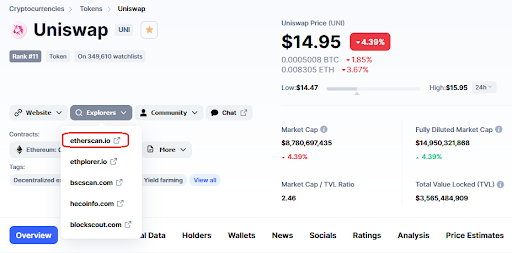

你现在看到的是 Uniswap 的概况，在这个页面上，你需要进入页面右上方的档案摘要，在这里你需要点击 Contract，如下图所示。

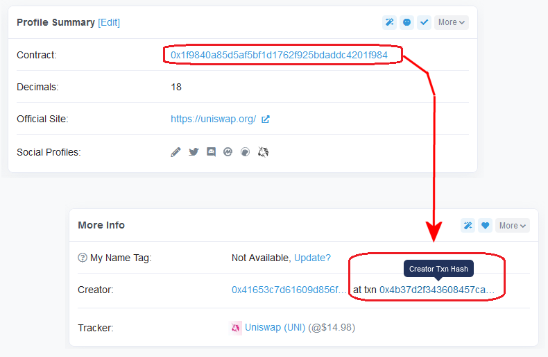

这将打开 Uniswap 合约的页面，在这个页面上你要[点击](https://etherscan.io/tx/0x4b37d2f343608457ca3322accdab2811c707acf3eb07a40dd8d9567093ea5b82) 上图所标的 txn 0x4b37.... 。

现在你会看到 Uniswap 合约创建的交易详情页面，交易哈希 0x4b37d2f343608457ca3322accdab2811c707acf3eb07a40dd8d9567093ea5b82 就是你要找的，因为这是用于部署 Uniswap 协议合约的交易。

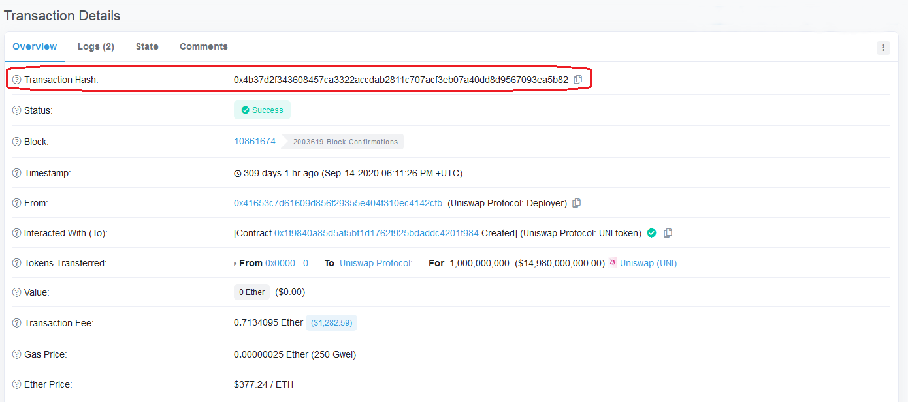

现在复制黏贴交易哈希到 ProofOfBeauty 搜索栏。

你会搜索发现注意到，这一交易哈希已经在 Genesis 第零季中被铸成了 73 号 NFT。

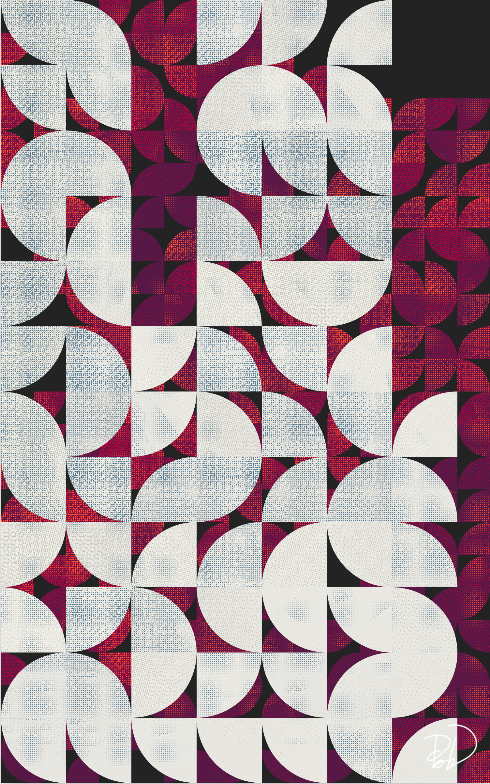

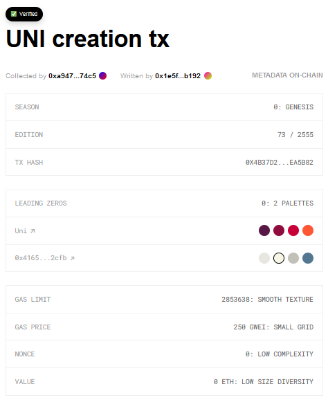

正如你在铸造信息上所看到的，所有者将其描述为「UNI 创建 tx」。

看到顶头的绿色 Verified 标记，表明这个 NFT 及其描述内容已被 Historian DAO 所验证。

## 用浏览器进一步搜索

对于一些独特的 NFT 铸造，另一种方法可以是查找 NFT 领域的其他已知项目。

The Bored Ape Yacht Club（无聊猿猴游艇俱乐部）：BAYC 通证已经勾起了很多人的兴趣，所以让我们深入了解一下。

从另一个 POB 铸造，我们知道这个 [txn](https://etherscan.io/tx/0x22199329b0aa1aa68902a78e3b32ca327c872fab166c7a2838273de6ad383eba) 是在该特定项目中创建的合约。

循着这一链接，你将进入 etherscan.io 的交易细节页面，见下图：

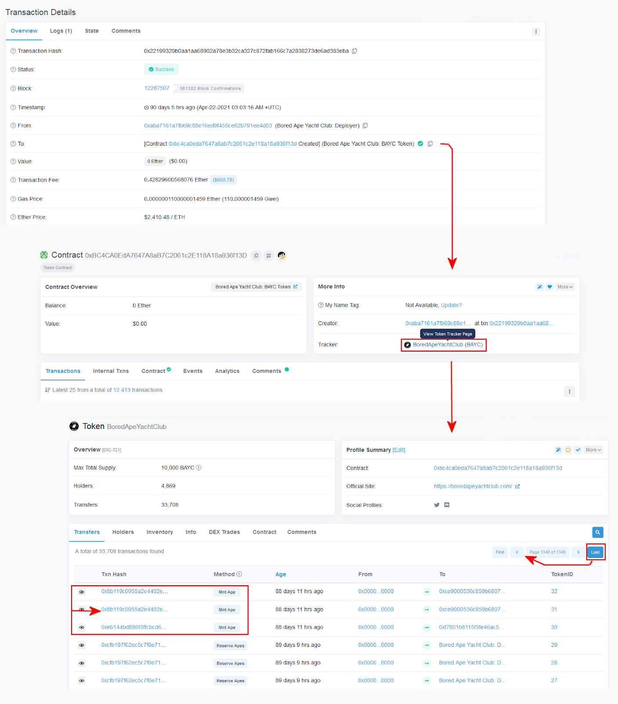

首先，你点击这个 [txn 合约](https://etherscan.io/address/0xbc4ca0eda7647a8ab7c2061c2e118a18a936f13d)

然后点击 Tracker：[BoredApeYachtClub（BAYC）](https://etherscan.io/token/0xbc4ca0eda7647a8ab7c2061c2e118a18a936f13d)。

现在看到的是 BoredApeYachtClub 的通证页面，关于这个例子，请点击最后一页。

这么做就能查看第一批交易。

似乎查看交易哈希、与 TokenID 相比的方法最正确，很多猿猴以完全相同的 txn 中保留。

让我们回退一页，点击上一页。

你现在应该在与上图底部完全相同的页面上。

现在点击图片中高亮显示的 [txn](https://etherscan.io/tx/0x8b119c0955a2e4402e6c11b820e84fa700b5e4d36b58e898ef8a4f0668a2f062)

现在应该看到与下图所示相同的页面：

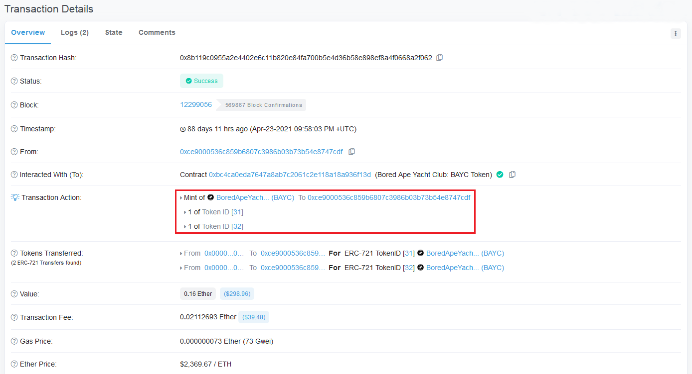

因此，似乎 txn 0x8b119c0955a2e4402e6c11b820e84fa700b5e4d36b58e898ef8a4f0668a2f062 被用于铸造 2 个 Bored Ape Yacht Club，ID 为 31 和 32。

使用 nftexp.io，可以通过 token ID 查询 Bored Apes Yacht Club。

那些在示例中的 txn 铸造的 NFT 看起来像这样：

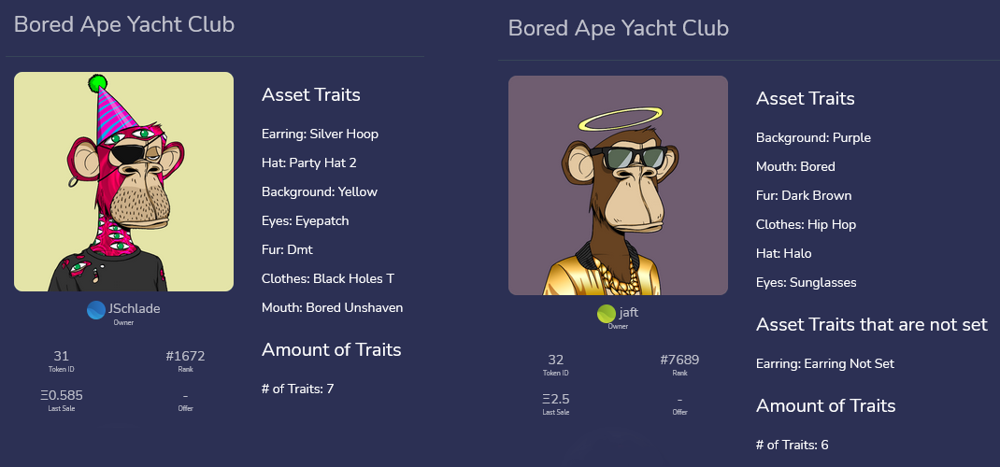

现在，继续在 [ProofOfBeauty](https://hash2.pob.studio/art/0x8b119c0955a2e4402e6c11b820e84fa700b5e4d36b58e898ef8a4f0668a2f062) 网站上查找 txn.

撰写本文时，这个 $HASH 还没有被铸造出来。

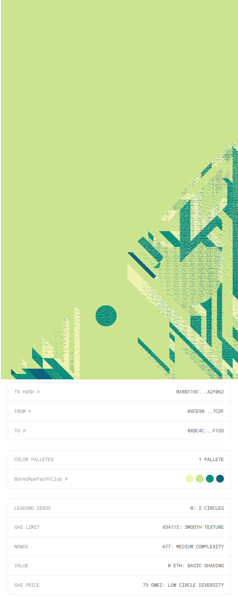

## 如何进一步搜索

我最早用来搜索随机的独特 txn 的网站工具之一是这个[网站](https://pob.kikoweb.ch/)。

似乎该站没有再更新显示 S1：SAGA 第一季的预览图，但尽管如此，仍然可以使用。

如果你试图用**start block: 430250 Num Blocks: 100** 进行搜索，然后点击扫描，你会得到以下结果：

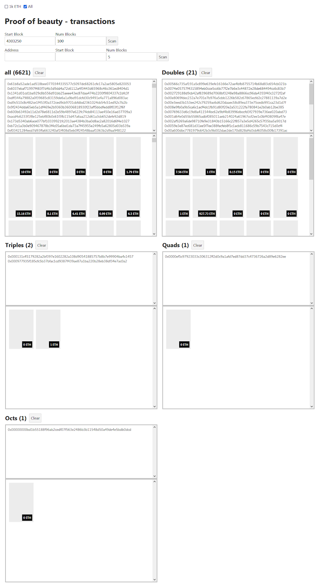

看到的是你想要搜索的 100 个区块内的交易数量。

要搜索独特而美丽的作品，也有一个费力的过程，你可以把每个 txn 粘贴到 ProofOfBeauty 的搜索栏里来看看它的视觉效果，也可以了解它是否已经被别人铸造了。

一个重要的参数是交易中的前导零数。

在 SAGA 第一季中，没有任何前导零的 $HASH 将有 2 个圆圈，每一个前导零都会增加一个圆圈。

迄今为止，拥有最多前导零的交易是这枚非常好的[作品](https://hash.pob.studio/art/0x00000000bd1b55188f96ab2cedf07f563e2486b3b11548d50a49de4e5bdb0dcd)，它有惊人的 8 个前导零，它是在 Genesis 第零季铸造的，编号为 894。

如果你深入研究上述图片，你会看到这个 txn 也是用这个网站工具发现的。

到目前为止，以太坊区块链上总共记录了 33 笔有 7 个前导零的交易，除了一个其余都是在 Genesis 第零季铸造的。

在 ProofOfBeauty 网站上可以看到[这个](https://hash.pob.studio/art/0x0000000a54f29044d7eadab9b7a683ec3fcebc42fc52eecd0ed455a09e97faae)带有 7 个前导零的 Saga 第一季 NFT。

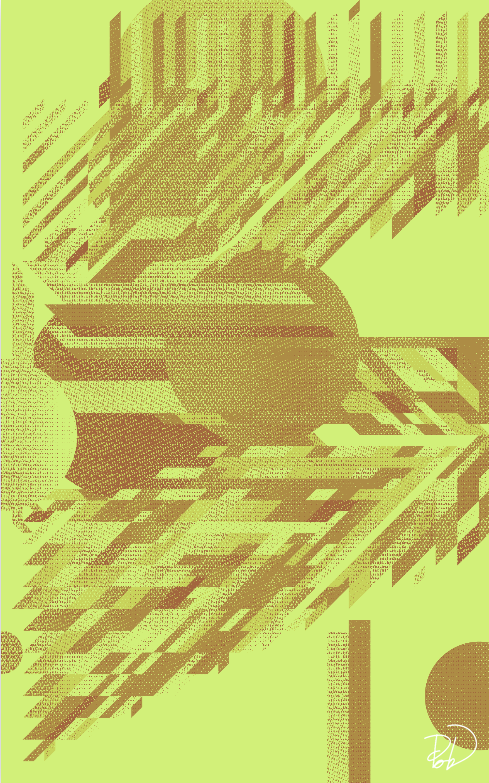

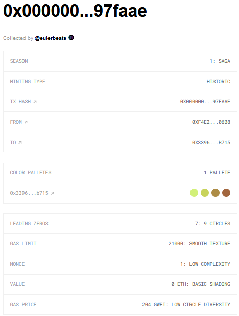

实际上，有很多参数产生了 ProofOfBeauty NFT 的最终视觉效果，你可在今年早些时候发布的[这篇文章](https://pob.mirror.xyz/WQAttPx_rDU2jCKwj66YHx_HMEpAWU2vXxR81PRiK0g)中深入了解 SAGA 算法的工作原理。

## 使用 SQL 进行高级搜索

搜索特定数量的前导零或其他参数，我建议使用 SQL，这就有点复杂了。

为了搜索以太坊区块链，我推荐使用 Googel Cloud BigQuery（谷歌云端大查询，它每月使用的第一个 1TB 数据是免费的。

使用这个[链接](https://console.cloud.google.com/bigquery?project=bigquery-public-data&page=dataset&d=ethereum_blockchain&p=bigquery-public-data&redirect_from_classic=true&ws=!1m4!1m3!3m2!1sbigquery-public-data!2sethereum_blockchain)可以进入 Googel Cloud BigQuery 平台的项目页面。

在平台上开始，你将需要导航到 crypto_ethereum 作为你要搜索的数据集。

通过选择 transactions 打开树状结构，这将显示哪些确切的变量可以使用数据集进行搜索。

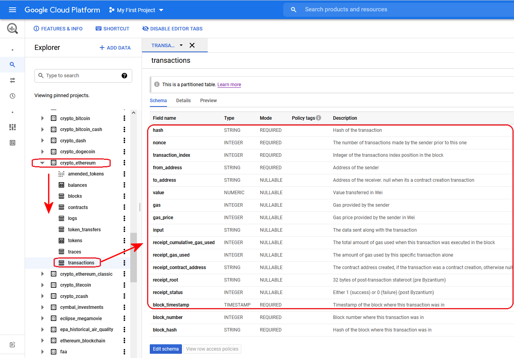

如果你点击屏幕中上部显示的细节，你会看到数据集的统计数据。

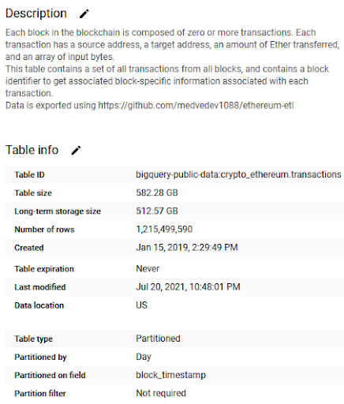

截至写作本文时，数据似乎比实际时间晚了约 45 分钟，但在不断地更新。

使用 SQL 来提取数据需要一些知识，我可能无法在这篇文章中教授 SQL，但作为一个例子，我将告诉你如何搜索截至 2021 年 7 月 20 日使用最多的前 10 个 ERC-721 合约。

使用下面的查询，你会得到这样的结果（我添加了通证名称）：

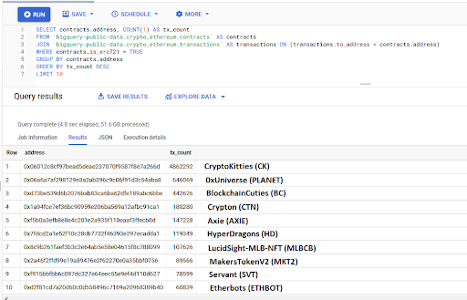

上述合约可以作为在这些项目中寻找独特 txn 的起点。

## 搜索历史交易

对有些人来说，这项任务只是简单明了，但对很多人来说，从哪里开始可能很难。这都是关于了解以太坊的历史。

我想说的是，一个好的开始可以是看看[以太坊的英文维基页面](https://en.wikipedia.org/wiki/Ethereum)。

在这个页面中，你会发现这个表格：

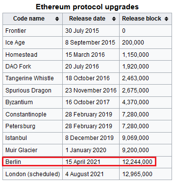

正如上图所见，以太坊在特定的区块编号上有一些协议升级。

我勾出了 2021 年 4 月 15 日发布的柏林升级，区块编号为 12244000。

现在请在这个[浏览器](<https://blockchair.com/ethereum/transactions?s=id(asc)&q=block_id(12244000)#f=hash,block_id,failed,time,sender,recipient,internal_value,index>)中查找该区块的编号，。

查看该页面会显示该区块中按时间顺序排列的交易，现在继续点击第一笔交易的[哈希](https://blockchair.com/ethereum/transaction/0xac503dd98281d4d52c2043e297a6e684d175339a7ebf831605fe593f01ce82c3)。

这笔交易是公布的柏林升级后第一个区块中的第一个 txn。

你可能想去看看 [ProofOfBeauty](https://hash.pob.studio/art/0xac503dd98281d4d52c2043e297a6e684d175339a7ebf831605fe593f01ce82c3) 上的交易。

连接钱包后，你很可能看到 Mint now。如果你看到这样的文字短语，这个交易仍可铸造。

如果看到 Opensea，说明这笔交易已经被其他人铸造了。

## 查阅历史上的 NFT 铸造及销售情况

这都是关于对 NFT 行业的了解，我对这个领域还不是很深入，但作为 Historians DAO 的一部分，我已经偶然发现了一些要求矿工验证一些著名的 NFT 艺术作品铸造等交易。

所以我想 Google 会是你最好的助手，挖掘出对进入 NFT 领域的人有价值的东西。

一旦你偶然发现一个项目，你需要进一步挖掘这个项目。起初，这是在以太坊区块链或其他地方部署的，这是检查的关键。

作为一个例子，让我们来探讨一下 Pak 的一个名为 Fade 的 NFT，查找一下[这个页面](https://www.sothebys.com/en/buy/auction/2021/natively-digital-a-curated-nft-sale-2/to-be-announced)：

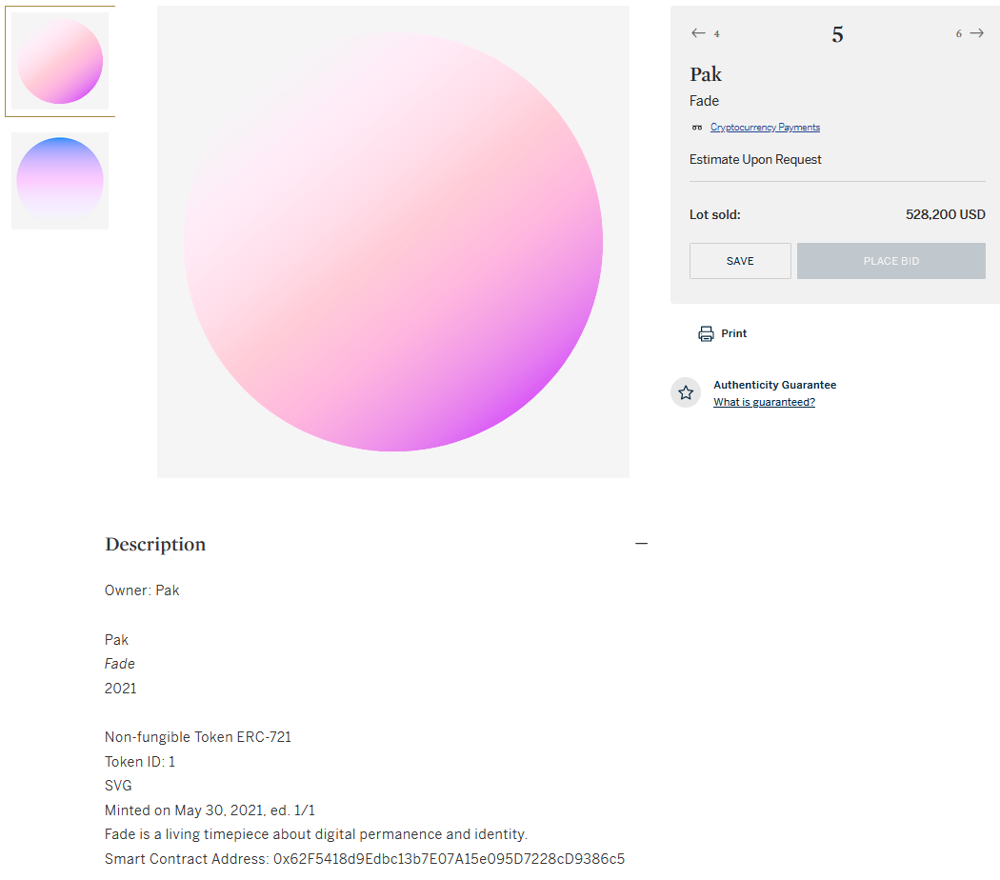

这个 NFT 的智能合约地址为 0x62f5418d9edbc13b7e07a15e095d7228cd9386c5

点击合约地址进行查询，查询该页面看到以下信息：Fade(FADE)

在页面底部，你会看到用于创建合同的交易。

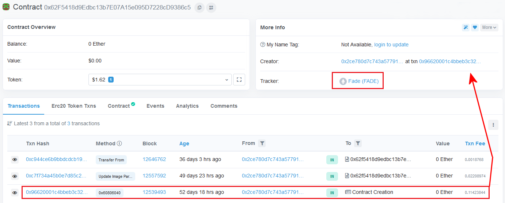

点击 [txn 0x9662000....](https://etherscan.io/tx/0x96620001c4bbeb3c32881e3cd011023d2fea5e87653a3f2856b562a16eab9489)，然后查看交易细节，你会看到这个 txn 被用来铸造 Fade ERC-721 通证，编号为 1。

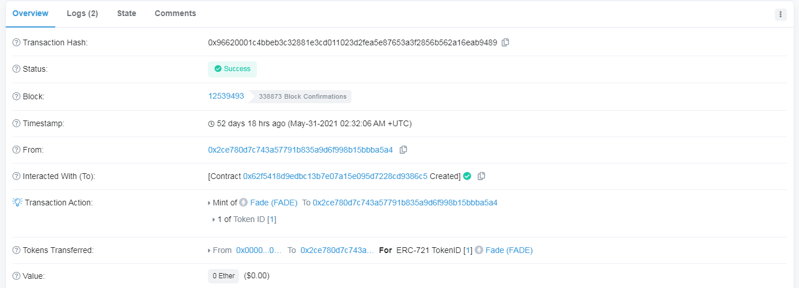

在 [ProofOfBeauty ](https://hash.pob.studio/art/0x96620001c4bbeb3c32881e3cd011023d2fea5e87653a3f2856b562a16eab9489)上查询发现这个 $HASH 已经被铸造了。

谢谢你花时间阅读这篇长文。如果你还不清楚该如何寻找一些独特的、也许美丽的 NFT 来铸造，非常欢迎你来我为展示我在 ProofOfBeauty 的 $HASH 发现而搭建的[网站](https://pobnfts.com/)看看。

网站上的大部分东西都是可以按你想要的价格拿走，也有几件是固定价格。

请注意，从网站购买任何东西只给你 $HASH，你需要用它来铸造 NFT 本身。

**延伸阅读：**

- $LONDON：纪念以太坊伦敦硬分叉升级，赶紧去撸这个有趣的币吧！| Today's Pick
- # $LONDON：礼品店艺术背后的故事 | Thought for Today

这里是「元宇宙特攻队」，我们下期见。
