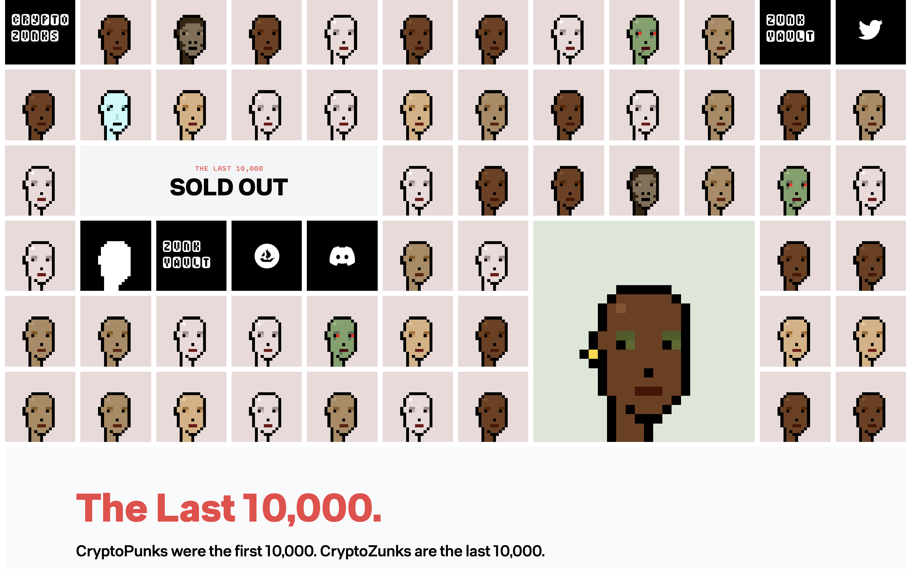
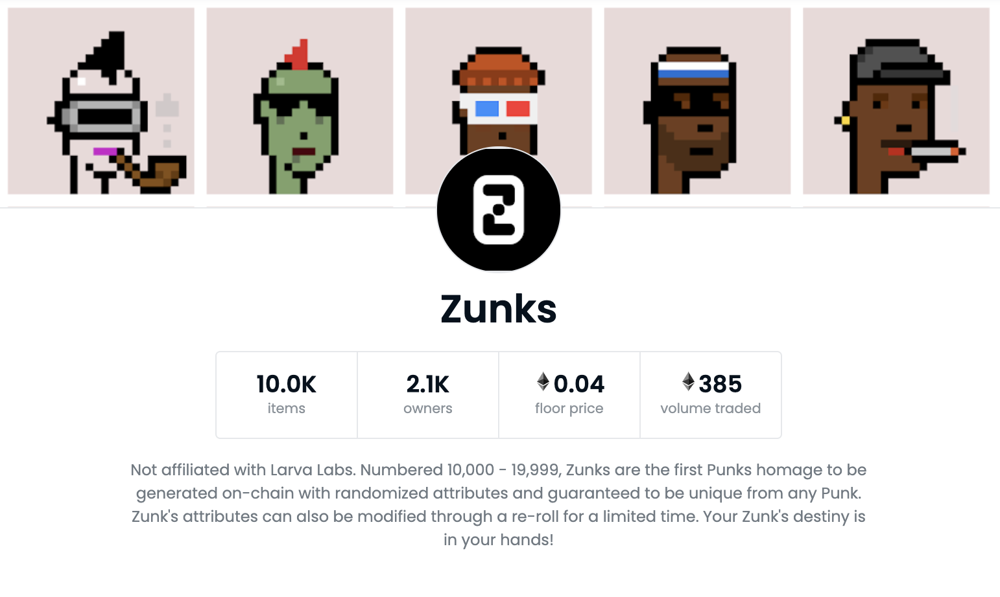
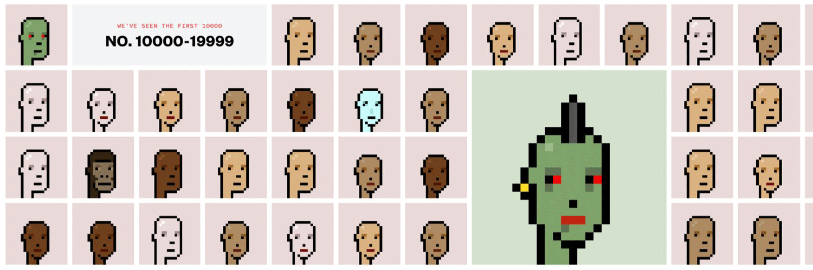

# CRYPTOZUNK：可以变脸的朋克头像 | Today's Pick

> 今天，「元宇宙特攻队」推荐一个有趣的朋克头像项目：CryptoZunks ✨✨✨✨
>
> 官网：**cryptozunks.com**

**By ABMTF_crypto**

自从 CryptoPunk 作为 NFT 领域的比特币项目在今年这轮牛市天价交易频出之后，众多山寨朋克头像（Altpunk）项目如雨后春笋般层出不穷、此起彼伏，其中，比如快餐朋克（Fast Food PUNK）项目在经历了几次生死徘徊后，现在较高的出价已经追平 CryptoPunk 的地板价。朋克头像这种 Meme（模因）玩法连玩带恶搞，吸引了很多有趣的灵魂。今天为你介绍一个玩法比较新颖有趣朋克头像：CryptoZunks。

打开官网首页，开宗明义说明：「CryptoPunks 是第一批 10,000 个朋克，CryptoZunks 是最后 10,000 个。」编号为 10,000 - 19,999 的 CryptoPunks 是第一批在链上生成的、具有随机属性的朋克头像，每一个 Zunk 都保证是独一无二的。

铸造 CryptoZunks 的价格是 0.05 ETH，但目前已经一售而空。想要获得 Zunk，可以上 Opensea 去淘宝。

(video)

CryptoZunks 最独特之处是，你可以修改 Zunk 的属性来掌控其「命运」。每次修改某个特征将花费 0.02 ETH，一次能同时改变 5 个属性特征。第一批 Zunk 系列的属性修改将在一个待定的日期正式关闭，之后就再也不能修改了。

## 如何修改属性？

CryptoZunks 的人类、僵尸、猿人、外星人等基本类型不能重新修改，你的 Zunk 拥有的附加属性可以重滚修改。每次重滚都会修改你现有 Zunk 的元数据，但项目方 Figmatic Labs 编写的智能合约会检查确保你的 Zunk 修改后后仍然是独一无二的。

重滚修改任何属性后，请确保刷新 OpenSea 上的元数据，以查看最新的变化。你也可以在官网的 Zunk Vault 中随时查看 Zunk 的更新。

一旦收藏完成（日期待定），就不再允许重滚修改，项目方将对收藏中的所有 Zunks 进行稀有性排名。

拥有 Zunk 的人可以独家获得项目方未来发布或空投的产品，以帮助用户寻求以令人兴奋的实用性和机制建立他们的元宇宙。

这里是「元宇宙特攻队」，我们下期见。
