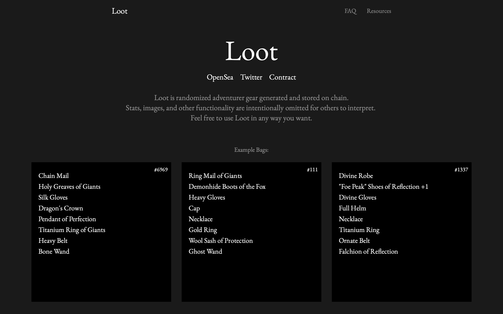
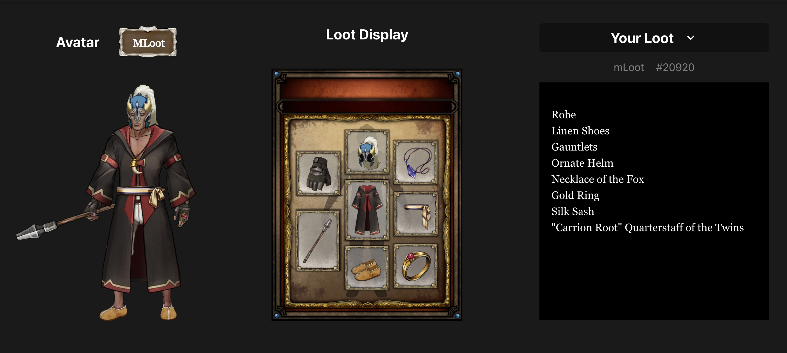
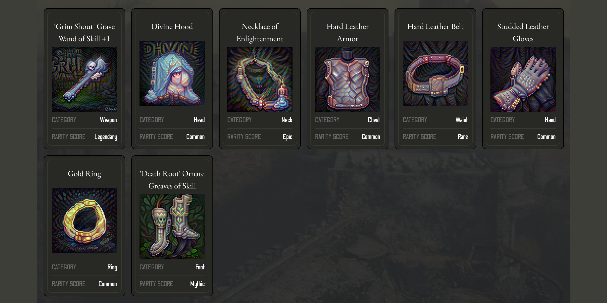
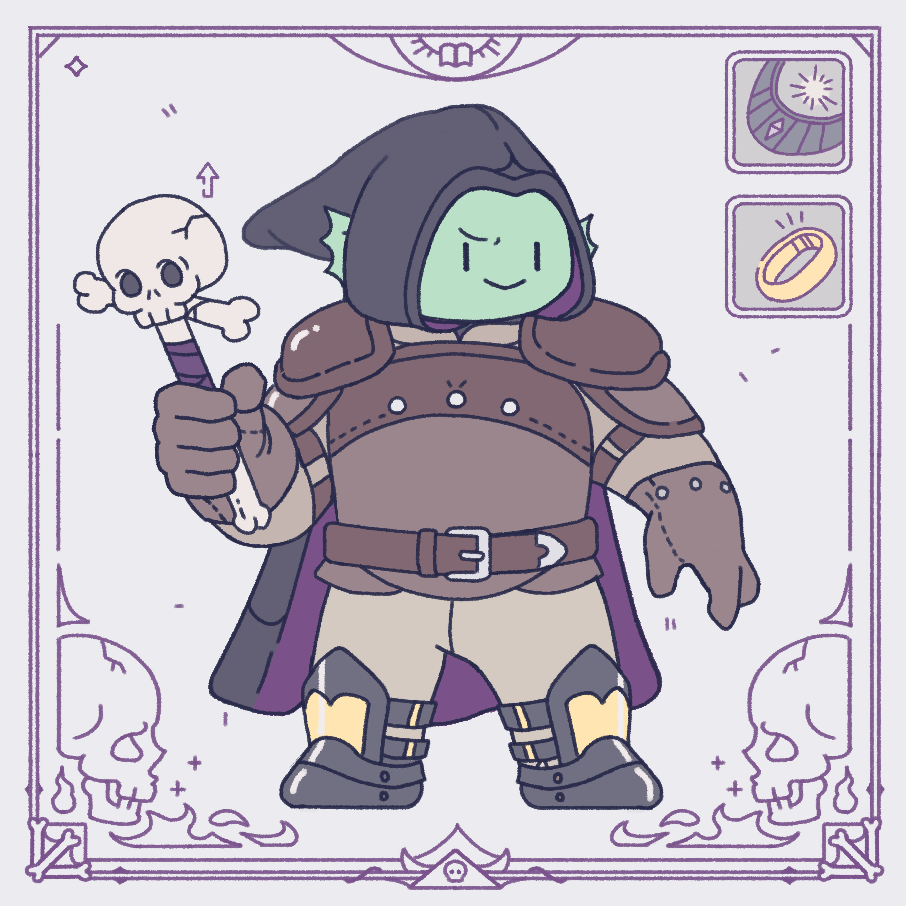

# 看看 Loot 创始人奶了哪 5 个 Loot 可视化软件？ | Today's Pick

> 自 8 月底 Loot 横空问世以来，围绕这一自下而上、公平铸造的 NFT 项目的狂热炒作已然退潮，但基于 Loot 的创作衍生却绵延不断……
>
> 昨天，Twitter 旗下短视频共享应用 Vine 的联合创始人、Loot 项目创始人多姆·霍夫曼（Dom Hofmann）发推推荐了 5 个 Loot 可视化软件，且让我们看看 Dom 都奶了哪些潜力项目？✨✨✨✨

**By cryptoroaming**

意为战利品的 Loot 仅有 8 行文字描述人物装备属性，给予加密/NFT/元宇宙世界的 Adventurers（冒险家们）无限的想象和创造空间。因此，Dom 说看到很多 Loot 的视觉化软件涌现出来，以不同视角诠释展现相同数据，令人兴奋！

## Loot Swag

> 官网：**https://lootswag.io**
>
> 推特：**@lootswag**

(lootswag.mp4)

连接钱包，只要你有 Loot、MLoot 和 Synthloot，就能生成栩栩如生的人物和装备形象。

_这是小编钱包里的一个 Mloot 生成的人物和装备_

## Lootmart

> 官网：**https://www.lootmart.xyz**
>
> 推特：**@lootmart_xyz**

Lootmart 利用最新 AI 技术可生成漂亮且超现实的像素可视化形象，而且能够解绑你的 Loot 为单件物品（并不破坏原有的 NFT 包），以便自由交易。它也许代表装备零部件和元游戏组合的一个趋势。

目前只能用 Loot 生成，未来 MLoot 也能使用。

## Loot Character

> 官网：**https://www.lootcharacter.com/**
>
> 推特：**@lootmart_xyz**
>
> GitHub 仓库：**https://github.com/jordanmessina/loot-layers**

(loot-character.mp4)

这是最早诞生的 Loot 可视化软件，基于 Loot Layers 项目而成，有着非常干净简单的像素生成方式。可用 Loot 铸造，并拥有有趣的「公会」概念。

## HyperLoot

> 推特：**@hyperloot\_**

(hyperloot.mp4)

一个即将发布的为 Loot 和 MLoot 而设计的新软件。

它似乎有一个非常深入的资产库，涵盖了许多不同的前缀和后缀，可以应用于命名的变体。

## Loot: Explorers

> 推特：**@LootExplorers**

也是一个即将发布的新项目，其艺术风格非常鲜明、极其有趣。

_**Dom 奶文原推：** https://twitter.com/dhof/status/1446477344093446153?s=20_

这里是「元宇宙特攻队」，我们下期见。
