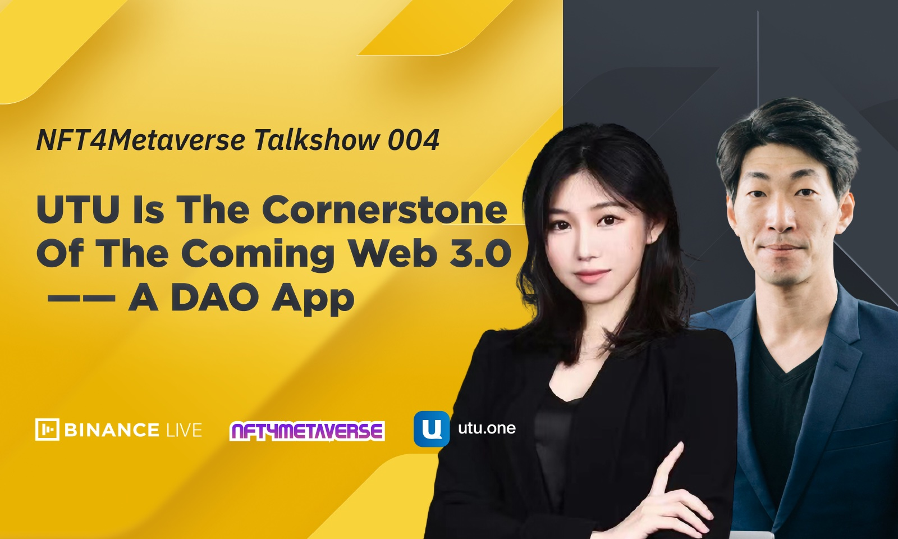
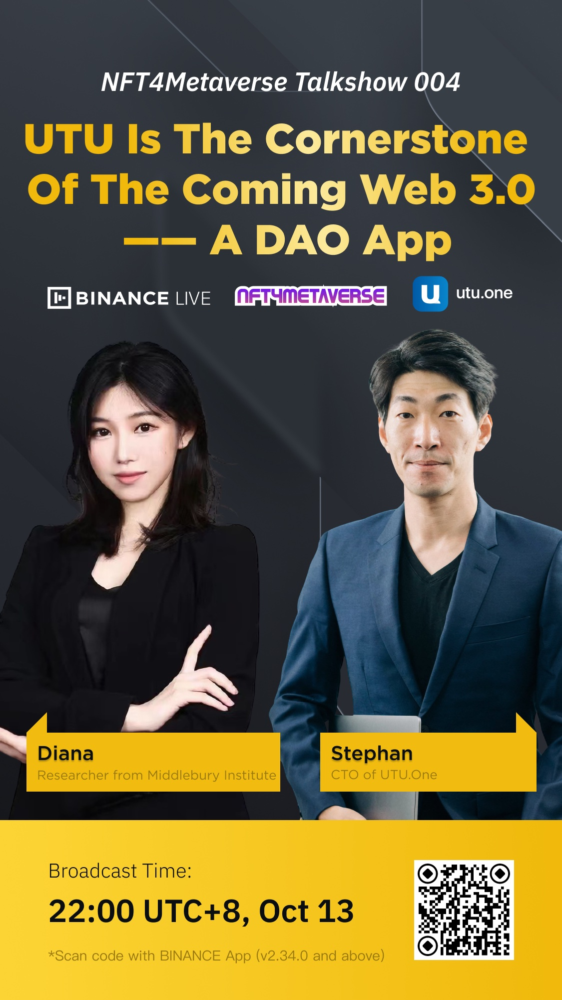
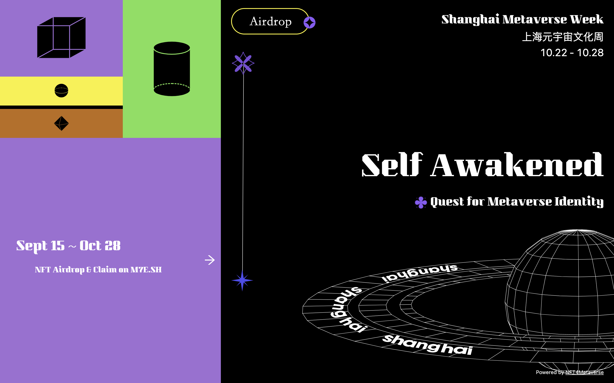

# 在向 Web 3.0 的范式转变中，Loot 该往何方？ | Thought for Today

> 正如上期 # 看看 Loot 创始人奶了哪 5 个 Loot 可视化软件？所言，Loot 的横空出世将 NFT 的创新带向了一个新的层次，也激发了许多人思考探索 Loot 在向 Web 3.0（元宇宙）的范式迁移中发挥什么作用，又面临哪些问题？
>
> 「元宇宙特攻队」日前收到一篇英语投稿，特翻成中文，与大家分享。

**英文原稿**

## Where Should Loot Go in the Paradigm Shift to Web 3.0?

**By Linda Yang from UTU**

### To all NFT holders, the age of Web 3.0 has arrived.

Gear up and play the game before the world is built. It is what's happening in crypto gaming. This cannot be the first time you heard about Loot if you are concerned about the trend in town.

Loot can be seen as a simple, fair mint project of randomly generated text on Ethereum.

Each NFT is a unique mix of gears. Look at this, all you get is a set of items in the text—no stats, images, or artworks. Then why are there tons of people willing to pay for a short piece of text? What are the enthusiasts looking for? The Loot homepage said, "Feel free to use Loot in any way you want." Everything that seems missing here is waiting for others to interpret and complete. In other words, people are buying the ownership of each elements' future. Players are here in the community before the game has even been built.

### Are you ready to have your world upside down?

Looking at the internet paradigm shift through the lens of NFTs, early NFTs like Loot, Crypto Punks, NBA Top Shot, and Art Blocks are the foundational elements of the upcoming Web 3.0. In a world where everything is going to be permissionless, open-source, and decentralized. Owners of these early NFTs should ask themselves – one day, if people don't have to wait for tech giants to build the metaverse and everything is in your hand, how would you make a metaverse?

Social NFT projects are way more than collectible card games. It's a shift from thinking in funnels to sustainable attention economies shaped in a pyramid. The paradigm shift brought by NFTs like Loot is to turn the traditional approach for value creation upside down. In the metaverse era, the surroundings and experiences will be created and operated by an extensive range of contributors. Each social NFTs in your pocket today will eventually become part of the smart contract. Visualize them and build upon these elements freely. Collectors of these early NFTs will be the pioneer players in the eternally immersive games.

You are the heroes in the narrative. Adventure stories and unimaginable gears, everything owned by game characters, now belongs to you. You will be free to build games, create avatars, develop the storylines and quest maps, and build metaverse. Under the current Web 3.0 decentralization movement, your characters and equipment from different games will be merged into one, and the barriers between platforms will be broken down.

### For adventurers, chaos is a ladder.

But how to climb? Where is the hidden path in this frenetic and chaotic new world? Thinking as a big tech, no one will choose a fundamental element without any community value. A rational game developer always follows the trends of the attention economy. Rewards will all depend on how you attract, hold, and manage the attention of your NFTs. Virtual items have evolved into virtual economies. The value of traditional NFTs is mostly derived from pure speculation. Once real games, magical architectures, and even a universe tied to these social NFTs emerged, it's attention that drives the value of your crypto items. Speculation cannot sustain a community.

Owning a social NFT is just a beginning if you truly expect to see the value of it. The community's awareness and significance behind the NFTs will be precisely what a creator is looking for. To make a noise, independent individuals must come together and seek a way to find their common interests and have a place that allows decentralized decision-making to process. Seeking info through forums like Discord? Or via group chats that you incidentally joined? In the Web 3.0 era, the process from initial technical development to promotion should be consistently bottom-up. It's the massive owners standing at the very bottom. That's why owners urgently need a space to discuss how to boost the value of the elements. They have a consensus on achieving value growth and letting their NFTs become something worth owning.

### Now, it's time to reset the orders of dominoes.

It's far away enough that only the internal groups of holders see the potential and value of these NFTs. How to attract the outsiders to jump on board and take your assets into their promising gaming projects? As we said above, ultimately, the value of the community determines the renown and reputation of your NFTs. To reinforce the value, holders ask for critical tools to place a table for all shareholders, build the community and process the bottom-up, decentralized decision-making sustainably. **Owners of these early NFTs are the underlying valued community.** Seeds of awareness of the NFTs will be explored and planted by the masses through consensual running.

Loot has taken the first step forward to Web 3.0. However, there's no way to reach its value potential because there's yet a way to reach effective decisions among stakeholders. We are stuck in building the superstructure above Loot. Now, the urgent need is to bring the owners together. There is a more extensive ecosystem awaiting us to discover and explore. Each community will spontaneously find out the most conscious way to grow the group and raise the renown and value of these fundamental NFTs. The most robust connection between decentralized autonomous communities will be sharing a standard bottom-up operating system. The Matthew effect will quickly spread through. To boost the value of their assets, everyone will be an essential contributor to the DACs, and the dynamic balance drives a new ecology to grow.

If Loot is an unprecedented experiment open to the public, the key is what we can build up with Loot instead of what Loot brought to the public. The next milestone should be to decide where and how to gather enthusiastic NFT owners from Loot, Crypto Punks, or any hot NFTs and allow the community to achieve decentralized decision-making smoothly. Each owner will be a shareholder, an organizer, and a contributor. Any platform that can provide a ready-made solution will be the ladder for survivors and winners to Web 3.0.

No one can determine the future of these social NFTs. We need the community to navigate their future.

**中文翻译**

## 在向 Web 3.0 的范式迁移中，Loot 该往何方？

### 对所有 NFT 持有人来说，Web 3.0 时代已经到来。

装备起来，在世界建成之前玩游戏，这就是加密游戏中常常发生的事情。如果你关注 NFT 领域的趋势，这不可能是你第一次听说 Loot。

Loot 可以被看作是以太坊上一个随机产生文本的一个简单、公平铸造的项目。
每个 NFT 都是一个独特的装备组合。仔细瞅瞅，你得到的只是文本描述的一组物品 —— 没有统计数字、图像或艺术品。那么为什么会有大量的人愿意为一段文字付费呢？发烧友在寻找什么？Loot 网站主页说：「请自由地以任何方式使用 Loot」。这里似乎缺少的一切都在等待别人来解释和完成。换句话说，人们正在购买每个元素的未来所有权。在游戏还没有建立起来的时候，玩家就已经来到了社区。

### 你准备好颠覆你的世界吗？

请通过 NFT 的视角来观察互联网范式的转变，如 Loot、Crypto Punks、NBA Top Shot 和 Art Blocks 等早期的 NFT 是即将到来的 Web 3.0 的基础要素。在这个世界里，一切都将是无需许可的、开源的、去中心化的。这些早期 NFT 的拥有者应该问自己 —— 有一天，如果人们不需要等待科技巨头来建立元宇宙，一切都在你的手中，你会如何创造一个元宇宙？

社交 NFT 项目潜力远远超过了那些可收藏的卡牌游戏。这是一个从漏斗式思维到金字塔式可持续注意力经济的转变。像 Loot 这样的 NFT 带来的范式转变是颠覆了传统的价值创造方式。在元宇宙时代，周围的环境和经验将由广泛的贡献者创造和经营。今天你口袋里的每个社交 NFT 最终都会成为智能合约的一部分。将它们可视化并在这些元素的基础上自由构建。这些早期 NFT 的收藏者将成为永恒的沉浸式游戏的先锋玩家。

你是叙事中的英雄。冒险故事和难以想象的装备，游戏人物所拥有的一切，现在都属于你了。你将自由地创建游戏，创造化身，发展故事情节和任务地图，并建立元宇宙。在当前的 Web 3.0 去中心化运动下，你在不同游戏中的角色和装备将合二为一，平台之间的障碍将被打破。

### 对于冒险家来说，混乱是阶梯。

然而，如何攀登？在这个狂热而混乱的新世界里，隐藏的道路在哪里？作为一家科技巨头来思考，没有人会选择一个没有任何社区价值的基本元素。一个理性的游戏开发者总是遵循注意力经济的趋势。回报将全部取决于你如何吸引、保持和管理你的 NFT 的注意力。虚拟物品已经演变成了虚拟经济。传统 NFT 的价值大多来自于纯粹的投机。一旦真正的游戏，神奇的架构，甚至与这些社会 NFT 相联系的宇宙出现，是注意力推动了你的加密物品的价值。投机不能让一个社区维持下去。

如果你真正期望看到它的价值，拥有一个社交 NFT 只是一个开始。社区对 NFT 的认知和背后的意义将正是一个创造者所寻找的。为了发声，独立的个人必须走到一起，寻求一种方法来找到他们的共同利益，并有一个允许去中心化决策的地方来处理。通过像 Discord 这样的论坛寻求信息？或者通过你偶然加入的群来聊天？在 Web 3.0 时代，从最初的技术开发到推广的过程应该是一贯的自下而上。站在最底层的才是庞大的拥有者。这就是为什么拥有者迫切需要一个空间来讨论如何提升这些元素的价值。他们对实现价值增长，让他们的 NFT 成为值得拥有的东西达成了共识。

### 现在，是时候重新洗牌了。

它离得足够之远，只有身在其内的持有人群体看到了这些 NFT 的潜力和价值。如何吸引外部人士加入，将你的资产纳入他们有前途的游戏项目？如上所说，最终，社区的价值决定了你的 NFT 的名声和声誉。为了加强价值，持有人要求提供一系列关键的工具，为所有利益相关者放置一张桌子，建立社区并可持续地处理自下而上的分散决策。\*8 这些早期 NFT 的拥有者是潜在的有价值的社区。\*\* 对 NFT 的认知的种子将由群众通过合意的运行来探索和播种。

Loot 已经向 Web 3.0 迈出了第一步。然而，目前没有办法充分其价值潜力，因为还没有在利益相关者之间达成有效决策的方式。我们被困在建造 Loot 上面的上层建筑。现在，当务之急是把拥有者聚集起来。有一个更广泛的生态系统等待我们去发现和探索。每个社区都会自发地找出最自觉的方式来发展团体，提高这些基本的 NFT 的名声和价值。去中心化自治社区之间最强大的联系将是共享一个标准的自下而上的操作系统。马太效应将迅速蔓延开来。为了提升他们的资产价值，每个人都将成为 DAC 的重要贡献者，动态平衡促使新的生态得以成长。

如果 Loot 是一个向公众开放的史无前例的实验，那么关键是我们能用 Loot 建立起什么，而不是 Loot 给公众带来什么。下一个里程碑应该是决定在哪里以及如何从 Loot、Crypto Punks 或任何热门 NFT 中聚集热情的 NFT 所有者，并让社区顺利实现去中心化决策。每个拥有者将是股东，组织者和一个贡献者。任何能够提供成熟解决方案的平台都将成为幸存者和赢家通往 Web 3.0 的阶梯。

没有人可以决定这些社交 NFT 的未来。我们需要社区为他们的未来导航。

今晚 10 点，上海元宇宙文化周第五场币安直播为你带来 UTU 的访谈，听一听 UTU CTO Stephen 介绍 UTU 这一 DAO App 如何努力解决上述的挑战和问题。为时一小时的访谈全程英文，因此直播流程原文如下：

As the cornerstone of the coming Web3.0 (Metaverse), UTU provides everyone a convenient DAO platform with its unique cross chain technology, built-in exchange and wallet, and individual NFT marketplace in each Dao. Come and get your DID to the metaverse.

Highlights:

1. Dao
2. Cross-chain
3. Built-in Dex, wallet
4. NFT Marketplace
5. DID

Webinar Sessions:

1. Introduction of Stephan (interesting fact) and Diana (interesting fact)
2. Talk about Dao:
   Dao-infrastructure of Web3.0,
   What’s Dao?
   Who needs Dao?
   How to create your own Dao?
3. Introduction of UTU
4. Quiz reward time
5. UTU future development plan
6. UTU rewards

IOS: https://apps.apple.com/ca/app/utu-one/id1556630562

Android: https://play.google.com/store/apps/details?id=com.utu.one

Invite Code：redefinesocial

_网址：**https://m7e.sh/**_

### 2021 上海元宇宙文化周日程更新

- 9 月 15 日至 10 月 28 日：NFT 空投与申领 @文化周官网
- 9 月 29 日至 11 月 21 日：《分身宇宙》展览 @苏州寒山美术馆
- 10 月 21 日：MOCA 展开幕虚拟酒会 @Decentraland
- 10 月 22 日至 28 日：《MOCA 展：自我的觉醒》 @元宇宙/官网/推特/上海 M50
- 10 月 22 日：开幕论坛《探寻元宇宙身份》@上海外滩创意家俱乐部
- 10 月 23 日至 24 日：超次元 & Flow 虚拟化身实时互动体验 @上海 M50 创+空间
- 10 月 23 日上午：Harmony 聚会《当上海在元宇宙与硅谷邂逅》 @上海 M50 创+空间
- 10 月 23 日下午：MyCryptoProfile 聚会 @上海 M50 创+空间
- 10 月 23 日晚：Polygon 生态元宇宙之夜 @上海 M50 创+空间
- 10 月 24 日上午：UTU.TOP 聚会 @上海 M50 创+空间
- 10 月 24 日下午：Dataverse 聚会 @上海 M50 创+空间
- 10 月 24 日晚：闭门酒会 @上海外滩创意家俱乐部
- 10 月 26 日：MOCA 聚会 @Somnium Space
- 10 月 27 日：元宇宙化身研讨会 @MAY
- 10 月 28 日：闭幕派对 @CryptoVoxels

* 以上活动截至今日，可能有调整变化，请密切关注文化周 M7E.SH 官网、元宇宙特攻队公众号和推特（@NFT4Metaverse）的通告！
