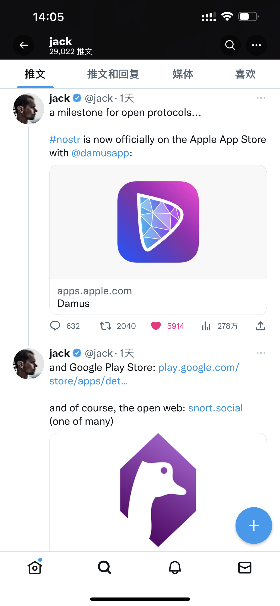
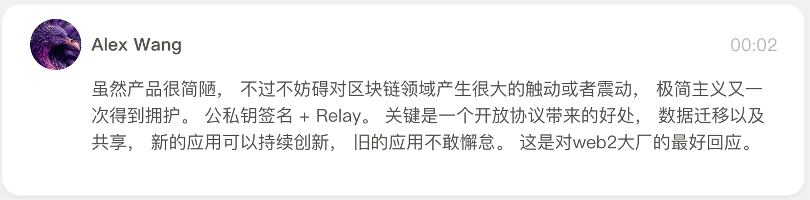
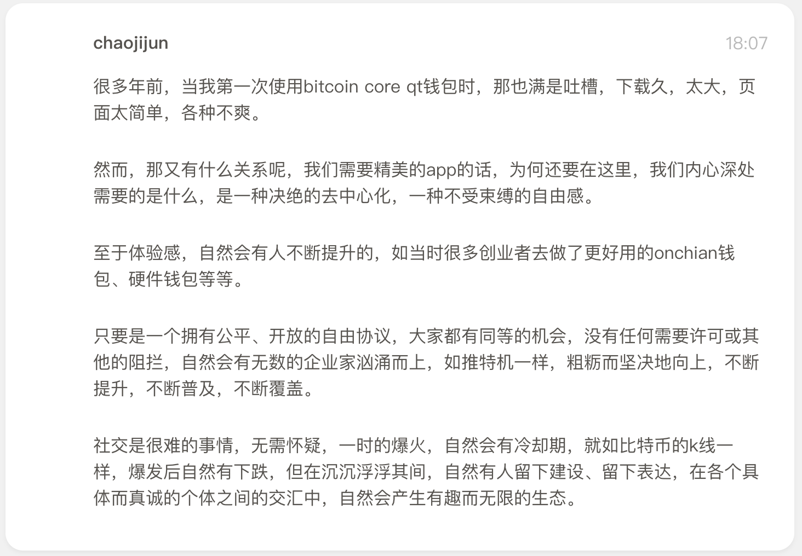
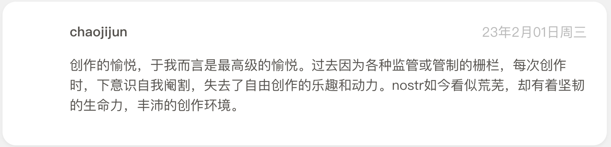
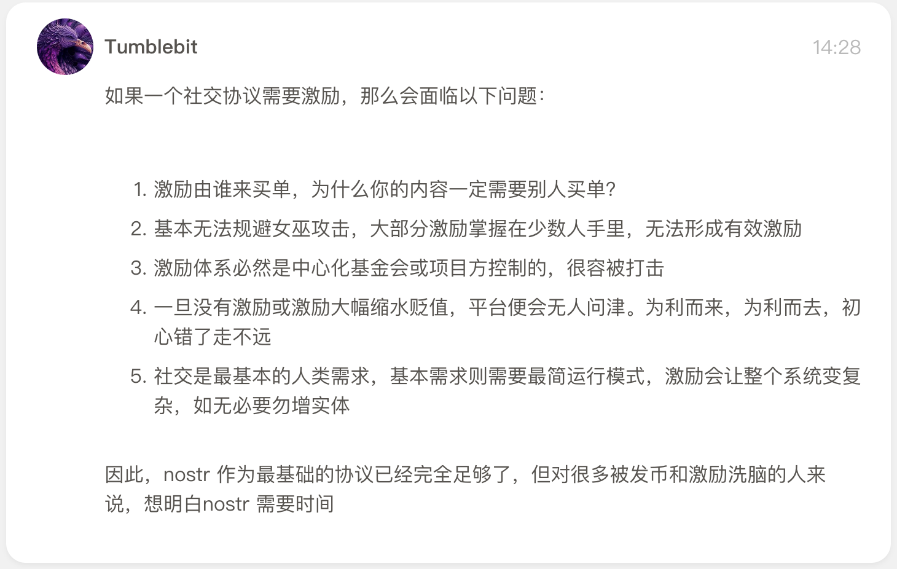
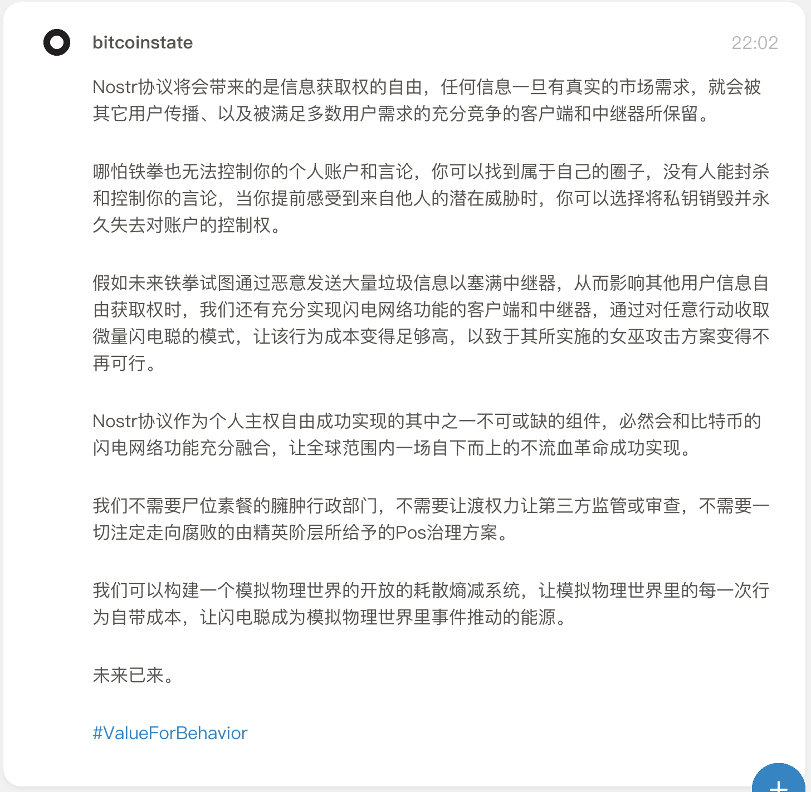
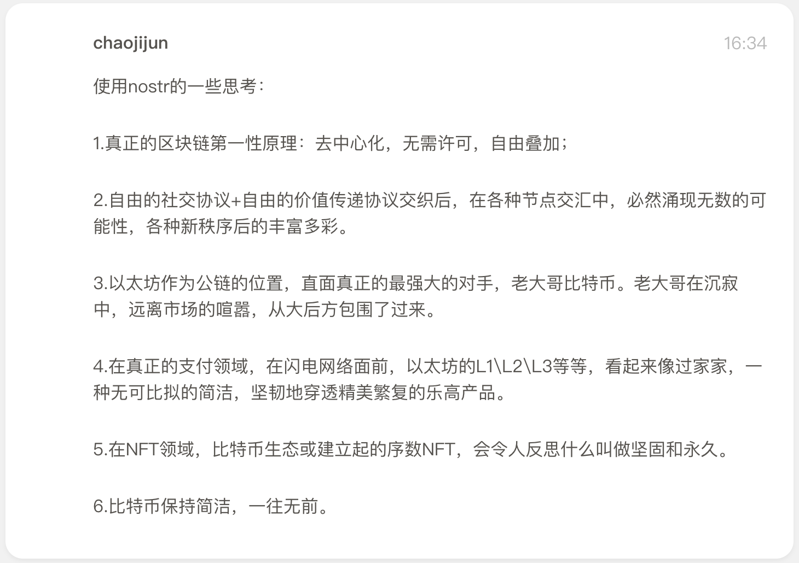
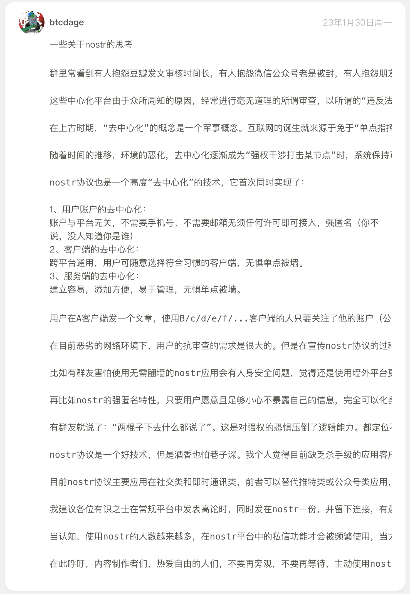
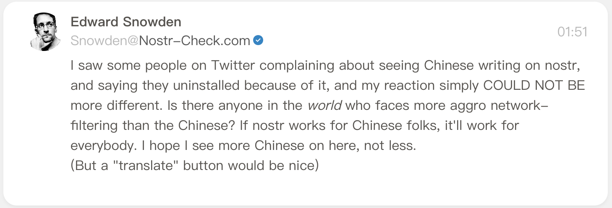

# Damus 一出，Nostr 能「杀」死 Twitter 吗？

> 昨天 2 月 1 日，Twitter 创始人 Jack Dorsey 一推奶 Damus —— 一款基于去中心化社交协议 Nostr 的 iOS 客户端上架，微信朋友圈立刻刷屏，币圈+链圈+Web3 圈+投资人纷纷贴出一串看不懂的公钥字符串，各路介绍分析文章竞相出炉……

**Damus 一出，Nostr 能「杀」死 Twitter 吗？**

且让我这个 13 年从业经历的媒体老兵、15 年 Twitter 老用户，以及 5 年币圈新韭菜为大家梳理一番，推荐以下 4 篇值得一读的文章、值得一听的播客——

- **Nostr 协议简介和 Damus 上手指南：** [火热！去中心化 Twitter：Nostr 协议为什么有趣？](https://mp.weixin.qq.com/s/s4kOaoFazvONifE7-0TF5w)
- **技术介绍 Nostr 协议：** [一文了解 nostr ：一个让 Elon Musk 感到害怕的去中心化社交协议](https://mp.weixin.qq.com/s/DRq1dhHru6xjx_KWCeUfPg)
- **深入浅出了解 Nostr 的价值** [Twitter 真正的替代者，也许是去中心化网络 Nostr](https://mp.weixin.qq.com/s/2OHBS4U4TTCHu2szmvWbBw)
- **比较与思考：** [去中心化社交协议： Nostr 向左， Farcaster 向右](https://mp.weixin.qq.com/s/Tj6shkn_2_BCwSr_YPMrBg)

Nostr 使用体验到底如何？第一批吃螃蟹的人都在那里说了些啥？为保持原汁原味，截图如下——

### 关于体验

### 关于激励

### 关于价值

### 关于中国人「挤爆」Nostr

> 斯诺登说：「我在推特上看到一些人抱怨在 nostr 上看到中文字，并说他们因此而卸载，而我的反应简直不能再不同了。世界上还有人比中国人面临更严重的网络 XX 吗？如果 nostr 对中国人有用，那么它对所有人都有用。我希望我在这里看到更多的中国人，而不是更少。(但如果有一个 "翻译 "按钮就好了。）」

如果你有以上用户的需求和痛点，请来体验 Nostr，欢迎加我关注——

npub1z6mvnum57x3wg005xmq4z3yxfdcwcyxsp5829gqz9naeeharpmds0l2st7
