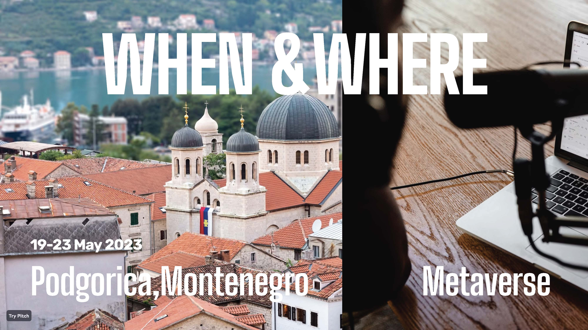

# Web3 可组合之旅，7 天后黑山启程，你上车么？ | Web3 Composability Odyssey@EDCON 2023 ③

> 7 天后的今天，Odyssey DAO 团队落地黑山，与来自全世界的 Web3 建设者一起奔赴 5 月 19 日召开的以太坊社区开发大会 EDCON 2023，开启黑山 Web3 可组合性之旅！

# 官网上线

(site video)

ppqq 点击 **www.odysseydao.io** 实时查看由 Odyssey DAO 发起、律动 Blockbeats & M7e 元宇宙特攻队 & ManesLAB 协办、DataverseOS & DeBox & EBunker & Navigator 赞助支持的 Web3 Composability Odyssey 的最新进展。

_扫码或点击文末「阅读原文」查看官网_

# 议题出笼

在这场 OG 云集、聚焦于 Public Goods & Network State 最新叙事的全球 #Web3BUIDL 盛会中，我们邀请全球底层协议、中间层服务、上层应用、DAO、NFT 项目创始人、建设者、创作者和研究者一起就以下 Web3 可组合性议题分享真知灼见、孵化创意和创新——

- **Web3 可组合性，是常识还是叙事？**
- **Web3 可组合性如何为公共物品、网络国家建设奠定基础?**
- **目前公链和去中心化存储的演进，为 Web3 可组合性带来哪些挑战和机遇？**
- **NFT 如何超越金融属性，作为组件赋能 Web3 可组合性？**
- **DAO 如何利用 Web3 可组合性，在公共物品和网络国家建设发挥独特作用？**
- **DID 和 Web3 社交如何发展，帮助培育数字公民、构建网络国家？**

# 日程初定

### ① VIRTUAL TALK：聊聊 Web3 可组合性

**地点：** Twitter Space

合作伙伴 Atticc、BUIDLER DAO、Viti Diary 主理，围绕 NFT、DAO、社交、游戏等技术和应用组织 4 场线上讨论：

- 5 月 12 日北京时间晚 8 时：**华人 Builder 在黑山｜ NFT 在 Web3 游戏中的应用** Viti Diary 主理
- 5 月 13 日北京时间晚 8 时：**华人 Builder 在黑山｜ AI 如何帮助 DAO 的决策治理** BUIDLER DAO 主理
- 5 月 17 日北京时间晚 8 时：**华人 Buidler 在黑山｜ DAO 如何平衡去中心化和效率** BUIDLER DAO 主理
- 5 月 18 日北京时间晚 8 时：**华人 Builder 在黑山｜在 Web3 的第一个朋友** Atticc 主理

### ② RANDOM WORSHOP：探营 Zuzalu

**主理：** OKX wallet、Odyssey DAO

**时间：** 5 月 17 或 18 日

**地点：** 黑山蒂瓦特

Zuzalu，为期两个月、第一个由以太坊创始人 Vitalik 和来自全球的 200 加密居民围绕合成生物学、隐私技术、公共物品、长寿、治理等课题共住共学共创的临时社区将近尾声，我们举办即兴工作坊，邀请参与者、探访者一起演示讨论和脑暴……

### ③ PIZZA DAY：Ordinals 聚会

**主理：** AstroX、Odyssey DAO

**时间：** 5 月 22 日晚

**地点：** 黑山波德戈里察

12 年前的 5 月 22 日，有人用 10000 个比特币购买了 2 个披萨饼 —— 如今价值 2.75 亿美元、堪称史上最贵披萨饼，12 年后的披萨日，我们将邀请大家一起边吃披萨边聊聊为啥在每一个聪上铭刻 NFT、BRC 代币令人兴奋……

### ④ PANEL DISCUSSION：Web3 社交的痛点和引爆点

**主理：** DeBox、Odyssey DAO

**时间：** 5 月 23 日上午

**地点：** 黑山波德戈里察 Voco Hotel

在 EDCON 2023 社区日主会场，我们邀请 Firefly、Mask、SeeDAO、TokenPocket、SeeDAO 一起讨论 Web3 社交目前存在哪些痛点，何时迎来引爆点……

### 活动 ⑤ WEB3 COMPOSABILITY CONFERENCE：深潜 Web3 可组合性

**主理：** EBunker、Odyssey DAO、律动 Blockbeats、ManesLAB

**时间：** 5 月 23 日下午

**地点：** 黑山波德戈里察

我们邀请在黑山 EDCON 的 Web3 Builder 开展对话，探寻可组合性作为 Web3 发展的新动力……

### 嘉宾云集，陆续确认中

### 欢迎参与 申领 POAP

**主理：** Social Layer

**时间：** 5 月 1 日至 31 日

凡参与线上线下 Odyssey 活动的嘉宾和观众，以及为本次 Odyssey 做出贡献的合作伙伴均可申领由 Social Layer 精心设计发行的 4 种链上 POAP，还有限量 100 枚实体徽章，供线下参会者领取，先到先得！~

_注：未来，持有 Odyssey 徽章可铸造 Odyssey DAO 的 NFT。_

# 合作伙伴，集结就位

截至 5 月 9 日，Web3 Composability Odyssey@EDCON 2023 又迎来 DeBox、EBunker、3WW3 亚非拉 Web3 研究院、AstroX、eNode、EthStorage、Funtastic 玄风航空、KEYPAL、MetaCat、Metopia、OKX Ventures、OKX Wallet、TD Club、TokenPocket、Web3 行研会、Mempool 等 17 位新合作伙伴加入，让我们的共创伙伴阵营达到了 42 家！

- **协办方：** 律动 Blockbeats、M7e 元宇宙特攻队、ManesLAB
- **贡献者：** DataverseOS、DeBox、EBunker、Navigator
- **合作伙伴：** 3WW3 亚非拉 Web3 研究院、706 Creators、Antalpha Labs、AstroX、Atticc、BUIDLER DAO、eNode、EthStorage、Funtastic 玄风航空、KEYPAL、Litentry、Mask Network、MetaCat、Metaforo、Metopia、OKX Ventures、OKX Wallet、PAKA、SeeDAO、Social Layer、TD Club、THEPASS、TokenPocket、Viti Diary、Web3MQ、Weido Ghost Gang、Web3 行研会
- **媒体支持：** 币扑、胖车库、Foresight News、Mempool、星球日报、橙皮书

_注：合作伙伴 Logo 按英文首字母排序_

# 欢迎入群 参与共创

如果熊市低迷、AI 火爆都未能动摇你 All in Web3 的信心和行动，而且对 Web3 可组合性的可能性和前景充满兴趣，无论你是否去黑山，无论现在是什么身份状态，欢迎上车黑山 EDCON Web3 Composability Odyssey，敬请关注后续最新进展！

