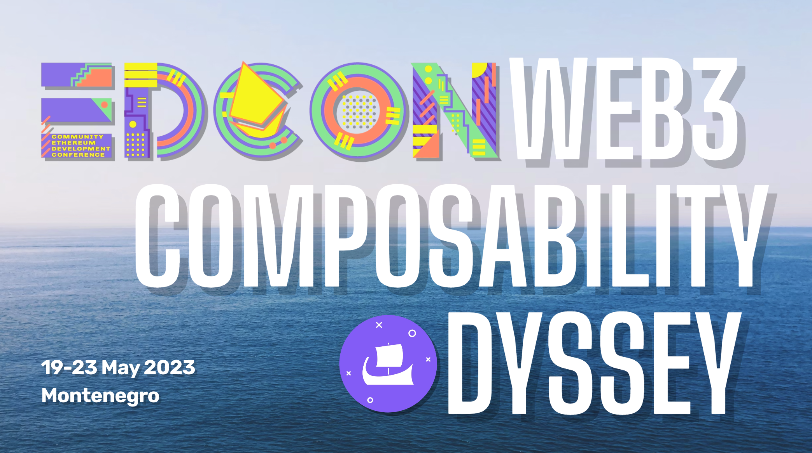
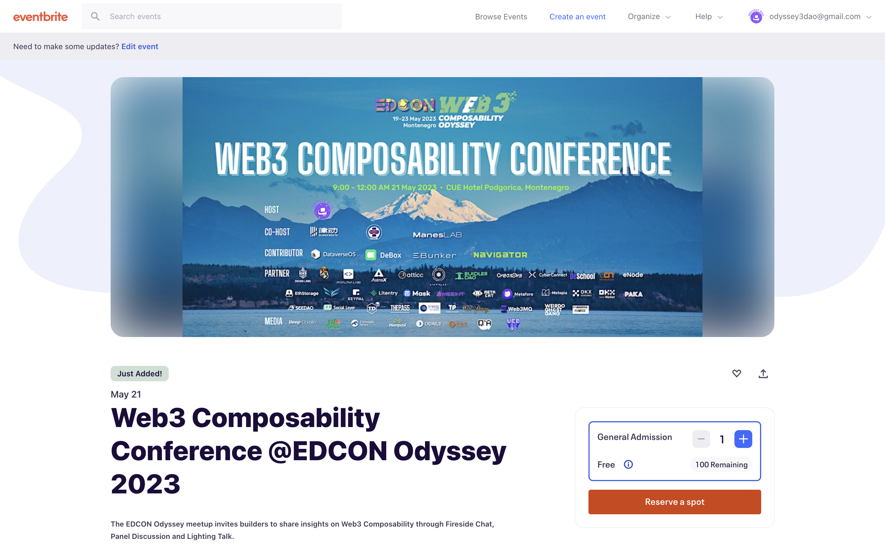
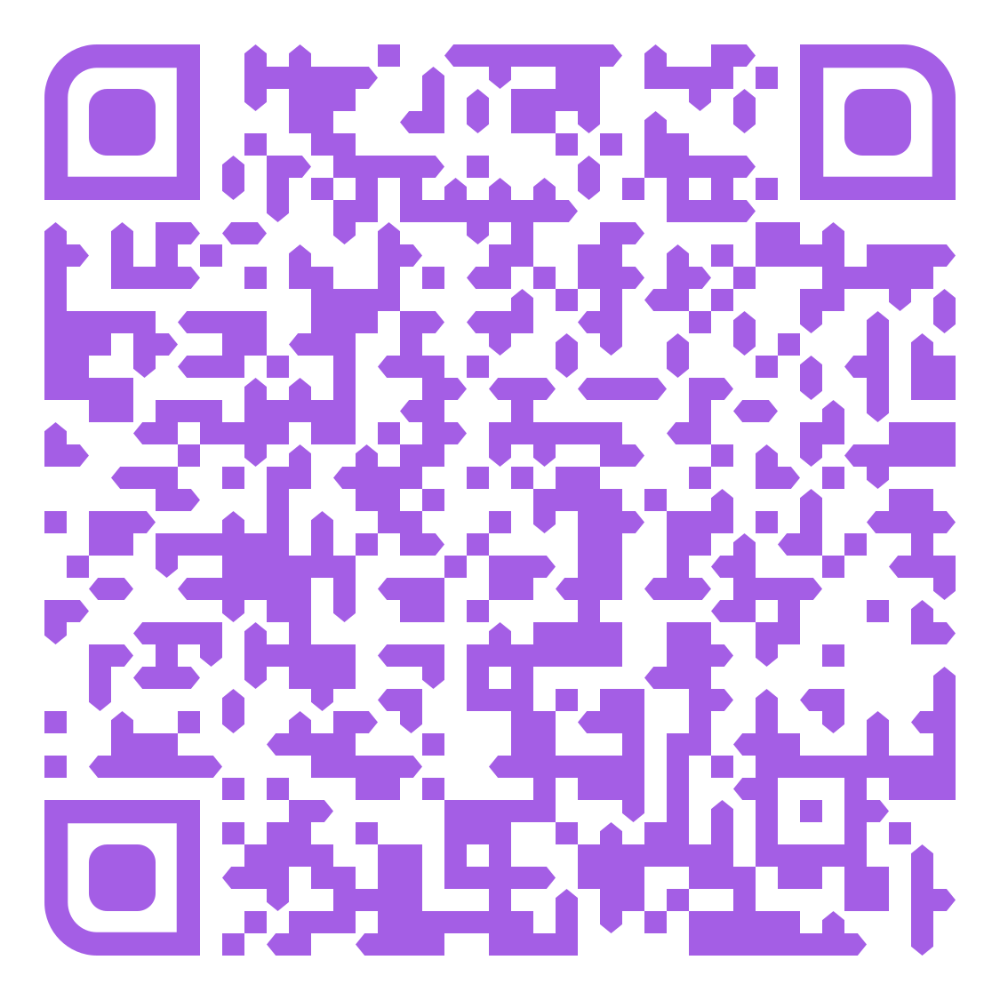
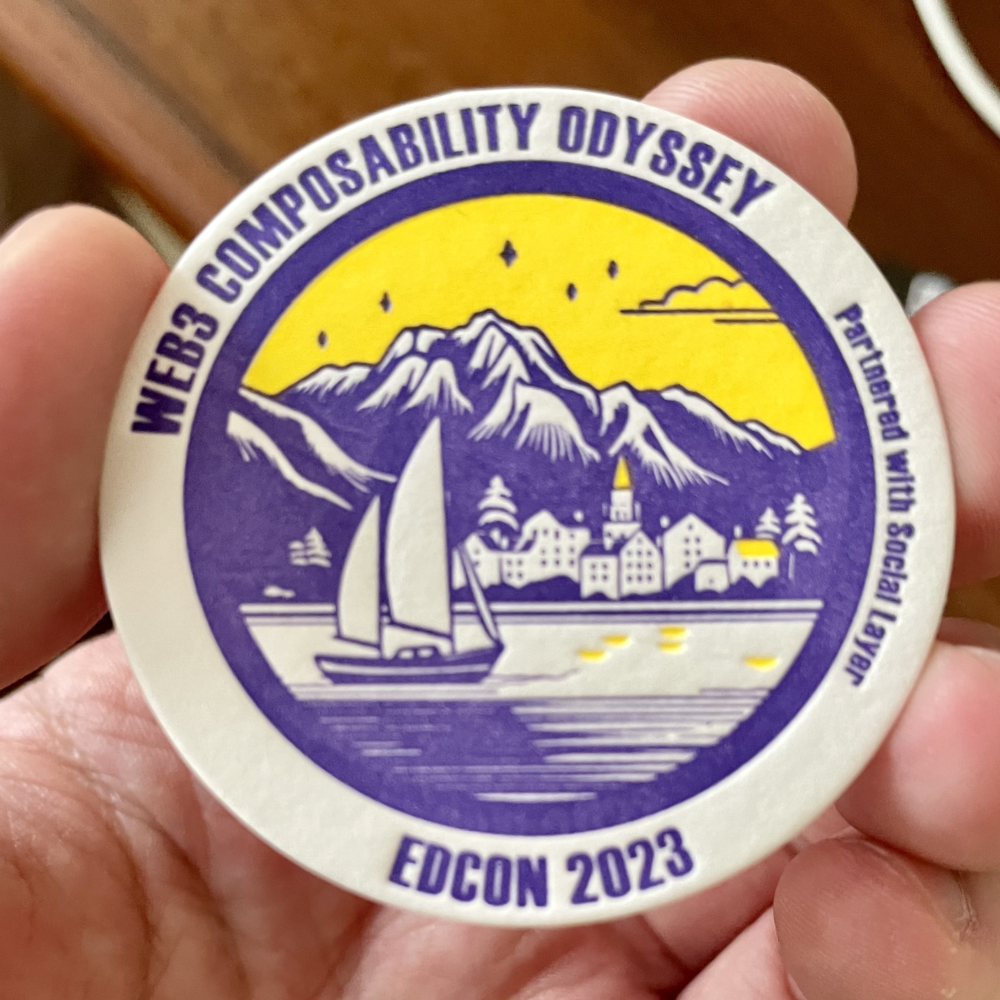
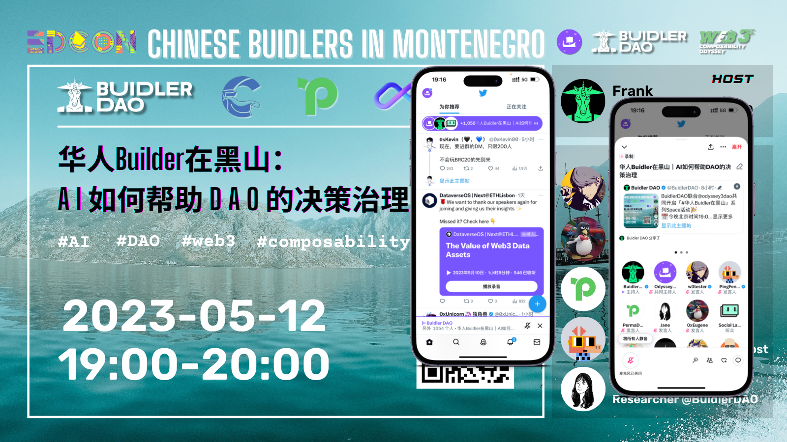
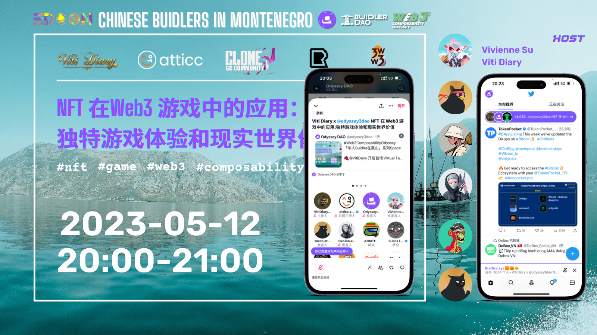

# 7 天后的 Web3 可组合研讨会欢迎全球建设者上台 | Web3 Composability Odyssey@EDCON 2023 ④

> 7 天后、5 月 21 日在黑山波德戈里察举行的 Web3 Composability Conference，8 天后、5 月 22 日举办的 OrdVibe Pizza Day，将是黑山 Web3 可组合性之旅的重头戏！

## 5 月 21 日：Web3 Composability Conference

在黑山举行的 EDCON2023 聚集全球 Web3 建设者讨论 L2、DID、公共物品、网络国家，是时候重申 Web3 可组合性这一常识，为前述的叙事奠定基础。

- **主办：** Odyssey DAO
- **协办：** 律动 Blockbeats, M7e 元宇宙特攻队, ManesLAB
- **内容共创：** BUIDLER DAO, CyberConnect, PlanckerDAO, Social Layer, 万物岛 ThreeDAO
- **赞助：** DataverseOS, DeBox, EBunker, Navigator

5 月 21 日上午，我们在黑山波德戈里察 CUE 酒店举办 Web3 Composability Conference 0，邀请区块链协议、去中心化应用、DAO、NFT 项目创始人、建设者、创作者和研究者一起通过 Fireside Chat、Panel Discussion 和 Lighting Talk 就就 Web3 可组合性从技术到应用的无穷可能和前景分享真知灼见、孵化创意和创新。

**时间：** 黑山时间 2023 年 5 月 21 日上午 9 时至 12 时

**地点：** CUE Hotel Podgorica，Cetinjska 7 The Capital Plaza 81000 Podgorica Montenegro

届时，首届 Web3 可组合研讨会将就以下议题组织 1 场 Fireside Chat、2 或 3 场 Panel Discussion，以及 12 或 18 个 Lighting Talk 展开 ——

- Web3 可组合性，是常识还是叙事？
- Web3 可组合性如何为公共物品、网络国家建设奠定基础?
- 目前公链和去中心化存储的演进，为 Web3 可组合性带来哪些挑战和机遇？
- NFT 如何超越金融属性，作为组件赋能 Web3 可组合性？
- DAO 如何利用 Web3 可组合性，在公共物品和网络国家建设发挥独特作用？
- DID 和 Web3 社交如何发展，帮助培育数字公民、构建网络国家？

其中，从全球奔赴黑山的 Web3 建设者为主角的 Lighting Talk 是最重要的亮点！现在，欢迎扫码报名！

_链接：https://forms.gle/h3dFvfqdY7qZrz8VA （复制地址在浏览器打开）_

Web3 Composability Conference 已在 Eventbrite 开放报名，100 席位，先到先得。

_即刻扫码抢票_

## 5 月 22 日：OrdVibe PIZZA DAY

- **主办：** Odyssey DAO, AstroX
- **时间：** 5 月 22 日晚
- **地点：** 黑山波德戈里察

12 年前的 5 月 22 日，有人用 10000 个比特币购买了 2 个披萨饼 —— 如今价值 2.75 亿美元、堪称史上最贵披萨饼，12 年后的披萨日，我们将邀请大家一起边吃披萨边聊聊为啥在每一个聪上铭刻 NFT、BRC 代币令人兴奋……

具体地点时间和内容形式，待 Odyssey DAO 团队后天落地黑山实地考察确定后，再向大家报告，敬请期待！

## 实体 POAP 线下申领

这 100 枚由 Social Layer 设计制作的 Web3 Composability Odyssey 实体徽章只有参与上述及其他预告的线下活动才能领取，先到先得！

## 5 月 12 日，奥德赛成功揭幕

两天前，5 月 12 日晚 7 时起，连续两场 Twitter Space，嘉宾精彩分享，在线听众均在千人以上，为 Web3 Composability Odyssey @EDCON2023 成功揭幕 ——

- 5 月 12 日北京时间晚 7 时：**华人 Builder 在黑山｜ AI 如何帮助 DAO 的决策治理** BUIDLER DAO 主理

- 5 月 12 日北京时间晚 8 时：**华人 Builder 在黑山｜ NFT 在 Web3 游戏中的应用** Viti Diary 主理

## 合作伙伴，再添 8 位

截至 5 月 14 日，Web3 Composability Odyssey@EDCON 2023 又迎来 OxGen Labs、Ascendant、 CyberConnect、DeSchool、ECN、万物岛 ThreeDAO、QA 元宇宙、Web3.0go 等 8 位新合作伙伴加入，让我们的共创伙伴阵营达到了 50 位！

- **协办方：** 律动 Blockbeats、M7e 元宇宙特攻队、ManesLAB
- **贡献者：** DataverseOS、DeBox、EBunker、Navigator
- **合作伙伴：** OxGen Labs、3WW3 亚非拉 Web3 研究院、706 Creators、Antalpha Labs、AstroX、Ascendant、Atticc、BUIDLER DAO、CyberConnect、DeSchool、ECN、eNode、EthStorage、Funtastic 玄风航空、KEYPAL、Litentry、Mask Network、MetaCat、Metaforo、Metopia、OKX Ventures、OKX Wallet、PAKA、SeeDAO、Social Layer、TD Club、THEPASS、万物岛 ThreeDAO、TokenPocket、Viti Diary、Web3MQ、WeidoGhostGang、Web3 行研会
- **媒体支持：** 币扑、胖车库、Foresight News、Mempool、星球日报、橙皮书、QA 元宇宙、Web3.0go

_注：合作伙伴 Logo 按英文首字母排序_

## 登录官网 关注实况

更多 Twitter Space、更多奥德赛合作伙伴周边活动，请随时登录黑山 EDCON Web3 Composability Odyssey 官网，敬请关注后续最新进展！

(video)

**点击「阅读原文」，登录官网**
