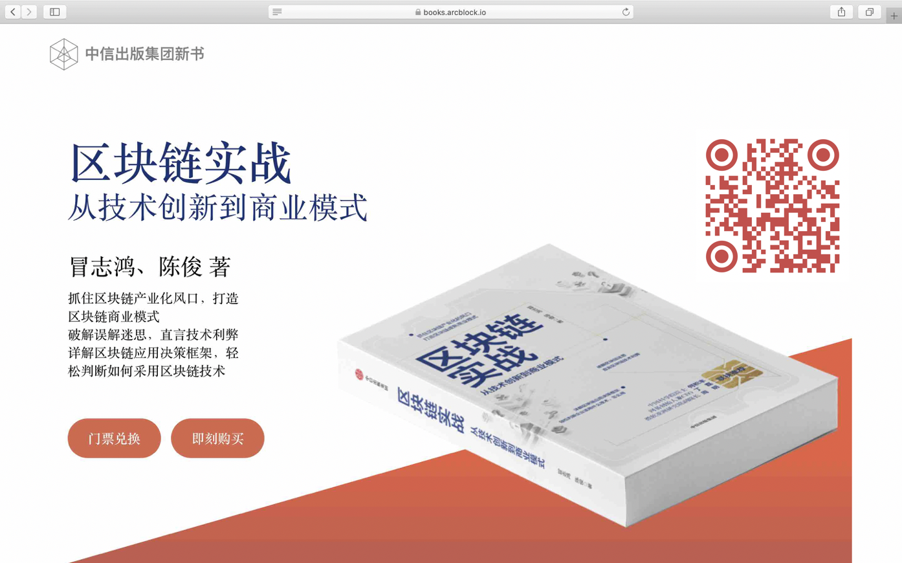

# 几个容易迷惑的区块链概念

**作者：** 冒志鸿、陈俊

> 由 ArcBlock 创始人兼 CEO 冒志鸿与副总裁陈俊合著、中信出版集团出版的《区块链实战：从技术创新到商业模式》，以通俗的语言和实际案例，从宏观的视角讲述区块链的起源、发展、技术趋势及落地应用场景，同时对层出不穷的新概念、新名词进行了辨析和讲解，破解了外界对区块链技术的各种迷思，帮助读者正确认识区块链的优势和局限之处。本书还以多个政府、企业的区块链项目情况，详解区块链应用的多层决策框架，以帮助组织决策者评估何时使用区块链。
>
> 《区块链实战》系列书摘，在此连载。

## “区块链”本身和“区块链应用”

“区块链”和“区块链应用”其实是两个概念， 但常常易混淆，并且由于这些混淆导致对区块链的误解。

我们已经盲人摸象般从不同角度来看什么是区块链，无论从哪个角度，都可以看到“区块链”是一种基础架构类型的部件。在计算机应用系统里类似这样的部件还有很多，比如说“数据库”、 “网络”、“文件系统”等等。作为基础部件，意味着它们通常是“有所为且有所不为”，它们是用来构建一个应用的基础，而往往不是应用本身。

由于区块链还处于早期，应用不够丰富，也显得比较原始，容易让人区分不清区块链及其应用的区别。这里可以类比来理解一下：例如企业的工资管理系统基本都是数据库的应用，用到的如 MySQL 或 SQL Server 就是数据库本身，而工资系统就是应用。虽然工资系统的软件核心逻辑、数据全部保存在数据库里，但是企业管理者、企业员工、财会人员是完全不需要也不应该去接触数据库的。其实你并不需要任何数据库的知识，就可以使用这些数据库应用，数据库应用作为一个重要角色来为你提供友好的界面、正确的应用逻辑，而把与数据库如何打交道的技术细节完全对最终用户隐藏。区块链应用也是同理，未来一个合格的区块链应用应该为用户提供非常友好的界面和使用体验，并不需要用户去了解区块链的技术细节。

不少接触过区块链现有应用的用户，可能会困惑现在这些区块链数字钱包、交易所和矿机需要学习很多知识才能用。为什么？因为这些处于区块链早期的“应用”还处于原始状态，有些根本不是为最终用户设计的，所以无比难用。不过，早期的计算机、数据库和互联网都无一例外很难用，当时也只有专业人员才有能力使用。

## “区块链应用”和“去中心应用”

接触区块链也常会听说“去中心应用”或“去中心化应用”，这和“区块链应用”是什么关系呢？ 关于“去中心应用”，本部分第五章会进行仔细介绍和讨论。

简单而言，“区块链应用”定义更广，也就是只要使用到区块链技术的应用，就是“区块链应用”，无论这个应用是不是去中心化的，例如目前很多和区块链相关的应用，如 Web 版的区块浏览器、数字货币交易所等都是典型中心化部署的应用，并不是“去中心应用”，但他们都和区块链相关，后台的数据来自区块链或者其业务逻辑需要区块链支持，因此都是“区块链应用”。

区块链将有助于构建真正的“去中心应用”，但是“去中心应用”未必一定需要区块链，在区块链诞生之前繁荣的很多 P2P 应用都有非常好的去中心化特性，但它们并不是区块链，也没有使用区块链。

## 钱包

区块链钱包其实是个“钥匙包”，并不是钱包，因为并没有任何数字货币、数字资产会放在“钱包”里，那些都保存在区块链上；而它里面保存的是一连串“钥匙”（Keys），这些钥匙使得用户可以使用区块链上的资产，因此可以认为这是一个钥匙包。 之所以称为“钱包”是从比特币时代开始，大家都这么称呼，约定俗成沿袭到今天。但这种叫法常常让初次接触区块链的人们困惑，甚至误解。

新一代区块链数字钱包保存的不仅仅是数字资产的钥匙，还会保存更多的东西，最典型的是数字身份。这样一来，区块链钱包其实又越来越接近于现实生活里的钱包——今天我们的钱包里放的最多的反倒不是钱，而是身份证、驾照、信用卡、银行卡（相当于银行账户的钥匙）等。

_ArcBlock 开发的新一代区块链数字钱包_

## 区块浏览器

同样，“区块浏览器”和我们常用的万维网浏览器完全不是同一个东西！由于区块链是一个密码学账本，为了高效的网络传输都采用特定的二进制格式保存数据，如果需要查看区块链上的数据就非常不直观，区块浏览器的作用首先是能把区块链上的数据解码出来让用户看得明白，此外还会对区块链的数据进行各种索引，从而让用户可以查询并交叉对照各种信息。

其实，区块浏览器更多是一个开发者才需要使用的应用，最终用户按理不必使用。但由于区块链处于早期，很多应用和基础设施不完善，才导致现在的区块链用户都习惯用区块浏览器去查看区块链上具体的数据信息。

_Etherscan 区块浏览器，可查看以太坊区块链信息_

_ABT 链网通用区块浏览器，可查看使用 ArcBlock 框架创建定制的区块链并互联互通、编织成网的区块链数据_

> 目前，《区块链实战》一书可在中信出版集团以下官方渠道购得：
>
> - 纸质版：[京东](https://item.jd.com/70651034479.html)、[当当网](http://product.dangdang.com/28970979.html)、[天猫](https://detail.tmall.com/item.htm?spm=a1z10.3-b-s.w4011-15948767397.35.61556d99EoTsQn&id=621180059733&rn=b36e7bf4128178c5f1d9d47fdccb3d69&abbucket=19)、[中国图书网](http://www.bookschina.com/8339596.htm)
>
> - 电子版：[亚马逊](https://www.amazon.cn/dp/B08BYM7GCC/ref=zg_bs_661058051_5?_encoding=UTF8&psc=1&refRID=C77P1VDJR9J22RSQBHTN)、[豆瓣阅读](https://read.douban.com/ebook/151888899/)、[微信读书](https://weread.qq.com/web/appreader/3b63273071e8eda73b6dc4d)、[得到 ](https://www.biji.com/eBook/z4R9BQ7pP4ZEaXYkx8KvRdljeyqo608MRkW1m2bMAO9NnDL7gBGQr5VzJqrvmEVN)

新书更多情况，请扫码登录[新书官网](https://books.arcblock.io/)查看。
