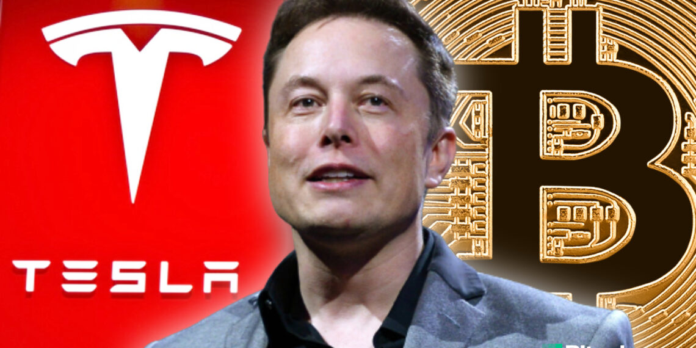
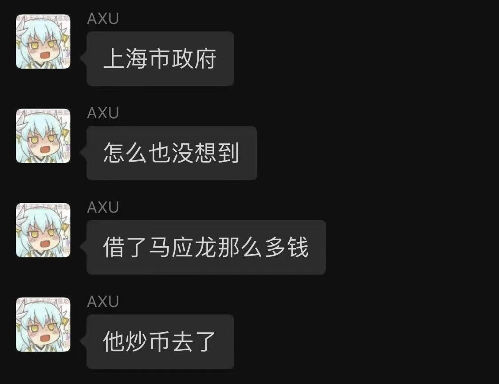
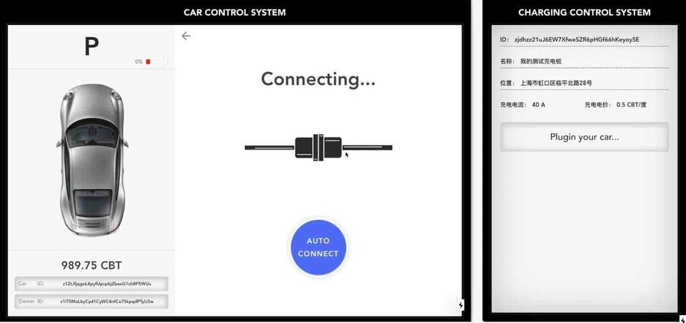
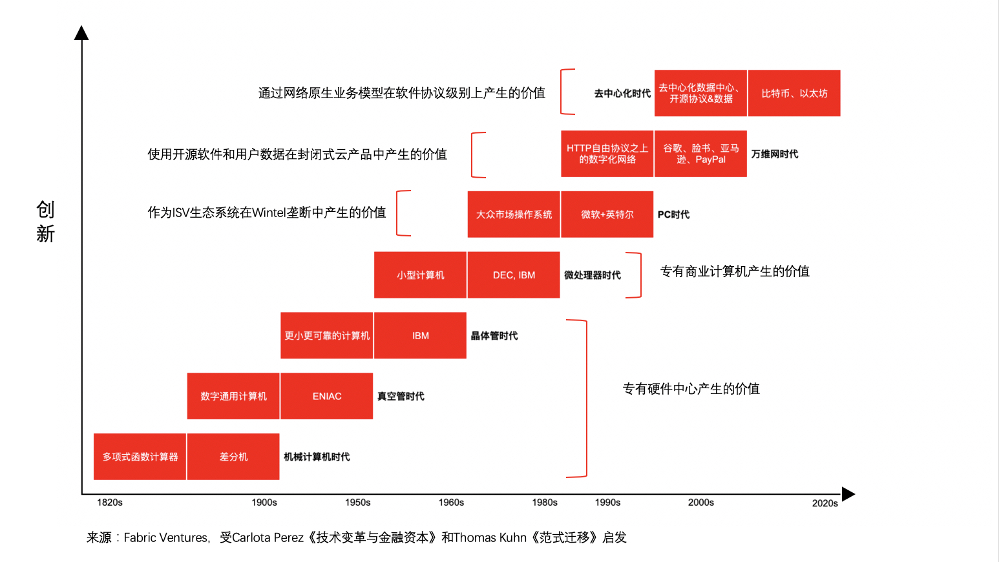

# 买入比特币的特斯拉，下一步要发币吗？

**作者：** 陈俊

> 又是伊隆·马斯克！喊单狗狗币，买入比特币，下一步特斯拉要发币吗？

想必昨晚币圈、区块链和科创领域从业者、投资者都没睡好觉。[特斯拉](https://www.futunn.com/stock/TSLA-US)在 2 月 8 日美股开盘之际向美国 SEC 报告它已斥资 15 亿美元买入比特币，并计划将来接受客户使用比特币购买特斯拉相关产品。消息一出，比特币价格立刻跳升至 42000 美元以上，早间摸高 47156 美元，此刻笔者敲键盘时，稳定在 45000 美元以上运行。许多人恍然大悟，马应龙(Elon Musk 的非正式中文译名)你推特个人简介改成比特币、喊单狗狗币、[上 Clubhouse 吹水](https://mp.weixin.qq.com/s/zz67HuLDL9QZlfBGVYcYKQ)后悔自己没有早点买入比特币，原来是[声东击西](https://mp.weixin.qq.com/s/JeLJ-odhUO3Q4iQM288J0Q)，悄咪咪让特斯拉囤货比特币，甚至还有人模拟了如下 OS——

毫无疑问，特斯拉跟随灰度、Micro Strategy 等一众美国机构、上市公司买入投资比特币，是认可比特币成为价值存储抗通胀、媲美黄金的另类资产，以此企业财务举措应对美联储无限量化宽松导致的全球流动性泛滥，不仅进一步夯实[比特币这一轮牛市以机构为主的基本面](https://mp.weixin.qq.com/s/3g0tWpC5_ZhF-5BI2E_bXA)，而且让比特币市值一举超越 Facebook，成为全球最有价值的第七大资产(仅次于苹果、微软、亚马逊、谷歌、腾讯和特斯拉)，由此进一步震动人心，让更多的人严肃认真的思考比特币是什么、比特币为代表的加密数字货币及其底层支撑技术区块链到底带来什么价值和影响？

特斯拉买入比特币，确实不同于其他机构，只是为圈外人指出投资理财新思路、鼓舞圈内比特币信徒(Bitcoiner)长期持币的信仰，而是打开了新的想象空间——特斯拉下一步在加密数字货币、区块链领域有何新举措？——毕竟伊隆·马斯克、特斯拉及其客户和投资者，相比于他人，更乐于拥抱未来新世界……

- 特斯拉在向 SEC 报告时透露它计划考虑接受客户使用比特币购买其产品。相信这是特斯拉涉足加密数字货币/区块链第一步：只要解决法律税务等问题，增加一种支付方式，纯属举手之劳。具体可参考目前火爆的 NFT 球星卡收藏游戏[NBA Top Shot](https://mp.weixin.qq.com/s/EueWdKrID2BxgjtY9_Iwcg)，该[官方网站](https://www.nbatopshot.com/)支持法币信用卡和加密数字货币 BTC、BCH、ETH、DAI、USDC 的支付。不过，这更多是吸引用户、增强粘性的市场营销行为。

- 第二步，个人建议特斯拉继续引领全球新能源汽车革新潮流，率先应用区块链技术和通证经济为电动车主搭建一个点对点共享充电网络，以鼓励更多充电设施建设共享，进一步解决里程焦虑，而且能让车主、业主、运营方等多方参与者获得激励。区块链在这一需求场景的应用，不仅有业界充分交流讨论的解决方案，而且我们 ArcBlock 工程师在 2019 上海区块链国际周黑客马拉松开发了名为 Charging Block 的去中心化应用进行了[初步的实现](https://www.arcblockio.cn/blog/zh/post/2019/10/09/building-a-dapp-with-forge-in-36-hours)，我和 ArcBlock 创始人冒志鸿合著、中信出版集团去年出版的[《区块链实战：从技术创新到商业模式》](https://books.arcblock.io/)详细介绍了这一应用实例。

_Charging Block DApp 用户界面_

- 究其根本，特斯拉电动车并非只是电力驱动的交通工具，而是关于人、车、路以及车联网内容的实时数据移动计算平台(由于算力的提升推动了 AI 深度学习的高速发展，电池蓄能的提升和成本降低推动了电动车的发展，其又推动了自动驾驶的需求，从而进一步促进了对算力和 AI 深度学习的需求)。除了特斯拉，马斯克投资研发的火箭、飞船、高速铁路、卫星互联网，无一不是源源不断生产处理数据的计算终端，当海量数据在各个边缘计算终端实时涌现汇聚交互，不仅以客户端/服务器架构为代表的中心化数据中心、云计算平台难以处理，而且越来越多牵涉用户隐私和资产的数据，更是让传统中心化方式束手无策——据麦肯锡咨询公司研究，2016 年全世界生产了 16 泽字节的数据，然而，其中只有 1% 被分析使用。而到 2025 年 , 全球预计将生成超过 160 兆字节的数据(泽字节是 TB 的 2^30 倍，即 1ZB=10.7TB)，唯有去中心化的区块链和激励人人参与协作的通证经济(Token Economy)能够解决这一瓶颈。可以设想，特斯拉发的币，并不是什么奖励用户忠诚的会员积分计划，而真正是人和机器、机器与机器之间沟通协同的 Token——例如，特斯拉若如[ARK Invest](https://ark-invest.com/)预计于 2022 年推出无人驾驶网约车，每辆车就是一个 Token(通证)，接受乘客的预定使用和支付，按约完成一段从 A 地到 B 地的行程，接受的经济利益按规则自动分配给所有提供服务和支持的各方。

_Fabric Ventures 总结的[信息技术演进历程](https://medium.com/fabric-ventures/the-fabric-ventures-investment-thesis-6cd08684b467)_

- 未来的火星经济将依靠加密货币运行，狗狗币是未来世界的人民货币，钢铁侠在推特上可能是在开玩笑，更大的可能是直觉区块链、Token 在技术融合的未来新世界的不可或缺……

以上只是我昨晚兴奋失眠、辗转反侧想到的一些东西，今天在此抛砖引玉，欢迎大家说说，买入比特币的特斯拉，下一步在加密数字货币、区块链技术、去中心化应用、通证经济会有哪些惊人之举？

### 推荐阅读

- [特斯拉高调入局，比特币 2021 年还会涨多高？](https://www.odaily.com/post/5163972)
- [Z 时代两大 YOLO 资产相遇，特斯拉投资比特币会有怎样的影响？](https://mp.weixin.qq.com/s/P019f0XuHvSiA4ZC28T3YQ)
- [来自西方的明牌长牛](https://mp.weixin.qq.com/s/3g0tWpC5_ZhF-5BI2E_bXA)
- [ARK 重磅报告：5 年 10 倍的科技投资机会](https://mp.weixin.qq.com/s/vHCDKdh9j5soyrP8nrw2cA)
- [未来已来 / 后疫情时代的美股科技趋势投资指南](https://indigos.me/2021/02/the-future-is-already-here/)
