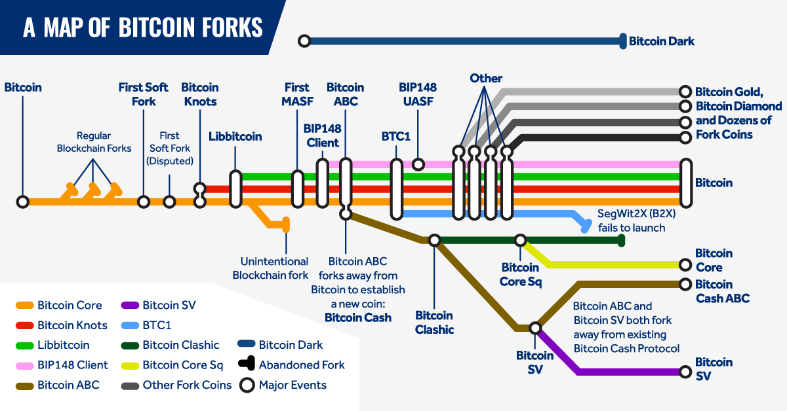

# 区块链的几种架构

**作者：** 冒志鸿、陈俊

> 由 ArcBlock 创始人兼 CEO 冒志鸿与副总裁陈俊合著、中信出版集团出版的《区块链实战：从技术创新到商业模式》，以通俗的语言和实际案例，从宏观的视角讲述区块链的起源、发展、技术趋势及落地应用场景，同时对层出不穷的新概念、新名词进行了辨析和讲解，破解了外界对区块链技术的各种迷思，帮助读者正确认识区块链的优势和局限之处。本书还以多个政府、企业的区块链项目情况，详解区块链应用的多层决策框架，以帮助组织决策者评估何时使用区块链。
>
> 《区块链实战》系列书摘，在此连载。

## 专用功能的区块链

**典型代表： 比特币（Bitcoin）、各种比特币分叉币**

世界上第一个区块链是在比特币中实现的，比特币设计的最初目标是在网上实现一个“点对点的电子现金”，因此点对点之间不需要中间人是一个基础。

在比特币出现之前，类似希望在网上个人之间收发现金的需求已经出现很久，例如著名的 PayPal 通过电子邮件的方式发送但实际上基于 PayPal 本身作为中间人；银行内及银行之间的转账（如 SWIFT 系统）等都依赖于银行作为中间人。采用 P2P 和加密技术来发送现金一直是极客、黑客和计算机科学家们多年来尝试的方式。但在比特币出现之前，还没有人能够解决其中最关键的“双重花费问题（Double Spending）”，即同一笔钱花费支付了两遍——想一想同一份信息在互联网中拷贝传播是多么容易，且很难阻止。

比特币的设计可以认为是一个单一系统精巧设计的典型。从结构角度而言，比特币是一个简单的区块链技术，比特币也是一套基于区块链技术之上的、很简单的数字货币协议，同时也实现了一个叫做比特币的应用，可以认为这是一个“多合一”的一体化系统。比特币的设计没有提供外部扩展和可编程能力，虽然比特币支持一种非常简单的脚本，但是并不具备完整的编程能力和扩展性，比特币本身也没有对外的编程 API 支持。 总而言之，比特币系统的设计目的就是为了实现比特币本身，没有其他目的。在比特币发展过程中，一度有一些如“染色币”这样的技术，试图在比特币的数据结构里的“空闲”区域加载结构化的数据，从而使比特币具备表达其他数字资产的能力，但显然比特币社区排斥这种改造，并在后续比特币软件的升级中限制了这种做法。

> **区块链分叉**
>
> 区块链分叉主要是指一条区块链分开成两条区块链。分叉可分为意外分叉和有意分叉。当两个或以上的矿工在几乎相同的时间成功挖到区块，便会出现意外分叉。有意分叉则对原区块链作出修改，可再分类如下：
>
> - 硬分叉：硬分叉之中新分叉所产生之区块将被旧软件视为无效。因此所有参与者，包括交易服务器以及矿工（节点），都必须更新软件，才能继续运行新分叉。如有节点组继续使用旧软-件，而其他节点使用新的软件，便有可能产生分裂成两只货币。
> - 软分叉：与硬分叉相比，软分叉所产生之区块能够被旧软件识别为有效区块，即区块 向下兼容。然而，旧软件所产生之区块则未必在新规则下有效。

## 功能可扩展的区块链

**典型代表：以太坊（Ethereum）、R3 Corda，同期各种“公链”和“联盟链”**

“以太坊（Ethereum）” 为代表的公链其最大特点是可编程和可扩展性。由于比特币是一个专用功能的区块链，在以太坊出现之前，扩展比特币功能的唯一办法，就是复制其开源代码进行扩展，这就是所谓的“分叉币”。 基于比特币出现过数百个知名或不知名的分叉币，大部分已经消失了，少数仍然还存在，甚至一度和比特币竞争。“分叉”开源的代码虽然容易，但运行维护的困难是很大的，尤其比特币基于 PoW 的设计需要相当的算力支持才能维持区块链的安全运行，各个分叉币也分散了本可集中的算力，使得这些分叉币都很难成气候。

> 算力
>
> 也称哈希率，是比特币网络处理能力的度量单位。即为计算机（CPU）计算哈希函数输出的速度。比特币网络必须为了安全目的而进行密集的数学和加密相关操作。 例如，当网络达到 10Th/s 的哈希率时，意味着它可以每秒进行 10 万亿次计算。
>
> 在通过“挖矿”得到比特币的过程中，需要找到其相应的解 m，而对于任何一个六十四位的哈希值，要找到其解 m，都没有固定算法，只能靠计算机随机的哈希碰撞，而一个挖矿机每秒钟能做多少次哈希碰撞，就是其“算力”的代表，单位写成 hash/s。

以太坊的出现很大程度解决了这一难题，通过“智能合约”这种代码形式，相当于在以太坊上能够创建各种各样的新功能。这样一来，以太坊的功能理论上可以无限扩展，开发者不需要分叉以太坊，就能直接部署自己的智能合约，来给以太坊扩展自己所需要的功能，而且开发者不需要建立新的区块链网络，甚至不需要建立自己的节点，这大大提高了区块链开发的效率。

即使在“联盟链” 或“私链”的环境，这种功能扩展能力也非常有价值。例如用户打算运行一个私链版本的比特币系统来支持自己的区块链应用，但是比特币是功能特定的，如果应用业务和比特币应用是相类似的，那么还可能比较容易，如果应用业务与比特币差别较大，可能就一筹莫展。采用以太坊这样的可扩展区块链，即便是部署私有或联盟链的版本，也可以通过部署智能合约来扩展业务所需功能。以太坊最初是作为“公链”而诞生的，但不久“以太坊企业联盟（EEA）”随之诞生，其成员包括英国石油、摩根大通、微软为首的能源、金融和 IT 业的全球性企业，致力于将以太坊开发成企业级区块链平台。摩根大通（JP Morgan）更是在以太坊开源代码基础上开发了自己的区块链技术 Quorum，成为其稳定币 JP Morgan Coin 的技术基础。

以太坊的成功，引来大量效仿者，目前市场上大部分公链和联盟链都属于这种功能可扩展型的区块链架构。

## 模块化的区块链架构

**典型代表：Hyperledger Fabric、ArcBlock、Libra 等**

以太坊等可扩展区块链虽然本身支持扩展，但由于自身是一体化的设计和实现。这对“公链”类型的设计可能无可厚非，但对企业联盟链和私链，或者想在原有基础上作更大功能扩展的新公链，一体化设计就会出现问题：无论你的应用实际需要多少功能，你都必须部署完整的区块链软件，哪怕实际上你只需要用其中一小部分；如果你想替换一部分功能，例如你想使用以太坊的软件，但并不想采用 PoW 的共识算法，那么没有简单的办法能做到，这也是为什么会出现多种以太坊的企业版本分叉的原因，而一旦有了版本分叉，在维护上就会碰到新的问题。

Hyperledger Fabric 可能是第一个在市场上宣传采用模块化设计的区块链。官方介绍“Hyperledger Fabric 由模块化架构支撑，被设计成支持不同的模块组件直接拔插启用，并能适应在经济生态系统中错综复杂的各种场景”。Hyperledger Fabric 提供了多个可拔插选项，账本数据可被存储为多种格式，共识机制可被接入或者断开，同时支持多种不同的成员管理机制。

作为更进一步模块化设计和简化开发者使用的区块链，ArcBlock 的区块链框架则设计实现“一键发链”的模式，通过提供一系列的工具，让开发者通过友好的界面就可以立刻定制产生符合其需要的区块链。最新的 Cosmos SDK，Polkadot 的 Substrate 框架都采用了类似的这种设计。Facebook 推出的 Libra 区块链项目也采用了模块化设计的思路，使得社区可以更容易加入扩展。这种把区块链模块化的架构，正成为区块链最先进一代的设计和实现趋势。

> 目前，《区块链实战》一书可在中信出版集团以下官方渠道购得：
>
> - 纸质版：[京东](https://item.jd.com/70651034479.html)、[当当网](http://product.dangdang.com/28970979.html)、[天猫](https://detail.tmall.com/item.htm?spm=a1z10.3-b-s.w4011-15948767397.35.61556d99EoTsQn&id=621180059733&rn=b36e7bf4128178c5f1d9d47fdccb3d69&abbucket=19)、[中国图书网](http://www.bookschina.com/8339596.htm)
>
> - 电子版：[亚马逊](https://www.amazon.cn/dp/B08BYM7GCC/ref=zg_bs_661058051_5?_encoding=UTF8&psc=1&refRID=C77P1VDJR9J22RSQBHTN)、[豆瓣阅读](https://read.douban.com/ebook/151888899/)、[微信读书](https://weread.qq.com/web/appreader/3b63273071e8eda73b6dc4d)、[得到 ](https://www.biji.com/eBook/z4R9BQ7pP4ZEaXYkx8KvRdljeyqo608MRkW1m2bMAO9NnDL7gBGQr5VzJqrvmEVN)

新书更多情况，请扫码登录[官网](https://books.arcblock.io/)查看。
