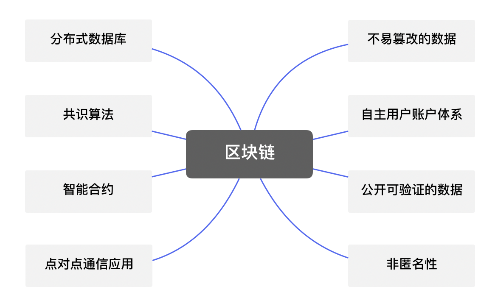
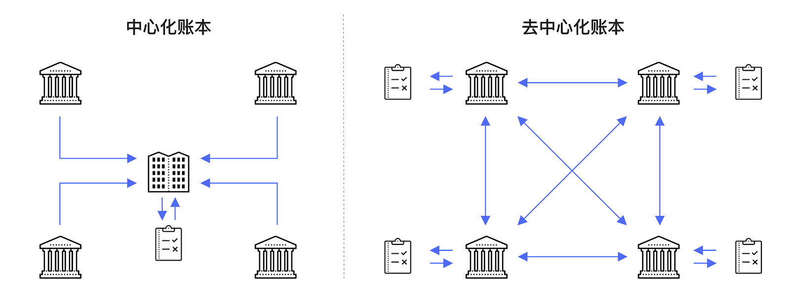
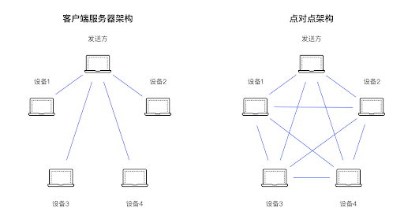
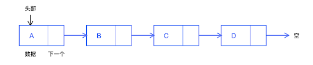
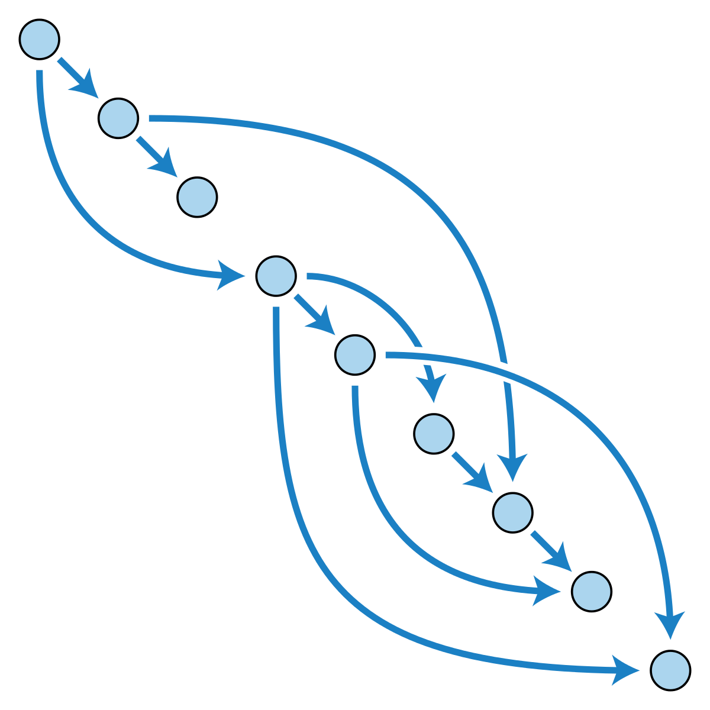
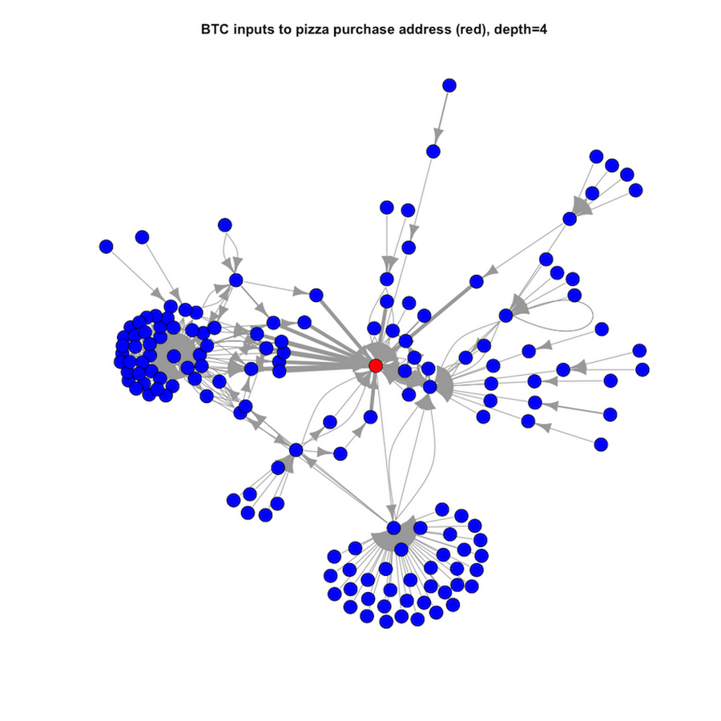

# 盲人摸象 解构区块链 8 大特性

**作者：** 冒志鸿、陈俊

> 由 ArcBlock 创始人兼 CEO 冒志鸿与副总裁陈俊合著、中信出版集团出版的《区块链实战：从技术创新到商业模式》，以通俗的语言和实际案例，从宏观的视角讲述区块链的起源、发展、技术趋势及落地应用场景，同时对层出不穷的新概念、新名词进行了辨析和讲解，破解了外界对区块链技术的各种迷思，帮助读者正确认识区块链的优势和局限之处。本书还以多个政府、企业的区块链项目情况，详解区块链应用的多层决策框架，以帮助组织决策者评估何时使用区块链。
>
> 《区块链实战》系列书摘，在此连载。

曾经有人批评很多对区块链技术的讲解如同“盲人摸象”，然而我们认为对新技术的理解必须有一种“盲人摸象”的勇气——先去解构性地理解局部，对更多的局部了解越来越清晰之后，再破除纠正一些错误的认知，就能形成完整的认知拼图。

_区块链技术的 8 种特性_

## 分布式数据库

区块链是一种数据库。

区块链是一种分布式数据库。

提到数据库时，人们常常会立刻想到最流行的数据库，如 PostgresSQL、MySQL 等。但在此需要提醒读者，“数据库”其实也是一个非常广义的概念，前述举例的关系型数据库只是其中一种特例。比如我们日常使用的计算机文件系统，也可以认为是一种类型的数据库。因此在理解区块链是一种数据库时，一定也要明白它很可能并不是你所认为的“数据库”的样子。

区块链的核心就是数据库，而且大部分区块链技术在底层实现上也采用了传统的数据库引擎来保存数据。例如维护比特币代码的 Bitcoin Core 团队实现的比特币就采用了 LevelDB（最早由 Google 公司贡献的一种开源数据库引擎）来索引和保存区块链的链状态信息（包括 UTXO 集、当前最佳块等），而在比特币的钱包里则采用 Bekerly DB（另一种开源的非关系型数据库引擎）。不同的区块链可能会采用不同的数据库系统来实现，同一种区块链的不同的节点实现版本也可能采用不同的数据库。

> **数据库及其分类**
>
> 简而言之可视为电子化的文件柜——存储电子文件的处所，用户可以对文件中的数据运行新增、截取、更新、删除等操作。 所谓“数据库”系以一定方式储存在一起、能予多个用户共享、具有尽可能小的冗余度、与应用程序彼此独立的数据集合。
>
> 数据库分为关系型数据库和非关系型数据库。
>
> - 关系型数据库是存储在计算机上的、可共享的、有组织的关系型数据的集合，存储的格式可以直观地反映实体间的关系。关系型数据库和常见的表格比较相似，关系型数据库中表与表之间是有很多复杂的关联关系的。 常见的关系型数据库有 MySQL，SQL Server 等。
> - 非关系型数据库指非关系型的、分布式的、且一般不保证遵循 ACID 原则的数据存储系统。非关系型数据库结构相对简单，在大数据量下的读写性能好；能满足随时存储自定义数据格式需求，非常适用于大数据处理工作。 适合追求速度和可扩展性、业务多变的应用场景。
>
> **分布式数据库**
>
> 用计算机网络将物理上分散的多个数据库单元连接起来组成的一个逻辑上统一的数据库。每个被连接起来的数据库单元称为站点或节点。分布式数据库有一个统一的数据库管理系统来进行管理，称为分布式数据库管理系统。
>
> 40 年前，数据库的关系模型的提出，开创了数据库关系方法和关系数据库理论的研究，为关系数据库技术奠定了理论基础。目前，关系数据库系统仍然是数据库系统的主流，市场上涌现了很多关系数据库产品，如小型关系型数据库管理系统 dBase/Foxbase/Visual FoxPro、Access、MySQL；大型关系型数据库管理系统一般为 DB2、Ingres、Oracle、Informix、Sybase 和 SQL Server 等。这些数据库产品从最初各自为政的编程接口起步到逐渐支持结构化查询语言 SQL，并使 SQL 的影响已经甚至超出数据库领域，得到其他领域如人工智能、大数据领域的数据检索的重视和采用。
>
> **UTXO**
>
> Unspent Transaction Output 的缩写，是比特币的一种独特设计，通俗理解 UTXO 相当于是用现金付账的时候的找零的零钱记录。比特币的交易由交易输入和交易输出组成，每一笔交易都要花费（spend）一笔输入，产生一笔输出（output），而其所产生的输出，就是“未花费过的交易输出”。

区块链网络各个节点是复制同步的分布式数据库。每个“健康”节点上的数据库里都有着完整的区块链上的所有数据和历史信息。由于每个节点上都有完整的检索数据，因此可以在每一个节点就能直接查询到区块链上的任何记录，不需要依赖任何第三方。

我们有时候说区块链是“分布式账本技术”（DLT），尤其当人们谈及联盟链（Consortium Blockchain）技术的时候。 “账本”其实只是“数据库”一种相对简化的特例，早期的区块链都是和数字货币相关，主要的数据就是“交易”（Transaction），而这些交易的数据集合就是“账本”。随着区块链技术的不断发展，越来越丰富的数据，甚至代码逻辑也出现在区块链上，但作为习惯的延续人们还常常称区块链数据库为“账本”（Ledger），每条记录为“交易”（Transaction）。

_中心化账本和分布式账本的示意比较_

由于区块链是一种分布复制的数据库，将数据保存在这样的数据库里的开销和成本是比较大的，因此区块链这种数据库不适合用来保存海量数据，通常只用来保存关键信息，或者作为其他存储方式的数据的验证信息。有种区块链的常见用法是试图把什么数据都一股脑儿“上链”在区块链里保存，这是一种误解误用。本书第四部分将阐述典型的“数据上链”应用设计模式。简而言之，数据上链并不是把数据全部放在区块链上，而是把数据仍然保存在原有的地方，只是把数据的校验信息放在链上。

## 共识机制：让各个节点的数据库保持一致的方法

谈到区块链时经常会听到“共识”（Consensus）这个概念，再结合各种“共识算法”的名字，例如工作量证明（Proof of Work，缩写 PoW），权益证明（Proof of Stake，缩写 PoS）等，让人望而生畏。

> **工作量证明**
>
> 工作量证明（Proof-of-Work，缩写 PoW）是一种对应服务与资源滥用、或是拒绝服务攻击的经济对策。一般是要求用户进行一些耗时适当的复杂运算，并且答案能被服务方快速验算，以此耗用的时间、设备与能源做为担保成本，以确保服务与资源是被真正的需求所使用。这一概念最早由辛西娅·德沃克（Cynthia Dwork）和莫尼·纳欧尔（Moni Naor）于 1993 年的学术论文提出，用于经济领域统计，工作量证明一词由马库斯·贾科布松（Markus Jakobsson）与阿里·朱埃勒（Ari Juels）在 1999 年计算机反垃圾邮件系统实现中提出。现在，PoW 成为了以比特币为代表的加密货币/区块链主流共识机制。
>
> **权益证明（PoS）**
>
> 权益证明（又称持有量证明, Proof-of-Stake，缩写 PoS）是 2012 年出现的共识机制。与要求验证者执行一定量的计算工作的 PoW 不同，PoS 要求一组验证者轮流对下一个区块进行提议和投票，每个验证者的投票权重取决于其持有权益证明的多少。PoS 的显著优势包括安全性、降低集中化的风险以及能效。

之前提到区块链就是一种分布式数据库，有很多个节点的复制的数据库，而且每个节点都可以独立验证数据不需要依赖第三方。那么一个很自然的问题就是，如何让这些节点的数据库能保持一致？传统的分布数据库设计有一个重要的假设是分布数据库的每个节点都是“友好”的，因此要保持数据的一致，主要需要克服的是一些技术问题，比如网络的延迟怎么办？网络临时出现了中断怎么办？不同的节点上的用户对相同的数据都想进行修改怎么办？……所有这些问题在区块链这种分布数据库上全部都存在，而更困难的是，区块链的一个重要想法是不能默认各个节点都是“友好”的，因此有可能有些节点就是有目的地要“制造麻烦”，这就使得区块链要解决这个问题更为困难。

实际上“共识”的概念很容易理解。所谓共识的本质，就是一种让区块链各个节点上数据保持一致的方法。而各种不同的共识算法，就是为了达此目的采用的不同技术方法。由于本书的目的和定位，我不打算在此详述这些共识机制的原理和算法，对此感兴趣的读者可以找到足够多的资料，首先去了解最经典的工作量证明（PoW），最有未来潜力的权益证明（PoS），然后进一步去了解更多的共识机制。 我们只需要理解一个重要概念就是，**“共识机制”的根本目的在于确保区块链各节点数据是一致的。**

因此，达成共识注定是一个“慢”且“费劲”的过程，但这就是代价——为了达到区块链系统的分布、去中心化、独立验证、数据难被篡改等特征所必须付出的代价。无论未来发明多么高性能的共识算法，网络和计算性能有多大提高，可以肯定的是，区块链系统的性能必然会始终低于集中式的系统。对这一事实的理解和把握，是我们在决策一个应用是否应该采用区块链技术，或者应用哪些部分应该采用区块链的重要原则，即高性能永远不是采用区块链技术的首要目标。

共识算法对“公链”（公共区块链，或无需许可的区块链）至关重要，因为这类区块链任何人可以不需要任何许可就能加入网络，因此无法确认节点的意图，即便发现其可能有恶意也难以杜绝，这就导致共识算法几乎是保证这类区块链系统可靠的唯一途径。但是对需要许可的区块链，例如“联盟链”，其成员往往被一定规则约束，从其身份识别验证、加入网络、访问权限到参与活动都是受控制的，因此在这类区块链架构中，除共识算法之外还有很多方法来保证系统安全和数据一致性，因此可以选择更轻量的共识机制，例如实用拜占庭容错（Practical Byzantine Fault Tolerance，缩写 PBFT）算法等，而在联盟链环境下选择 PoW 机制往往是不必要的。

> **拜占庭将军问题及 PBFT 算法**
>
> 拜占庭将军问题（Byzantine Generals Problem），是由莱斯利·兰波特 1982 年在其同名论文中提出的分布式点对点网络通信容错问题。含义是在存在消息丢失的不可靠信道上试图通过消息传递的方式达到一致性是不可能的。因此对一致性的研究一般假设信道是可靠的，或不存在本问题。这个难题也被称为“拜占庭容错”、“拜占庭将军问题”、或者“两军问题”。
>
> 实用拜占庭容错（Practical Byzantine Fault Tolerance，缩写 PBFT）算法，由米盖尔·卡斯特罗（Miguel Castro）和芭芭拉·利斯科夫（Barbara Liskov）在 1999 年发表，该算法解决了原始拜占庭容错算法效率不高的问题，将算法复杂度由指数级降低到多项式级，使得拜占庭容错算法在实际系统应用中变得可行。

直到本书 2020 年初截稿为止，在公链类型的区块链上，工作量证明（PoW）仍然是唯一真正经受了时间考验和证明的共识机制。由于 PoW 共识机制通常会演变成消耗巨大的计算资源消耗，进而导致无谓的能耗竞争，业内一直在尝试寻找更经济实用、性能更好的方法。 已经有为数众多的区块链项目尝试采用权益证明（PoS）机制或在其基础上演变的改进版本算法，但其可靠性还需要时间来证明。近两年，公链项目层出不穷，市场上出现各种各样的共识算法，好多都采用“Po？、Proof of ？”来命名，有人开玩笑说 A 到 Z 的 26 个英文字母都不够用了。这些算法，有一些作为学术讨论 和论文研究被学界接受，也有一些纯属无稽之谈或炒作，无一例外都尚未在实际应用中得到足够的验证。

## 点对点（P2P）通讯

为了成为一个有“共识”的可靠的分布式数据库，而且能够不依赖于任何中间人，区块链必须在网络传输上有所突破，解决这个问题的方法就是点对点通信（又称为 P2P，是 Peer-to-Peer 的缩写）。所谓 P2P 通讯方式，就是节点之间直接通信而不需要经由第三方。我们不要被 P2P 这样的字眼所迷惑，其实这是最简单、最直接、最“原始”的通讯方式，是任何网络通讯的基础。

区块链出现之前，P2P 技术已经得到了飞速发展，其最成熟应用是文件的共享服务，证明了 P2P 技术可以实现高可靠性、高性能的数据同步，以及抗封锁能力等。

区块链是由很多台运行区块链软件的计算机组成的网络系统，每台这样的计算机被称为节点。很多情况下，一个节点对应着一台真正的计算机，但也有可能多台计算机一起工作才构成一个节点——通常是为了让这个节点计算能力更强。

_客户端服务器架构与点对点架构的示意比较_

区块链每个节点都独立地和其他节点进行通信，每个节点都会采用“存储—转发”策略来“收听”其他节点发送的内容，并且广播自己产生的、或者转发收到的信息。这种通信方式可以避免区块链网络依赖于一些关键的中间节点，也可以防止少数节点被恶意操纵后对整个区块链网络的影响。由于采用 P2P 通讯方式，区块链的“去中心化”特性比常见的互联网应用（如 Web 服务）更强。

> **P2P 技术及其发展历程**
>
> 点对点（P2P）是一种分布式应用计算网络架构，可在地位对等的参与者之间划分任务或工作负载。参与节点在应用中享有同等的权利，平等参与，并形成了点对点网络。网络节点将其部分资源（例如处理能力、磁盘存储或网络带宽）直接提供给其他参与者，而无需服务器或稳定主机的集中协调。与传统的“客户端/服务器”模型（其中资源消费和供给相分离）相反，这些节点既是网络资源的供应者又是资源的消费者。
>
> P2P 在隐私要求高的网络中和文件共享领域得到了广泛的应用。P2P 这一概念最早出现在 1969 年 4 月 7 日的第一份 RFC（Request For Comments，意为征求意见）文档中，RFC 是互联网工程任务组（Internet Engineering Task Force，缩写 IETF）发布的一系列备忘录，后来演变为用来记录互联网规范、协议、过程等的标准文件。
>
> **1999 年：P2P 音乐共享服务 Napster 上线**
>
> 18 岁的肖恩·范宁（Shawn Fanning）与 19 岁西恩·帕克（Sean Parker）上线发布 P2P 音乐共享服务 Napster，第一个把 P2P 技术变成为广大消费者接受并喜欢的主流，是互联网文件下载共享方式的一次变革。
>
> **2001 年：BitTorrent 协议**
>
> 4 月，布莱姆·科恩（Bram Cohen）发布了 BitTorrent 协议，并在 7 月正式应用。BitTorrent 协议是架构于 TCP/IP 协议之上的一个 P2P 文件传输通信协议。它把文件虚拟分成大小相等的块，并把每个块的索引信息和哈希验证码写入种子文件。下载者根据种子文件告知对方自己已有的块，然后交换没有的数据。使用 BitTorrent 协议，下载的人越多提供的带宽越多，下载速度也就越快；同时，拥有完整文件的用户也会越来越多，文件的“寿命”会不断延长。
>
> **2002 年：Kademlia 协议**
>
> 2002 年，彼塔·梅耶蒙科夫（Petar Maymounkov）与戴维·马兹埃瑞斯（David Mazières）发表了论文 Kademlia: A Peer-to-peer Information System Based on the XOR Metric，提出了第三代 P2P 网络的节点动态管理和路由协议 Kademlia，通过分布式哈希表实现信息的存储和检索。
>
> 相比之前的两代协议，Kademlia 以全局唯一 ID 标记 P2P 网络节点，以节点 ID 异或（XOR）值度量节点之间距离，并通过距离分割子树构建路由表，建立起一种全新的网络拓扑结构，相比于其他算法更加简单和高效。
>
> 2005 年，BitTtorrent 实现基于 Kademlia 协议的分布式哈希表技术，eMule 也实现了基于 Kademlia 的 类似技术。以太坊使用 Kademlia 作为分布式网络的底层算法。
>
> **2009 年：比特币协议**
>
> 2009 年 1 月，比特币网络上线，发布了第一个开源的比特币客户端软件。这是 P2P 技术首次应用于加密数字货币，也成为区块链最重要的基础技术之一。

## 公开可验证的数据

区块链的“节点”都是可见的。 对于如比特币、以太坊（Ethereum）这种典型的公链而言，链上的任何数据是完全公开的，也就是一旦数据上链，那么全世界任何人都可以看到，而且区块链上的数据是不能删除或修改的，因此一旦数据在区块链之上发布就成为公开的信息。

区块链上的数据普遍使用了一些常用的加密和签名算法来保证数据的正确性和一致性，因此在每个区块链节点上都可以立即验证链上数据的正确性。事实上，这些区块链节点在维护其数据的时候，总是通过这些算法随时独立地校验数据，不会盲从任何其他第三方。

区块链如何进行数据的验证呢？ 这涉及两个重要的计算机密码学相关的技术：一是哈希算法，二是数字签名技术。

在区块链里保存数据的时候，哈希算法被用在很多地方，例如在每一“块”数据里，都保留有这一块数据经过哈希计算的结果，因此只要把块内的数据按照相同的哈希算法计算一遍再比较一下结果是否一致，就能知道这“块”的数据是否正确。而区块链里每一个“块”的数据还包含着前一个块的哈希计算结果，并且把前一块的哈希计算结果用于自己这一块来计算哈希结果。 这样一来，任何一点数据的变化都会牵一发而动全身。

区块链里保存的来自用户的数据都包含该用户的数字签名，数字签名的特点是可以迅速验证签名的正确性，却几乎不可能篡改数据、伪造签名。每个区块链的节点软件都会独立验证每条数据的签名是否吻合。

正因为区块链具有这种数据公开可验证的特点，把需要确保数据真实性、难以篡改、可以验证的信息用区块链来实现是合乎情理的应用方式，这就是人们常说的“数据上链”。但“数据上链”通常并不是把数据本身放入区块链，而是把数据真实性和一致性的证明信息（例如数据的哈希验证码）或者加密后的数据放在区块链上。

> **哈希算法与数字签名**
>
> 哈希（hash）算法，又称散列算法、哈希函数，是一种从任何一种数据中创建小的数字“指纹”的方法。哈希算法的特点是任何原始数据的小改动都会导致数字“指纹”大变化，并且无法反向推导出原始数据的变化。
>
> 数字签名（Digital Signature）是一类用于快速验证的算法。每一个使用者有一对密钥：一把公钥和一把私钥。数字签名中，我们使用私钥生成签名，公钥验证签名。

## 难以篡改的数据记录

经常有人强调区块链上的数据“不可篡改”。严格来讲，这并不正确，区块链上的记录并非“不可篡改”，而只是 “难以篡改”。通过前述的区块链特点可见，区块链是一种分布式数据库，每个节点都有独立验证的能力，通过共识算法来保证各个节点数据一致，也就是说要想“篡改”数据，首先得骗过每个节点的验证算法，这已经非常困难了，然后还得骗过整个区块链的共识机制让所有的节点都跟着改变，更是难上加难。

> **链表（Linked List）:** 一种最常见的计算机数据结构。它从一个节点内的指向信息，就可以知道下一个节点或者上一个节点在哪里。这样一个节点连着一个节点，就像一根链条，所以叫做链表。

“区块链”之所以被称为“区块链”，就是因为其在组织数据记录时采用“区块”的方式来保持一大块数据，并且把这些分成块的数据用类似于链表（Linked List）的方式按次序连接起来。这是在比特币的实现之中最先出现的，并且一直为现在大部分区块链设计所沿用，近年也出现了少数不同方式的数据组织技术，如有向无环图（Directed Acyclic Graph，缩写 DAG），但绝大多数区块链至今仍在采用“区块”+“链”的方式来组织数据。

> **DAG（Directed Acyclic Graph，有向无环图）：** 在图论中，如果一个有向图从任意顶点出发无法经过若干条边回到该点，则为有向无环图。

在区块链里，通常每条数据记录被称为“交易”（Transaction）。这是沿袭比特币的名称，比特币上的数据基本就是和转账记录类似的交易信息。直到现在很多区块链里的数据仍然是这些交易信息，但也出现一些其他的应用需求使得这些数据记录其实并不是“交易” （例如智能合约代码）。而关系型数据库恰好也有 Transaction 这一名词，不过含义完全不同，在中文翻译里关系型数据库相关的 Transaction 多被翻译为“事务”。读者只需要记住这两个是完全不同的概念，千万不要混淆。

区块链是个“不支持删除操作”的数据库，区块链的数据只会不断增加，不会被删除。由于这些特点，区块链比较适合于非常重要、需要留下“审计记录”（Audit Trail）的使用场合，例如对关键敏感信息的访问记录，比如对保密资料的任何访问意图和使用记录，如果采用区块链技术来进行，就能有效对访问行为进行审计分析（因为一旦这些记录被记入区块链就非常难以修改或抹除）。

虽然区块链的数据难以被篡改，但并不意味着“不可篡改”或”数据永不丢失“。一般而言，区块链的节点越多越分散，数据的篡改、完全被破坏的难度就越大，这是比较容易理解的。这也是为什么大家提到区块链就会想起“去中心化”的一个重要原因，在一个去中心化程度非常高的区块链上，要进行数据篡改或破坏是极其困难的。但是，如果区块链网络节点非常少（比如一个测试性的区块链可能只在一个节点运行），或者节点全部或大部分控制在少数人手里，那么篡改或完全破坏数据，是能够做到的。

## 智能合约：链上的“代码逻辑”

区块链这个分布式数据库里保存的是数据，但实际上从第一个区块链比特币开始，这些数据里就包含了“代码逻辑”：比特币脚本。但是由于比特币脚本属于一个功能特定的脚本语言，并且被设计成无状态的特点，算不上是完整的“程序”，因此在比特币出现后很长时间里没人认为它是“智能合约”，但我认为比特币脚本是一种**区块链智能合约的雏形**。

以太坊是第一个引入更复杂的代码逻辑的区块链，并且沿用了尼克·萨博（Nick Szabo）发明的词汇“智能合约”，在极客社区广受认可；但从实践角度而言，也相当程度地“误导”了大众——以太坊的“智能合约”既不具备我们常说的“智能” （人工智能，自动化逻辑等），也不太符合大众理解的“合约”（合同，法律条款），而只是一种新的结合了区块链的计算模型，配合了一个图灵完备的虚拟机和一个新的程序设计语言。 我们会在后面的章节展开来讲智能合约以及大家认知的常见误区。

> **智能合约**
>
> 1995 年，计算机科学家，法学家及密码学家尼克·萨博在论文《智能合约：数字化市场的构建模块》（Smart Contracts: Building Blocks for Digital Markets）中提出了智能合约概念。智能合约是一套以数字形式定义的承诺 ，包括合约参与方可以在上面执行这些承诺的协议，其基本理念是把合约条款嵌入到硬件和软件中。以太坊实施了智能合约这一想法。
>
> **图灵机**
>
> 图灵机是英国数学家阿兰·麦席森·图灵在 1963 年提出的、为了研究可计算问题而构思的抽象计算模型——将人们传统的使用纸笔进行数学运算的过程，进行抽象，由一个虚拟的机器替代人们进行无数次的数学运算。这个虚拟的机器就是图灵机，也就是现在计算机的雏形。
>
> **虚拟机**
>
> 虚拟机，一种特殊的架构软件，可以在计算机平台和终端用户之间创建一种环境，而终端用户则是基于虚拟机这个软件所创建的环境来操作其他软件。虚拟机是计算机系统的仿真器，通过软件模拟具有完整硬件系统功能的、运行在一个完全隔离环境中的完整计算机系统，能提供物理计算机的功能。

把“程序逻辑”放在区块链上，就使得这些代码逻辑如同链上数据一般公开可验证。也许有人问如果代码开源不也是可以做到公开吗？是的，开源的代码是公开的，但是并不能做到“可验证”；虽然你能看到项目的源代码，但不能保证真正执行的就是源代码对应的程序。以太坊的设计中实现了一个以太坊虚拟机（Ethereum Virtual Machine，缩写 EVM），这些虚拟机包含在所有的以太坊节点软件里作为其一部分。智能合约需要执行的时候，相当于每个以太坊的节点都独立地执行这些代码。

> **开源软件**
>
> 开源软件（Open Source Software）又称开放源代码软件，是一种源代码可以任意获取的计算机软件，这种软件的著作权持有人在软件协议的规定之下保留一部分权利并允许用户学习、修改以及以任何目的向任何人分发该软件。开源软件同时也是一种软件发行模式。一般的软件仅可获取已经过编译的二进制可执行档，通常只有软件的作者或著作权所有者等拥有程序的源代码。

以太坊智能合约的设计、实现和采用链节点内置专用虚拟机的执行模型**只是代表一种智能合约的实现方法**，并不是所有区块链都应该采用相同的实现。以太坊成功后，大量追随者都采用与以太坊完全一致的设计模式，此类设计在业内极为流行，但还是有不少知名区块链技术采用不同的设计和实现：Hyperledger Fabric 支持的 Chaincode（链上代码）可以认为类似以太坊的智能合约，但其设计实现和以太坊的方式大相径庭；ArcBlock 的区块链平台选择了采用链节点和智能合约运行环境统一在 Erlang 虚拟机 BEAM 上的策略；2019 年 6 月亮相旋即引起争议的 Libra 其智能合约设计也显著不同却有几分类似于以太坊的设计。

## 自主账户体系

如果你使用过比特币或以太坊这些区块链，可能最容易产生的第一个疑惑就是区块链上的“账户”是没有人给你“分配”的，这和过去大家熟悉的各种互联网服务迥然不同——无论是传统的互联网服务，或者更传统的银行、证券公司等，需要对方提供服务的第一件事就是申请和开通在其平台上的“账户”。 为什么这些区块链里面是有价值的数字货币，却不需要事先开设账户？

我们回过头考察一下所谓传统的账户，是不是某个机构在它自己的记账系统中给你分配一个标示属于你的且受它规范的分帐记录序列？也就是你的相关记录首先得在这些机构的规范记账系统下的子账户里。而“自主”（Self-Sovereign）账户体系的设计，相对于之前的互联网账户是一个巨大的升级。

所谓“自主”的账户，是指账户不是由其他人分配的，而是用户自我产生、自我申明的。自主账户体系能够实现，得益于现代计算机密码学，使得只需要按照一个算法执行一下就可以获得自己独特的、安全的账户。自主账户体系的进一步发展和延伸，也许是区块链应用除了数字货币以外的又一个重要领域——去中心化身份（Decentralized Identity）。去中心化身份将成为未来区块链应用的一个重要基础，甚至会成为下一个区块链应用时代到来的标志，我们会在本部分第四章专门介绍。

其实，自主账户体系更加像在没有计算机系统之前的社会，我们每个人生而为人，并不需要其他人和机构来证明，每个人的权利在现代文明社会，也就是所谓“天赋人权”，无需任何其他人给予。因为人作为个体，身份是“自主”的，也就是我们不需要任何其他人或者机构的“证明”、“认证”、“承认”，我们就是一个独立的个体，可以拥有和支配货币。想象一下在现实生活里，比如在商场使用现金购物时，我们不需要开户，不需要给店家提供各种个人注册信息，不需要认证身份，只需“一手交钱”，店家必然“一手交货”。区块链技术的自主账户让个体和个体之间的数字资产交换转移回归到最初的阶段。

## 区块链并不是真正匿名的

区块链普遍采用的自主账户地址，往往是一长串我们人类难以识别的字符或数字，因此不少人会误认为区块链是匿名的。但大部分区块链并不实现真正的匿名，包括区块链的鼻祖比特币在内。除了少数专注于隐私需求的区块链技术之外，大部分区块链上的数据完全是公开的，也就是每笔交易都很清晰地知道相关的账户，如果是一笔转账，那么转账金额和来龙去脉都清清楚楚，虽然有可能不知道某个账户背后对应的是谁，但这个账户在区块链上的一举一动完全大白于天下，而且一旦公开几乎不可能再被抹去。相比之下，互联网业务数据往往不是全公开的，虽然互联网服务常常收集各种用户数据，但一般只有其内部才有访问的能力和权限，出现隐私问题通常是因为某些互联网企业出售了含有用户隐私的数据，或者出现了数据泄漏（可能来自外部黑客攻击，也可能来自其内部的滥用或盗用）。

区块链存在“隐私”的地方是区块链的账户和它背后的真实用户身份在区块链上不存在对应关系。正如前文所述，“自主账户”不需要向任何人或机构申请，因此在使用这些自主账号的时候，没有任何信息能把这些账户和真实世界的个人信息关联起来。另外，区块链采用 P2P 通信方式，也很难在链本身的记录里发现使用者的网络 IP 地址等传统的互联网用户定位方法。从这个角度而言，区块链的匿名性的确比互联网应用要更好一些，因为区块链上虽然交易信息全公开，但毕竟没有任何敏感个人信息，既然这些信息不存在也自然不存在泄露的问题。因此在比特币及其分叉币出现的相当长时间里，数字货币的这种“匿名”和“隐私”一度成为了地下交易、暗网、跨境洗钱的利器。

> 用比特币购买披萨的交易踪迹：2010 年 5 月 17 日，Laszlo Hanyecz 用 1 万个比特币购买了 2 个披萨饼，图为通过他的地址向外展开四层看到的所有的关联地址和交易。上图使用 Google 提供的 BigQuery 产生。

由于数据的公开性，采用大数据分析的方法，可以很容易发现各个账户之间的关系，账户的一举一动都完全公开暴露在各种分析决策工具之下，由于区块链的历史数据也是公开的，因此可以在新的行为发生后倒推历史行为和关联的操作，反之亦然。 通过大数据分析技术，也可以发现各种交易的典型特征，包括一些企图故意迷惑侦查的行为。 由于现实中的大部分数字货币交易所现在都已经有“了解你的客户”（Know Your Customer，缩写 KYC）和“反洗钱”（Anti-Money-Laundry，AML）的要求，因此从交易所的用户数据就可以定位到用户，此外执法机构的各种执法行动中也能锁定一些账户的真实背景。 通过这两种方法的结合，往往可以对区块链上的交易作出非常精准的定位。

目前有部分区块链技术，例如 Zcash，Mimblewimble 等以主打彻底的隐私匿名为特点，在技术上是可以做到一定程度的匿名，但其存在和应用面临法律和监管的严峻挑战，其应用前景难以预料。

本书第四部分会介绍区块链数据分析这种应用方式，可以看到如何在实际应用里有效地掌握区块链上的一举一动。因此读者需要知道区块链并非真正匿名的，相反是完全公开透明的。

> 目前，《区块链实战》一书可在中信出版集团以下官方渠道购得：
>
> - 纸质版：[京东](https://item.jd.com/70651034479.html)、[当当网](http://product.dangdang.com/28970979.html)、[天猫](https://detail.tmall.com/item.htm?spm=a1z10.3-b-s.w4011-15948767397.35.61556d99EoTsQn&id=621180059733&rn=b36e7bf4128178c5f1d9d47fdccb3d69&abbucket=19)、[中国图书网](http://www.bookschina.com/8339596.htm)
>
> - 电子版：[亚马逊](https://www.amazon.cn/dp/B08BYM7GCC/ref=zg_bs_661058051_5?_encoding=UTF8&psc=1&refRID=C77P1VDJR9J22RSQBHTN)、[豆瓣阅读](https://read.douban.com/ebook/151888899/)、[微信读书](https://weread.qq.com/web/appreader/3b63273071e8eda73b6dc4d)、[得到 ](https://www.biji.com/eBook/z4R9BQ7pP4ZEaXYkx8KvRdljeyqo608MRkW1m2bMAO9NnDL7gBGQr5VzJqrvmEVN)

新书更多情况，请扫码登录[新书官网](https://books.arcblock.io/)查看。
