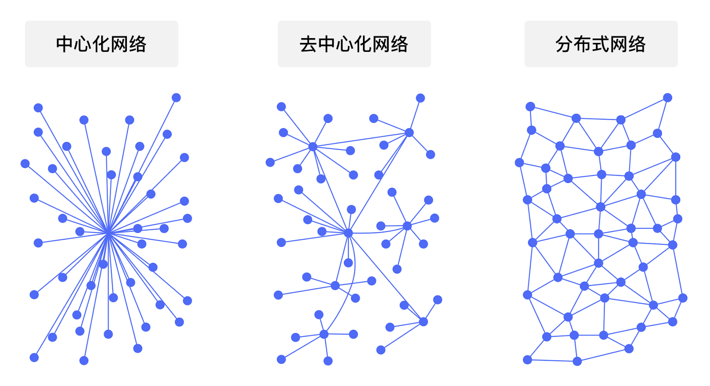
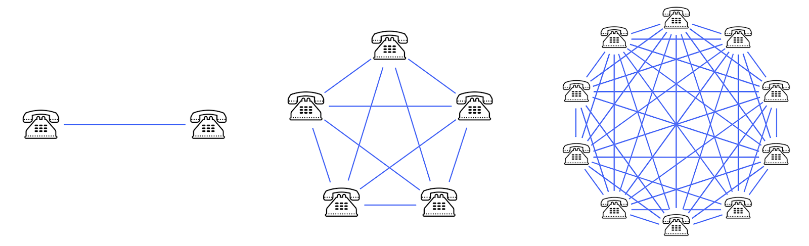

# 区块链的核心价值

**作者：** 冒志鸿、陈俊

> 由 ArcBlock 创始人兼 CEO 冒志鸿与副总裁陈俊合著、中信出版集团出版的《区块链实战：从技术创新到商业模式》，以通俗的语言和实际案例，从宏观的视角讲述区块链的起源、发展、技术趋势及落地应用场景，同时对层出不穷的新概念、新名词进行了辨析和讲解，破解了外界对区块链技术的各种迷思，帮助读者正确认识区块链的优势和局限之处。本书还以多个政府、企业的区块链项目情况，详解区块链应用的多层决策框架，以帮助组织决策者评估何时使用区块链。
>
> 《区块链实战》系列书摘，在此连载。

即使无法或无意了解区块链各项技术细节，相信读者还是希望能够从本质上理解把握区块链技术为我们带来的价值。在此，我们先从基本逻辑上来思考区块链究竟带来哪些基本价值，读者可以从这些价值的基础上去思考，这些价值会延展出哪些其他的价值，以及这些特点对你的业务意味着什么。

## 核心价值一：通过降低验证成本，来降低“信任”的成本

区块链数据公开可验证、记录难以篡改的技术特性，使得区块链网络的参与方对数据的验证成本（cost of verification）大为降低，这种成本包括时间的成本和直接的经济成本。举例而言，现在如果要彻底验证一张发票的真伪，其实没那么容易，要耗费很多时间和成本，结果是一般不那么重要的情况下，比如企业的报销，只能大体上看看票据的模样，金额差不多就可以了；而在重要的场合下，比如进出口贸易的核验，就需要耗费很多的手续和时间，尽管如此，仍然存在着大量的问题。如果采用区块链技术，那么一个全面的校验，包括从发票本身、发票交易本身、交易方、交易方的授权方，甚至交易方的身份登记信息，其行政管理方等等，都可以在数秒的时间内得到全面、完整、独立的验证。

区块链行业有个著名的口号：“不要相信，验证”（Don't trust, Verify!），意思就是用区块链技术，你不需要盲目地靠“相信”、“信任”来对待每条数据，而是无时不刻地在检查校验这些数据，而且这些检查完全是独立的，你不需要依赖任何第三方，也不需要去找最初提供这些检查信息的人来校验，自己就能独立完成，而且这一切都只是在以秒计算的时间内，花费极少的费用就能完成。这种机制将极大程度上改变商业世界。

信任，是世界上任何价值标的转移、交易、存储的基础。缺失信任，人类将无法完成任何价值交换和协作。回顾人类发展史，最初人们靠血缘宗族等熟人关系来建立信任，随着社会的发展，人们创造并利用宗教和道德来建立信任；再到后来，人类又发明依靠法律、中心化组织机构来建立信任。到了今天，互联网将全世界近一半人口连接起来，人类社会逐渐数字化，互联网的作用也正在从信息传播、消除信息不对称转移到价值传递、降低价值交换成本，区块链的出现恰逢其时——用数学算法来建立交易双方的信任关系，使得弱关系可以依靠算法达成强连接，进而进行价值交换活动。

传统的“信任”是个极高成本的东西。 而区块链技术让验证变得如此高效率低成本，从而导致信任建立和维护的成本大大降低，这在任何商业体系里都极具价值。

把区块链描述成为“信任机器”或者“制造信任”肇始于 2015 年《经济学人》杂志的封面文章，后来常常被许多人和大量文章引用。我觉得，如今再继续沿用并扩展这一区块链早期布道的说法，容易让不了解技术的人对区块链产生 “玄学” 的印象或者不切实际的看法。准确的理解，应该是区块链通过降低验证成本来降低了建立“信任”的成本。

## 核心价值二：去中心化，减少对中间人的依赖，颠覆现有的商业模式

由于区块链的设计特点，采用 P2P 的网络结构，这就使得基于区块链的系统天生具有“去中心”的特点，其应用的特点就是更少依赖于中间人。 “中间人”是今天商业模式里的重要商业基础。在一本影响颇广的商业读物《中间人经济》（The Middleman Economy）中，作者玛丽娜·克拉科夫斯基（Marina Krakovsky）指出在互联网高度发达的今天，中间人已经成为我们经济生活中不可或缺的一部分。

减少对中间人的依赖带来的价值很容易理解：例如在区块链的金融类应用中，通过移除或减少中间人，从而减少中介费，降低基础设施复杂度，而取得降低成本的目的，其另一个好处是加快结算时间及周期。最初的区块链比特币的设计目标就是一个“点对点的电子现金系统”，就是想在不通过任何如银行、支付公司等中间人进行两人之间的安全转账，毫无疑问，这类应用已通过 10 多年的时间证明了其可行性和价值。

减少对中间人的依赖并不是“消灭”中间人，实际上在商业之中，“中间人”是符合经济学专业分工合作理论，是有其存在价值，并非一无是处。在《中间人经济》中，作者通过大量经典案例研究归纳总结了中间人所扮演的 6 种角色：搭桥者、认证者、强制者、风险承担者、礼宾者、隔离者。中间人正是通过这 6 种角色的不同组合创造价值，为客户提供服务。区块链技术大量普及应用的时候，这些不同的中间人角色有些可能会失去大量的价值，有些会开始扮演不同的角色来适应技术的发展，有些反而会获得更大的机会。总之，区块链减少了对中间人的依赖但并不会对之彻底消灭，但对现有存在各种中间人弊端的商业模式必然带来颠覆性的影响。

_三种网络的不同结构比较_

“去中心化”是区块链带来的一个更大的价值转移机会。过去几年里，很多打着共享经济旗号的公司经历了大起大落，例如 Uber、AirBNB、WeWork 等美国“独角兽”企业，国内如滴滴、共享单车企业等。大多数这类公司实际上都是服务的聚合者，通过充当中间人的角色汇聚服务并加以出售，实际上这类“共享经济”公司的成功恰恰来自它们的不共享。

区块链减轻对中间人的依赖，可能会让这种披着“共享经济”外衣的分时租赁模式变得更高效率，真正化身为共享经济。可能因为区块链的出现，出现的不仅仅是一批共享经济企业，而是一种共享经济“协议”来协调更多的角色能够公平地加入竞争和合作。本书后面章节会详细介绍什么是“去中心化”，以及“去中心化应用（Decentralized Applications，缩写 DApps）”等概念。

## 核心价值三：发挥“群众力量”，降低网络建立的成本，加速产生“网络效应”

去中心化的区块链，其实是一种“群众运动”。以比特币网络形成为例，如果以公司和政府的形式来建设形成类似于比特币这样一个网络的基础设施，即便抛开市场、法规、政策等因素，需要多少成本？运维这样的系统需要多少人力物力？

更重要的一点在于，区块链的网络是“无需信任（Trustless）”的。何为“无需信任”？区块链特点之一是每个节点都是能独立验证的，不依赖于其他节点来形成全网的共识，也就是说区块链系统使得每个节点本身不需要是“可信赖的”，因为在这个体系下极其难以作恶。有人说 Google 当年的口号是“不要作恶（Don't Be Evil）”，而区块链能实现是“不能作恶（Can't Be Evil）”。无需信任就能加入网络的建设，这大幅度降低了准入门槛。相比之下，过去的银行、电信、政府，甚至互联网公司的网络全部是需要在可信任的基础上才能够组建网络，这个成本远远大于“无需信任”的区块链节点。以上我们主要是拿比特币网络举例，比特币网络是个不需要许可的“公链”；对于企业环境下的“联盟链”或“私链”这些需要许可的系统，网络构建成本下降仍然因相同理由而成立。

传统平台的网络建立成本相当多地消耗在选择、审查、维护“可靠”的节点和网络上，而区块链平台的网络运行成本主要消耗在计算上，因此有人说区块链的世界是因为大家的信仰建立在对数学（算法）的信任之上（In Math We Trust）。以比特币而言，其基于工作量证明（PoW）的共识算法非常消耗电力资源，但如果按同等规模去比较例如一个银行的系统，会发现实际上比特币的设备和耗电可能低于整个银行系统运行 IT 系统的成本。而且比特币网络的扩展如前所述是依靠“群众力量”形成的，大家在一起分摊成本，并且可以根据市场的需求扩展到每一个角落，具备了传统网络不可比拟的优势。

除了网络建设本身，另一个重要价值来自“网络效应”。

网络效应（Network Effect）又称网络外部性（Network Externality），或需求方规模经济（Demand-side Economies of Scale），指在经济学或商业中，消费者选用某项商品或服务，其所获得的效用与“使用该商品或服务的其他用户人数”具有相关性时，此商品或服务即被称为具有网络外部性。最常见的例子是电话通信或社交网络服务：采用的用户人数越多，每一位用户获得越高的使用价值。“梅特卡夫定律”指出：一个网络的价值与联网的用户数的平方成正比，也就是每位用户所获得的效益并非常数，而是大约随着网路用户总人数成线性成长。

_网络效应：以电话网络为例，使用电话的人越多电话的价值就变得越大。_

在互联网时代形成“网络效应”非常关键，大量公司的大量初期投入，通常来自于风险投资，都是为了能使自己的服务尽快形成网络效应。以比特币为例，并没有任何风险投资或传统投资进入，在过去 10 多年时间里创造的价值和增长，足以令任何企业汗颜，其网络效应的形成的一个重要原因就是比特币本身的激励机制，以及比特币基于区块链的特性让大众形成的对比特币的“共识”。

为什么比特币能更快形成网络效应，“比特币”本身对网络效应形成的贡献是很明显的。比特币系统里获得比特币的规则其实很简单：1，谁出块谁就获得系统产生的比特币奖励，所有比特币都是靠出块来产生的，出块奖励每四年减半直到消失；2，交易手续费，交易费多少用于激励矿工节点的打包顺序，市场自己来决定。这个简单的体系至今工作良好，究竟是中本聪深谋远虑，还是偶然的神来之笔，我们已经无法考证。但可以肯定的是，这是个非常简单的规则，越简单越容易理解，每个人无论懂不懂技术还是经济都能明白。在这种简单的规则下，比特币用户越多，网络中的交易越多，意味着矿工能够收到的交易费就越多，这会激励更多矿工加入网络。网络中的矿工越多，全网算力越大，网络就越安全、越坚不可摧、越难以篡改，这无形中增加了用户对于网络的长期信心。

为什么这么多人会对比特币这样一个凭空而来的数字货币奖励有信心，而对存在很久的积分等类似激励体系并不相信呢？ 重要的原因就是区块链的去中心化、公开透明可验证的特点，让大家更容易理解和相信规则，提前形成生态，加速形成“网络效应”。不仅仅在比特币的发展中大家看到了区块链对网络效益形成的加速和促进，而且在后来的以太坊、大量的区块链项目首次公开发行（Initial Coin Offering）等活动中，一而再再而三地看到了这种价值。

> 目前，《区块链实战》一书可在中信出版集团以下官方渠道购得：
>
> - 纸质版：[京东](https://item.jd.com/70651034479.html)、[当当网](http://product.dangdang.com/28970979.html)、[天猫](https://detail.tmall.com/item.htm?spm=a1z10.3-b-s.w4011-15948767397.35.61556d99EoTsQn&id=621180059733&rn=b36e7bf4128178c5f1d9d47fdccb3d69&abbucket=19)、[中国图书网](http://www.bookschina.com/8339596.htm)
>
> - 电子版：[亚马逊](https://www.amazon.cn/dp/B08BYM7GCC/ref=zg_bs_661058051_5?_encoding=UTF8&psc=1&refRID=C77P1VDJR9J22RSQBHTN)、[豆瓣阅读](https://read.douban.com/ebook/151888899/)、[微信读书](https://weread.qq.com/web/appreader/3b63273071e8eda73b6dc4d)、[知乎](https://www.zhihu.com/pub/book/119902514)、[得到 ](https://www.biji.com/eBook/z4R9BQ7pP4ZEaXYkx8KvRdljeyqo608MRkW1m2bMAO9NnDL7gBGQr5VzJqrvmEVN)

新书更多情况，请扫码登录[官网](https://books.arcblock.io/)查看。
