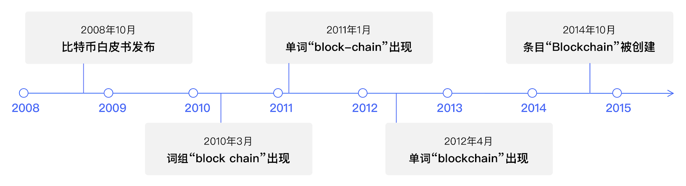

# 什么是区块链？这是个问题

**作者：** 冒志鸿、陈俊

> 由 ArcBlock 创始人兼 CEO 冒志鸿与副总裁陈俊合著、中信出版集团出版的《区块链实战：从技术创新到商业模式》，以通俗的语言和实际案例，从宏观的视角讲述区块链的起源、发展、技术趋势及落地应用场景，同时对层出不穷的新概念、新名词进行了辨析和讲解，破解了外界对区块链技术的各种迷思，帮助读者正确认识区块链的优势和局限之处。本书还以多个政府、企业的区块链项目情况，详解区块链应用的多层决策框架，以帮助组织决策者评估何时使用区块链。
>
> 《区块链实战》系列书摘，在此连载。

计算机领域有个很有趣的现象：很多常见词汇术语很长时间内并没有严格准确的定义，因此有人说计算机更多是“工程”而不是“科学”。“区块链”（Blockchain）就是其中之一，类似被广泛使用但长时间没有明确定义的词汇还有“数据库”、“网络”等。这些计算机技术的共性是，它们都首先诞生于“工程”之中，然后更多人开始研究才逐渐成为了“科学”。

今天，区块链作为新一代信息技术，其底层颠覆性影响正在为各行各业所感知。通过 [Google 学术论文检索](https://scholar.google.com/scholar?q=bitcoin&hl=en&as_sdt=0%2C10&as_ylo=2008&as_yhi=2019)，截至 2020 年 1 月，有超过 4 万条学术内容提及比特币（Bitcoin），6 万多条提及区块链，更有[媒体报道](https://www.chainnews.com/articles/692538312108.htm)在 2019 年已有超过 1 万 4 千篇论文涉及比特币。 然而，什么是区块链？正如 1000 个观众眼中有 1000 个哈姆雷特，相关的介绍阐释层出不穷，其实到现在仍然没有完全一致公认的定义。

有趣的是，虽然全世界第一个真正可运行的区块链是 2009 年诞生的比特币，但是区块链这一词汇并未在比特币白皮书中出现，而是分别出现区块（Block）和链（Chain）这两个词。一组交易数据集合储存在一起，就叫区块；需要一种数据结构把区块按顺序连接起来，就用线性的“链”这个词。区块链一词的首次现身，还是在比特币白皮书发表近 3 年半之后的维基百科比特币条目讨论区里。

_区块链一词在维基百科出现和演变的时间线_

当比特币运行成功、规模影响日益扩大，不只是少数极客关注，而且越来越多 IT、金融界专业人士及机构关注研究作为比特币的底层架构和实现方式的区块链技术，分布式账本技术（Distributed Ledger Technology，缩写 DLT）这一名词也应运而生。我们发现，一些金融机构、政府更愿意用 DLT 来指代区块链，可能是因为希望与强调它和比特币等数字货币保持距离乃至划清界限，更强调其底层的分布式账本技术。把区块链称为 DLT 的说法有些类似所谓“无币区块链”的提法，都属于“名词之争”，总体上我觉得 DLT 的说法更科学一些，而“无币区块链”则有刻意为划清与数字货币关系而误导的嫌疑，这一问题将在本书第二部分专文论述。

对区块链简明扼要的介绍，我们在此介绍[美国国家标准和技术研究院（National Institute of Standards and Technology，NIST）](https://www.nist.gov/)在 2018 年 10 月发布的重要文献[《区块链技术概述》（NISTIR 8202 ）](https://nvlpubs.nist.gov/nistpubs/ir/2018/NIST.IR.8202.pdf)中的版本——

_“区块链是以无中心节点的分布式方式实现的、防篡改的数字化账本，并且通常无需如银行、企业或政府这样的权威机构提供担保。基本来说，区块链使得用户能够在自己社区内的共享账本中记录交易，一般在正常的区块链网络中操作，交易一旦发布，就不得更改。2008 年，区块链理念与其他几种技术和计算机概念相结合，创造了现代加密货币：通过加密机制而不是受中心节点或权威机构保护的电子现金，比特币是第一个基于区块链技术的加密货币。”_

NIST 的介绍，从计算机科学的角度首先定义区块链是无需中心节点提供信任担保的数字化账本，然后描述其网络用户行为的规则特点，最后介绍了区块链首个应用比特币的起源。

> **美国国家标准和技术研究院及《区块链技术概述》白皮书**
>
> 美国国家标准与技术研究所（National Institute of Standards and Technology，缩写 NIST），前身为国家标准局（NBS，1901 年~1988 年），属于美国商务部的非监管机构。从事物理、生物和工程方面的基础和应用研究，以及测量技术和测试方法方面的研究，提供标准、标准参考数据及有关服务，在国际上享有很高的声誉。
>
> 2018 年 10 月，NIST 发表了白皮书 《区块链技术概述》（NISTIR 8202），标志着政府对区块链技术形成了冷静接纳的认知和态度。NIST 曾代表美国政府发布安全哈希算法（Secure Hash Algorithm，缩写 SHA），因此这份首度为联邦政府机构全面介绍区块链技术的白皮书就如何考察采用区块链技术给出了科学的指引：区块链技术日新月异，仍处于早期阶段，应该以“区块链技术如何使我们受益”，而不是“如何让我们的问题融入区块链技术”的思维方式进行调研，机构应该像对待任何其他技术解决方案一样对待区块链技术，并在适当的情况下使用它。

全球最大的区块链行业组织[数字商会（Chamber of Digital Commerce）](https://digitalchamber.org/)，在 2019 年发表了一篇《区块链国家行动计划》的号召，从技术应用的角度对区块链进行了定义，以期代表区块链行业与政府监管层沟通交流时，能保持认识一致：

“区块链是一种由计算机网络维护、去中心化的在线记录保存系统（即账本），网络中这些计算机使用既有的加密技术来验证和记录交易。区块链也是一种数据结构，可以创建一致的数字化数据账本，并在独立各方的网络之间共享。区块链（分布式账本技术）可能会成为数字化转型的关键推动力，从而实现点对点交易，而无需中介机构或预先建立的信任机制介入。起初，区块链是为支持数字货币交易而开发；如今，正在探索将区块链应用于其他领域，如金融服务、软件安全、物联网、零件跟踪（供应链）、资产管理、智能合约、身份验证等。”

> **数字商会及《区块链国家行动计划》**
>
> 数字商会（Chamber of Digital Commerce）是目前全球最大的区块链行业协会，其顾问委员会由世界经济论坛资深顾问、知名区块链布道者唐·塔普斯科特（Don Tapscott），美国司法部、美国商品期货交易委员会前高官，摩根大通、埃森哲等公司高管组成，代表 200 多家包括全球 IT 咨询公司、大型金融机构、跨国科技企业，会计律师事务所、保险公司、投资公司以及领先的区块链创业公司等在内的单位会员，通过与政策制定者、监管者和行业合作，积极向政府建言，呼吁制定开展支持区块链发展的法律和监管，促进数字资产和区块链技术的普及和应用，从而创造有利于创新、就业和投资的环境。
>
> ArcBlock 2019 年 1 月作为行业会员正式加入数字商会，与 IBM、微软、思科、埃森哲、KPMG、德勤、纳斯达克、蚂蚁金服、比特大陆、Ripple 等企业机构共同参与商会工作，以区块链技术创新企业的角度提供关于区块链技术如何与真实的商业场景结合落地的咨询意见。尤其在数字商会主持并于 2019 年 2 月 20 日正式发表的[《区块链国家行动计划》白皮书](https://digitalchamber.org/blockchain-national-action-plan/)中，ArcBlock 以其作为美国区块链初创企业的身份和经历，与其他会员一起呼吁联邦政府公开支持区块链技术，并采取全面协调的措施促进区块链技术在美国的发展，并在区块链技术在网络安全、数字身份与隐私、医疗、保险、供应链、媒体、知识产权等具体应用方面提供了意见和建议。
>
> 《区块链国家行动计划》指出，区块链技术为企业、政府和消费者提供了巨大的可能性，具有巨大的创新和经济增长潜力，攸关美国在全球科技和经济领先的竞争力和地位，但如果没有政策制定者的广泛支持，这一潜力将无法在美国实现。为此，白皮书提供了一系列政府如何为区块链技术提供最佳支持的指导方针。这一白皮书在美国获得了政府、业界与媒体的良好反响，也为政府积极采用区块链技术铺平了道路，有越来越多的联邦政府部门向社会开标征集区块链解决方案。

目前，《区块链实战》一书可在中信出版集团以下官方渠道购得：

- 纸质版：[京东](https://item.jd.com/70651034479.html)、[当当网](http://product.dangdang.com/28970979.html)、[天猫](https://detail.tmall.com/item.htm?spm=a1z10.3-b-s.w4011-15948767397.35.61556d99EoTsQn&id=621180059733&rn=b36e7bf4128178c5f1d9d47fdccb3d69&abbucket=19)、[中国图书网](http://www.bookschina.com/8339596.htm)

- 电子版：[亚马逊](https://www.amazon.cn/dp/B08BYM7GCC/ref=zg_bs_661058051_5?_encoding=UTF8&psc=1&refRID=C77P1VDJR9J22RSQBHTN)、[豆瓣阅读](https://read.douban.com/ebook/151888899/)、[微信读书](https://weread.qq.com/web/appreader/3b63273071e8eda73b6dc4d)、[得到 ](https://www.biji.com/eBook/z4R9BQ7pP4ZEaXYkx8KvRdljeyqo608MRkW1m2bMAO9NnDL7gBGQr5VzJqrvmEVN)

新书更多情况，请扫码登录[新书官网](https://books.arcblock.io/)查看。
